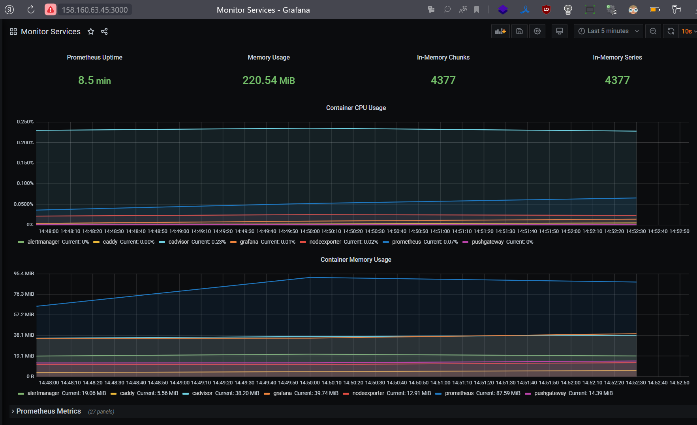

# Домашнее задание к занятию "4. Оркестрация группой Docker контейнеров на примере Docker Compose"

---

## Задача 1

Создать собственный образ любой операционной системы (например, ubuntu-20.04) с помощью Packer ([инструкция](https://cloud.yandex.ru/docs/tutorials/infrastructure-management/packer-quickstart))

Для получения зачета вам необходимо предоставить скриншот страницы с созданным образом из личного кабинета YandexCloud.

<--
```json
{
  "builders": [
    {
      "type": "yandex",
      "token": "***",
      "folder_id": "***",
      "source_image_family": "ubuntu-2004-lts",
      "ssh_username": "ubuntu",
      "disk_type": "network-hdd",
      "use_ipv4_nat": "true",
      "subnet_id": "***"
    }
  ]
}
```


----

## Задача 2

**2.1** Создать вашу первую виртуальную машину в YandexCloud с помощью web-интерфейса YandexCloud.        

<--


----

**2.2*** **(Необязательное задание)**
Создать вашу первую виртуальную машину в YandexCloud с помощью terraform (вместо использования веб-интерфейса YandexCloud).
Используйте terraform код в директории ([src/terraform](https://github.com/netology-group/virt-homeworks/tree/virt-11/05-virt-04-docker-compose/src/terraform))

Для получения зачета, вам необходимо предоставить вывод команды terraform apply и страницы свойств созданной ВМ из личного кабинета YandexCloud.

<--
Вывод:

<details>                         
    <summary>подробнее</summary>

```
terraform apply
yandex_vpc_network.default: Refreshing state... [id=enpmil0hnp81okgem0r2]
yandex_vpc_subnet.default: Refreshing state... [id=e9bavqpnkdfdqdr4e8fp]

Terraform used the selected providers to generate the following execution plan. Resource actions are indicated with the following symbols:
  + create

Terraform will perform the following actions:

  # yandex_compute_instance.node01 will be created
  + resource "yandex_compute_instance" "node01" {
      + allow_stopping_for_update = true
      + created_at                = (known after apply)
      + folder_id                 = (known after apply)
      + fqdn                      = (known after apply)
      + hostname                  = "node01.netology.cloud"
      + id                        = (known after apply)
      + metadata                  = {
          + "ssh-keys" = <<-EOT
                centos:ssh-rsa AAAAB3NzaC1yc2EAAAADAQABAAABgQC8swvFYAaYlCE0Kh8YrokY+MNB0fp0OPefbytHqEkGrTWUnB74nBbiKj1gLxc15+BpFlbywP8MgRmFPHWAampy+CEZt/npYe73MnCgHKMTXynuzU5F1kIj1fb1E29RcXVIpvLHRtha4Af0hx9uIHw3Pee1V58VFPKHdubuLHzy8lXwXcWv4XbaDamHUh3//QddtGhBCKx1VOY6PuIK21z6BTjrTytbsIVQZYmFNmU8ylEu01PKCq3Ivoqih6QaOHmDzVshZNpQ+9NkHHtJbd36FQoddrohTlUvcb8hkf5FaCaGePIsbBPCv0QftuKyOUleAUy9TNxlk1KZE/UTIUgoJb9sU58CkRfy/z8+rAiUkDinlEdkLhUlXyMmd9tAsHujGTZZZFKbDnw37TplPC/TR7i7N2AtYEiYACIjAe0OVOfcgQrZJsj5sryrcFZxBRdfdoJTw7azGxTN71CD3plvuRfT9TvAWfNdOm/X8WYl5vs0VcbucRcv1jh5zq2vW00= root@4SER-1670916090.4server.su
            EOT
        }
      + name                      = "node01"
      + network_acceleration_type = "standard"
      + platform_id               = "standard-v1"
      + service_account_id        = (known after apply)
      + status                    = (known after apply)
      + zone                      = "ru-central1-a"

      + boot_disk {
          + auto_delete = true
          + device_name = (known after apply)
          + disk_id     = (known after apply)
          + mode        = (known after apply)

          + initialize_params {
              + block_size  = (known after apply)
              + description = (known after apply)
              + image_id    = "fd8i0v13t2ufjashg3g1"
              + name        = "root-node01"
              + size        = 50
              + snapshot_id = (known after apply)
              + type        = "network-nvme"
            }
        }

      + metadata_options {
          + aws_v1_http_endpoint = (known after apply)
          + aws_v1_http_token    = (known after apply)
          + gce_http_endpoint    = (known after apply)
          + gce_http_token       = (known after apply)
        }

      + network_interface {
          + index              = (known after apply)
          + ip_address         = (known after apply)
          + ipv4               = true
          + ipv6               = (known after apply)
          + ipv6_address       = (known after apply)
          + mac_address        = (known after apply)
          + nat                = true
          + nat_ip_address     = (known after apply)
          + nat_ip_version     = (known after apply)
          + security_group_ids = (known after apply)
          + subnet_id          = "e9bavqpnkdfdqdr4e8fp"
        }

      + placement_policy {
          + host_affinity_rules = (known after apply)
          + placement_group_id  = (known after apply)
        }

      + resources {
          + core_fraction = 100
          + cores         = 8
          + memory        = 8
        }

      + scheduling_policy {
          + preemptible = (known after apply)
        }
    }

Plan: 1 to add, 0 to change, 0 to destroy.

Changes to Outputs:
  + external_ip_address_node01_yandex_cloud = (known after apply)
  + internal_ip_address_node01_yandex_cloud = (known after apply)

Do you want to perform these actions?
  Terraform will perform the actions described above.
  Only 'yes' will be accepted to approve.

  Enter a value: yes

yandex_compute_instance.node01: Creating...
yandex_compute_instance.node01: Still creating... [10s elapsed]
yandex_compute_instance.node01: Still creating... [20s elapsed]
yandex_compute_instance.node01: Still creating... [30s elapsed]
yandex_compute_instance.node01: Still creating... [40s elapsed]
yandex_compute_instance.node01: Still creating... [50s elapsed]
yandex_compute_instance.node01: Creation complete after 59s [id=fhmph7uugnbt0dddu37p]

Apply complete! Resources: 1 added, 0 changed, 0 destroyed.

Outputs:

external_ip_address_node01_yandex_cloud = "158.160.63.45"
internal_ip_address_node01_yandex_cloud = "192.168.101.21"
```
</details>


----

## Задача 3

С помощью ansible и docker-compose разверните на виртуальной машине из предыдущего задания систему мониторинга на основе Prometheus/Grafana .
Используйте ansible код в директории ([src/ansible](https://github.com/netology-group/virt-homeworks/tree/virt-11/05-virt-04-docker-compose/src/ansible))

Для получения зачета вам необходимо предоставить вывод команды "docker ps", все контейнеры, описанные в ([docker-compose](https://github.com/netology-group/virt-homeworks/blob/virt-11/05-virt-04-docker-compose/src/ansible/stack/docker-compose.yaml)),  должны быть в статусе "Up".

<--
Результат

```
[root@node01 ~]# docker ps
CONTAINER ID   IMAGE                              COMMAND                  CREATED         STATUS                   PORTS                                                                              NAMES
90df3277e6ba   prom/pushgateway:v1.2.0            "/bin/pushgateway"       2 minutes ago   Up 2 minutes             9091/tcp                                                                           pushgateway
65a919a2d722   stefanprodan/caddy                 "/sbin/tini -- caddy…"   2 minutes ago   Up 2 minutes             0.0.0.0:3000->3000/tcp, 0.0.0.0:9090-9091->9090-9091/tcp, 0.0.0.0:9093->9093/tcp   caddy
5a6acff5e5c0   prom/prometheus:v2.17.1            "/bin/prometheus --c…"   2 minutes ago   Up 2 minutes             9090/tcp                                                                           prometheus
f4ca1ff4c82b   grafana/grafana:7.4.2              "/run.sh"                2 minutes ago   Up 2 minutes             3000/tcp                                                                           grafana
e4fc73407748   prom/alertmanager:v0.20.0          "/bin/alertmanager -…"   2 minutes ago   Up 2 minutes             9093/tcp                                                                           alertmanager
79555f4546f3   gcr.io/cadvisor/cadvisor:v0.47.0   "/usr/bin/cadvisor -…"   2 minutes ago   Up 2 minutes (healthy)   8080/tcp                                                                           cadvisor
4642a889e53b   prom/node-exporter:v0.18.1         "/bin/node_exporter …"   2 minutes ago   Up 2 minutes             9100/tcp                                                                           nodeexporter

```

----

## Задача 4

1. Откройте веб-браузер, зайдите на страницу http://<внешний_ip_адрес_вашей_ВМ>:3000.
2. Используйте для авторизации логин и пароль из ([.env-file](https://github.com/netology-group/virt-homeworks/blob/virt-11/05-virt-04-docker-compose/src/ansible/stack/.env)).
3. Изучите доступный интерфейс, найдите в интерфейсе автоматически созданные docker-compose панели с графиками([dashboards](https://grafana.com/docs/grafana/latest/dashboards/use-dashboards/)).
4. Подождите 5-10 минут, чтобы система мониторинга успела накопить данные.

Для получения зачета, вам необходимо предоставить: 
- Скриншот работающего веб-интерфейса Grafana с текущими метриками, как на примере ниже

<--

http://158.160.63.45:3000/d/p-VsG5qZk/monitor-services?orgId=1&refresh=10s&from=now-5m&to=now



----

## Задача 5 (*)

Создать вторую ВМ и подключить её к мониторингу развёрнутому на первом сервере.

Для получения зачета, вам необходимо предоставить:
- Скриншот из Grafana, на котором будут отображаться метрики добавленного вами сервера.

<--


----
