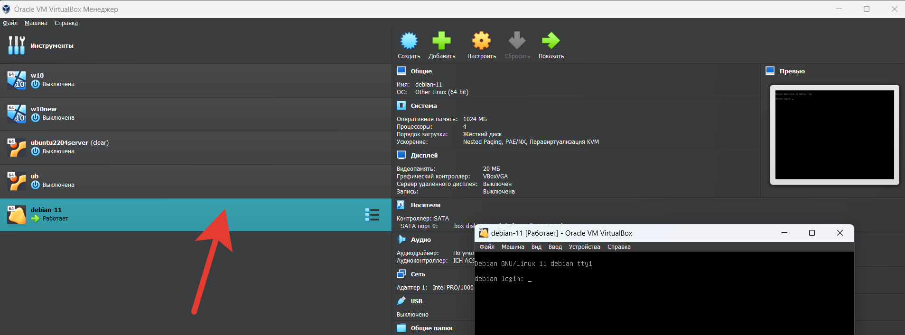

# Домашнее задание к занятию «Введение в Terraform»

### Цель задания

1. Установить и настроить Terrafrom.
2. Научиться использовать готовый код.

------

### Чеклист готовности к домашнему заданию

1. Скачайте и установите актуальную версию **terraform** >=1.4.0 . Приложите скриншот вывода команды ```terraform --version```.
2. Скачайте на свой ПК данный git репозиторий. Исходный код для выполнения задания расположен в директории **01/src**.
3. Убедитесь, что в вашей ОС установлен docker.

------

### Инструменты и дополнительные материалы, которые пригодятся для выполнения задания

1. Установка и настройка Terraform  [ссылка](https://cloud.yandex.ru/docs/tutorials/infrastructure-management/terraform-quickstart#from-yc-mirror)
2. Зеркало документации Terraform  [ссылка](https://registry.tfpla.net/browse/providers) 
3. Установка docker [ссылка](https://docs.docker.com/engine/install/ubuntu/) 
------

### Задание 1

1. Перейдите в каталог [**src**](https://github.com/netology-code/ter-homeworks/tree/main/01/src). Скачайте все необходимые зависимости, использованные в проекте. 
2. Изучите файл **.gitignore**. В каком terraform файле согласно этому .gitignore допустимо сохранить личную, секретную информацию?
3. Выполните код проекта. Найдите в State-файле секретное содержимое созданного ресурса **random_password**, пришлите в качестве ответа конкретный ключ и его значение.
4. Раскомментируйте блок кода, примерно расположенный на строчках 29-42 файла **main.tf**.
Выполните команду ```terraform validate```. Объясните в чем заключаются намеренно допущенные ошибки? Исправьте их.
5. Выполните код. В качестве ответа приложите вывод команды ```docker ps```
6. Замените имя docker-контейнера в блоке кода на ```hello_world```, выполните команду ```terraform apply -auto-approve```.
Объясните своими словами, в чем может быть опасность применения ключа  ```-auto-approve``` ? В качестве ответа дополнительно приложите вывод команды ```docker ps```
7. Уничтожьте созданные ресурсы с помощью **terraform**. Убедитесь, что все ресурсы удалены. Приложите содержимое файла **terraform.tfstate**. 
8. Объясните, почему при этом не был удален docker образ **nginx:latest** ? Ответ подкрепите выдержкой из документации провайдера.

<--

Ответ:

1. `cd /ter-homeworks/01/src` и `terraform init`
2. `*.tfstate.*`
3. Выполняем код с автоматическим подтверждением `terraform apply -auto-approve`, получаем результат `grep '"result"' terraform.tfstate` результат `"result": "o7eVSfkNFqWOkBRM"`
4. 
Ошибка 1. `resource "docker_image" ` - в блоке у ресурса должно быть указано два обозначения тип и имя, а тут только одно. 

Ошибка 2. `resource "docker_container" "1nginx"` обозначение имени должно начинаться с буквы или символа подчеркивания и может содержать только буквы, цифры, символы подчеркивания и дефисы, а тут начинается с цифры.

Ошибка 3. `resuld"` меняем на `result`, а `random_string_fake` на  `random_string`

Скорректированная версия:

```
terraform {
  required_providers {
    docker = {
      source  = "kreuzwerker/docker"
      version = "~> 3.0.1"
    }
  }
  required_version = ">=0.13" /*Многострочный комментарий.
 Требуемая версия terraform */
}
provider "docker" {}

#однострочный комментарий

resource "random_password" "random_string" {
  length      = 16
  special     = false
  min_upper   = 1
  min_lower   = 1
  min_numeric = 1
}


resource "docker_image" "nginx" {
  name         = "nginx:latest"
  keep_locally = true
}

resource "docker_container" "nginx" {
  image = docker_image.nginx.image_id
  name  = "example_${random_password.random_string.result}"

  ports {
    internal = 80
    external = 8000
  }
}

```

5.

```
docker ps
CONTAINER ID   IMAGE                        COMMAND                  CREATED         STATUS         PORTS                                                  NAMES
64f770123d54   f9c14fe76d50                 "/docker-entrypoint.…"   2 minutes ago   Up 2 minutes   0.0.0.0:8000->80/tcp                                   example_o7eVSfkNFqWOkBRM

```

6.
Главная опасность состоит в том, что в случае ошибки может быть уничтожена уже запущенная часть инфрастуктуры

```
docker ps
CONTAINER ID   IMAGE                        COMMAND                  CREATED        STATUS      PORTS                                                  NAMES

```

7. `terraform destroy -auto-approve`

```
{
  "version": 4,
  "terraform_version": "1.4.6",
  "serial": 18,
  "lineage": "23a1058c-cf49-e1e2-c2d7-3c4bece8a9b8",
  "outputs": {},
  "resources": [],
  "check_results": null
}

```

8. Образ не был удален так как не использовался `keep_locally = true` https://registry.tfpla.net/providers/kreuzwerker/docker/latest/docs/resources/image#keep_locally

---

### Задание 2*

1. Изучите в документации provider [**Virtualbox**](https://registry.tfpla.net/providers/shekeriev/virtualbox/latest/docs/overview/index) от 
shekeriev.
2. Создайте с его помощью любую виртуальную машину. Чтобы не использовать VPN советуем выбрать любой образ с расположением в github из [**списка**](https://www.vagrantbox.es/)

В качестве ответа приложите plan для создаваемого ресурса и скриншот созданного в VB ресурса. 


<--

Ответ:

```
terraform.exe plan

Terraform used the selected providers to generate the following execution plan. Resource actions are indicated with the
following symbols:
  + create

Terraform will perform the following actions:

  # virtualbox_vm.vm1 will be created
  + resource "virtualbox_vm" "vm1" {
      + cpus   = 4
      + id     = (known after apply)
      + image  = "https://app.vagrantup.com/shekeriev/boxes/debian-11/versions/0.2/providers/virtualbox.box"
      + memory = "1024 mib"
      + name   = "debian-11"
      + status = "running"

      + network_adapter {
          + device                 = "IntelPro1000MTDesktop"
          + host_interface         = "VirtualBox Host-Only Ethernet Adapter"
          + ipv4_address           = (known after apply)
          + ipv4_address_available = (known after apply)
          + mac_address            = (known after apply)
          + status                 = (known after apply)
          + type                   = "hostonly"
        }
    }

Plan: 1 to add, 0 to change, 0 to destroy.

Changes to Outputs:
  + IPAddress = (known after apply)

───────────────────────────────────────────────────────────────────────────────────────────────────────────────────────

Note: You didn't use the -out option to save this plan, so Terraform can't guarantee to take exactly these actions if
you run "terraform apply" now.
```



```

```

---