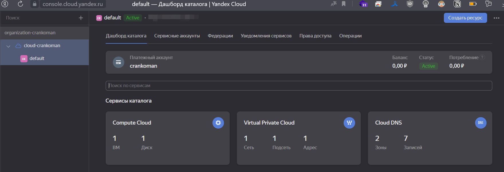
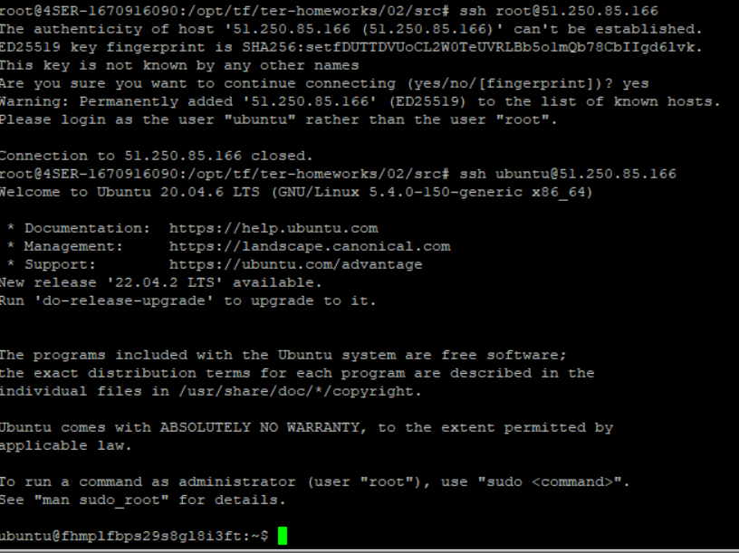

# Домашнее задание к занятию «Основы Terraform. Yandex Cloud»

### Цель задания

1. Создать свои ресурсы в облаке Yandex Cloud с помощью Terraform.
2. Освоить работу с переменными Terraform.


### Чеклист готовности к домашнему заданию

1. Зарегистрирован аккаунт в Yandex Cloud. Использован промокод на грант.
2. Установлен инструмент Yandex Cli.
3. Исходный код для выполнения задания расположен в директории [**02/src**](https://github.com/netology-code/ter-homeworks/tree/main/02/src).

### Итоговый код проекта 
[код проекта](https://github.com/Crankoman/devops/tree/terraform-02/src/ter-homeworks/02)

### Задание 0

1. Ознакомьтесь с [документацией к security-groups в Yandex Cloud](https://cloud.yandex.ru/docs/vpc/concepts/security-groups?from=int-console-help-center-or-nav).
2. Запросите preview доступ к данному функционалу в ЛК Yandex Cloud. Обычно его выдают в течении 24-х часов.
https://console.cloud.yandex.ru/folders/<ваш cloud_id>/vpc/security-groups.   
Этот функционал понадобится к следующей лекции. 

---


### Задание 1

1. Изучите проект. В файле variables.tf объявлены переменные для yandex provider.
2. Переименуйте файл personal.auto.tfvars_example в personal.auto.tfvars. Заполните переменные (идентификаторы облака, токен доступа). Благодаря .gitignore этот файл не попадет в публичный репозиторий. **Вы можете выбрать иной способ безопасно передать секретные данные в terraform.**
3. Сгенерируйте или используйте свой текущий ssh ключ. Запишите его открытую часть в переменную **vms_ssh_root_key**.
4. Инициализируйте проект, выполните код. Исправьте возникшую ошибку. Ответьте в чем заключается ее суть?
5. Ответьте, как в процессе обучения могут пригодиться параметры```preemptible = true``` и ```core_fraction=5``` в параметрах ВМ? Ответ в документации Yandex cloud.

В качестве решения приложите:
- скриншот ЛК Yandex Cloud с созданной ВМ,
- скриншот успешного подключения к консоли ВМ через ssh,
- ответы на вопросы.

<--

Ответ:


1. скриншот ЛК Yandex Cloud с созданной ВМ - 

2. скриншот успешного подключения к консоли ВМ через ssh - 

3. Проблема `the specified number of cores is not available on platform "standard-v1"; allowed core number: 2, 4` решается установкой `cores` = 2
Суть проблемы в том, что для данной ВМ не предусмотрена поддержка 1-ого ядра процессора

4. Как могут пригодиться параметры```preemptible = true``` и ```core_fraction=5```?

`core_fraction` - уровень производительности - 5%, не менее 50 мс в секунду будут гарантированно выделены. Указан самый минимальный, что бы не тратить много денег на ресурсы в рамках обучения. https://cloud.yandex.ru/docs/compute/concepts/performance-levels
`preemptible` - ВМ будет "прерываемая", т.е. не отказоустойчивая и может быть принудительно отключена, если будет не хватать ресурсов, зато они дешевле.

---


### Задание 2

1. Изучите файлы проекта.
2. Замените все "хардкод" **значения** для ресурсов **yandex_compute_image** и **yandex_compute_instance** на **отдельные** переменные. К названиям переменных ВМ добавьте в начало префикс **vm_web_** .  Пример: **vm_web_name**.
2. Объявите нужные переменные в файле variables.tf, обязательно указывайте тип переменной. Заполните их **default** прежними значениями из main.tf. 
3. Проверьте terraform plan (изменений быть не должно). 

<--

Ответ:

main.tf
```
resource "yandex_vpc_network" "develop" {
  name = var.vpc_name
}
resource "yandex_vpc_subnet" "develop" {
  name           = var.vpc_name
  zone           = var.default_zone
  network_id     = yandex_vpc_network.develop.id
  v4_cidr_blocks = var.default_cidr
}


data "yandex_compute_image" "ubuntu" {
  family = var.vm_web_family
}
resource "yandex_compute_instance" "platform" {
  name        = var.vm_web_name
  platform_id = var.vm_web_platform_id
  resources {
    cores         = 2
    memory        = 1
    core_fraction = 5
  }
  boot_disk {
    initialize_params {
      image_id = data.yandex_compute_image.ubuntu.image_id
    }
  }
  scheduling_policy {
    preemptible = true
  }
  network_interface {
    subnet_id = yandex_vpc_subnet.develop.id
    nat       = true
  }

  metadata = {
    serial-port-enable = 1
    ssh-keys           = "ubuntu:${var.vms_ssh_root_key}"
  }

}

```

variables.tf
```
###cloud vars
variable "token" {
  type        = string
  description = "OAuth-token; https://cloud.yandex.ru/docs/iam/concepts/authorization/oauth-token"
}

variable "cloud_id" {
  type        = string
  description = "https://cloud.yandex.ru/docs/resource-manager/operations/cloud/get-id"
}

variable "folder_id" {
  type        = string
  description = "https://cloud.yandex.ru/docs/resource-manager/operations/folder/get-id"
}

variable "default_zone" {
  type        = string
  default     = "ru-central1-a"
  description = "https://cloud.yandex.ru/docs/overview/concepts/geo-scope"
}
variable "default_cidr" {
  type        = list(string)
  default     = ["10.0.1.0/24"]
  description = "https://cloud.yandex.ru/docs/vpc/operations/subnet-create"
}

variable "vpc_name" {
  type        = string
  default     = "develop"
  description = "VPC network & subnet name"
}

variable "vm_web_name" {
  type        = string
  default     = "netology-develop-platform-web"
  description = "platform name"
}

variable "vm_web_platform_id" {
  type        = string
  default     = "standard-v1"
  description = "platform id"
}

variable "vm_web_family" {
  type        = string
  default     = "ubuntu-2004-lts"
  description = "image family"
}

###ssh vars

variable "vms_ssh_root_key" {
  type        = string
  default     = "<your_ssh_ed25519_key>"
  description = "ssh-keygen -t ed25519"
}
```

---


### Задание 3

1. Создайте в корне проекта файл 'vms_platform.tf' . Перенесите в него все переменные первой ВМ.
2. Скопируйте блок ресурса и создайте с его помощью вторую ВМ(в файле main.tf): **"netology-develop-platform-db"** ,  cores  = 2, memory = 2, core_fraction = 20. Объявите ее переменные с префиксом **vm_db_** в том же файле('vms_platform.tf').
3. Примените изменения.

<--

Ответ:

main.tf
```
resource "yandex_vpc_network" "develop" {
  name = var.vpc_name
}
resource "yandex_vpc_subnet" "develop" {
  name           = var.vpc_name
  zone           = var.default_zone
  network_id     = yandex_vpc_network.develop.id
  v4_cidr_blocks = var.default_cidr
}


data "yandex_compute_image" "ubuntu" {
  family = var.vm_web_family
}

data "yandex_compute_image" "ubuntu_db" {
  family = var.vm_db_family
}

resource "yandex_compute_instance" "platform" {
  name        = var.vm_web_name
  platform_id = var.vm_web_platform_id
  resources {
    cores         = var.vm_web_cores
    memory        = var.vm_web_memory
    core_fraction = var.vm_web_core_fraction
  }
  boot_disk {
    initialize_params {
      image_id = data.yandex_compute_image.ubuntu.image_id
    }
  }
  scheduling_policy {
    preemptible = true
  }
  network_interface {
    subnet_id = yandex_vpc_subnet.develop.id
    nat       = true
  }

  metadata = {
    serial-port-enable = 1
    ssh-keys           = "ubuntu:${var.vms_ssh_root_key}"
  }

}


resource "yandex_compute_instance" "platform_db" {
  name        = var.vm_db_name
  platform_id = var.vm_db_platform_id
  resources {
    cores         = var.vm_db_cores
    memory        = var.vm_db_memory
    core_fraction = var.vm_db_core_fraction
  }
  boot_disk {
    initialize_params {
      image_id = data.yandex_compute_image.ubuntu_db.image_id
    }
  }
  scheduling_policy {
    preemptible = true
  }
  network_interface {
    subnet_id = yandex_vpc_subnet.develop.id
    nat       = true
  }

  metadata = {
    serial-port-enable = 1
    ssh-keys           = "ubuntu:${var.vms_ssh_root_key}"
  }

}
```

vms_platform.tf
```
variable "vm_web_name" {
  type        = string
  default     = "netology-develop-platform-web"
  description = "platform name"
}

variable "vm_db_name" {
  type        = string
  default     = "netology-develop-platform-db"
  description = "platform name"
}

variable "vm_web_platform_id" {
  type        = string
  default     = "standard-v1"
  description = "platform id"
}

variable "vm_web_family" {
  type        = string
  default     = "ubuntu-2004-lts"
  description = "image family"
}


variable "vm_db_platform_id" {
  type        = string
  default     = "standard-v1"
  description = "platform id"
}

variable "vm_db_family" {
  type        = string
  default     = "ubuntu-2004-lts"
  description = "image family"
}

variable "vm_web_resources" {
  type = map(any)
  default = {
    "cpu_cores"    = 2
    "cpu_fraction" = 5
    "memory"       = 1
  }
}

variable "vm_db_resources" {
  type = map(any)
  default = {
    "cpu_cores"    = 2
    "cpu_fraction" = 20
    "memory"       = 2
  }
}

variable "metadata" {
  type = map(any)
  default = {
    "serial-port-enable" = 1
    "ssh-keys"           = "your_public_key"
  }
}
```

---


### Задание 4

1. Объявите в файле outputs.tf output типа map, содержащий { instance_name = external_ip } для каждой из ВМ.
2. Примените изменения.

В качестве решения приложите вывод значений ip-адресов команды ```terraform output```

<--

Ответ:

outputs.tf
```
output "instance_external_ip" {
  value = { 
			"${yandex_compute_instance.platform.name}" = "${yandex_compute_instance.platform.network_interface[0].nat_ip_address}",
			"${yandex_compute_instance.platform_db.name}" = "${yandex_compute_instance.platform_db.network_interface[0].nat_ip_address}" 
		  }
}
```

вывод `terraform output`
```
instance_external_ip = {
  "netology-develop-platform-db" = "51.250.87.131"
  "netology-develop-platform-web" = "51.250.69.107"
}

```
---


### Задание 5

1. В файле locals.tf опишите в **одном** local-блоке имя каждой ВМ, используйте интерполяцию ${..} с несколькими переменными по примеру из лекции.
2. Замените переменные с именами ВМ из файла variables.tf на созданные вами local переменные.
3. Примените изменения.

<--

Ответ:

locals.tf
```
locals {
  platform_name = "${var.vm_web_name}"
  platform_db_name = "${var.vm_db_name}"
}
```

main.tf
```
resource "yandex_vpc_network" "develop" {
  name = var.vpc_name
}
resource "yandex_vpc_subnet" "develop" {
  name           = var.vpc_name
  zone           = var.default_zone
  network_id     = yandex_vpc_network.develop.id
  v4_cidr_blocks = var.default_cidr
}


data "yandex_compute_image" "ubuntu" {
  family = var.vm_web_family
}
resource "yandex_compute_instance" "platform" {
  name        = local.platform_name
  platform_id = var.vm_web_platform_id
  resources {
    cores         = 2
    memory        = 1
    core_fraction = 5
  }
  boot_disk {
    initialize_params {
      image_id = data.yandex_compute_image.ubuntu.image_id
    }
  }
  scheduling_policy {
    preemptible = true
  }
  network_interface {
    subnet_id = yandex_vpc_subnet.develop.id
    nat       = true
  }

  metadata = {
    serial-port-enable = 1
    ssh-keys           = "ubuntu:${var.vms_ssh_root_key}"
  }

}


resource "yandex_compute_instance" "platform_db" {
  name        = local.platform_db_name
  platform_id = var.vm_web_platform_id
  resources {
    cores         = var.vm_db_cores
    memory        = var.vm_db_memory
    core_fraction = var.vm_db_core_fraction
  }
  boot_disk {
    initialize_params {
      image_id = data.yandex_compute_image.ubuntu.image_id
    }
  }
  scheduling_policy {
    preemptible = true
  }
  network_interface {
    subnet_id = yandex_vpc_subnet.develop.id
    nat       = true
  }

  metadata = {
    serial-port-enable = 1
    ssh-keys           = "ubuntu:${var.vms_ssh_root_key}"
  }

}
```

---


### Задание 6

1. Вместо использования 3-х переменных  ".._cores",".._memory",".._core_fraction" в блоке  resources {...}, объедените их в переменные типа **map** с именами "vm_web_resources" и "vm_db_resources".
2. Так же поступите с блоком **metadata {serial-port-enable, ssh-keys}**, эта переменная должна быть общая для всех ваших ВМ.
3. Найдите и удалите все более не используемые переменные проекта.
4. Проверьте terraform plan (изменений быть не должно).

<--

Ответ:

vms_platform.tf
```
variable "vm_web_name" {
  type        = string
  default     = "netology-develop-platform-web"
  description = "platform name"
}

variable "vm_db_name" {
  type        = string
  default     = "netology-develop-platform-db"
  description = "platform name"
}

variable "vm_web_platform_id" {
  type        = string
  default     = "standard-v1"
  description = "platform id"
}

variable "vm_web_family" {
  type        = string
  default     = "ubuntu-2004-lts"
  description = "image family"
}


variable "vm_db_platform_id" {
  type        = string
  default     = "standard-v1"
  description = "platform id"
}

variable "vm_db_family" {
  type        = string
  default     = "ubuntu-2004-lts"
  description = "image family"
}

variable "vm_web_resources" {
  type = map(any)
  default = {
    "cpu_cores"    = 2
    "memory"       = 1
	"core_fraction" = 5
  }
}

variable "vm_db_resources" {
  type = map(any)
  default = {
    "cpu_cores"    = 2
    "memory"       = 2
	"core_fraction" = 20
  }
}

variable "metadata" {
  type = map(any)
  default = {
    "serial-port-enable" = 1
    "ssh-keys"           = "your_public_key"
  }
}
```


---


## Дополнительные задания (со звездочкой*)

**Настоятельно рекомендуем выполнять все задания под звёздочкой.**   
Их выполнение поможет глубже разобраться в материале. Задания под звёздочкой дополнительные (необязательные к выполнению) и никак не повлияют на получение вами зачета по этому домашнему заданию. 

### Задание 7*

Изучите содержимое файла console.tf. Откройте terraform console, выполните следующие задания: 

1. Напишите, какой командой можно отобразить **второй** элемент списка test_list?
2. Найдите длину списка test_list с помощью функции length(<имя переменной>).
3. Напишите, какой командой можно отобразить значение ключа admin из map test_map ?
4. Напишите interpolation выражение, результатом которого будет: 
"John is admin for production server based on OS ubuntu-20-04 with X vcpu, Y ram and Z virtual disks", 
используйте данные из переменных test_list, test_map, servers и функцию length() для подстановки значений.

В качестве решения предоставьте необходимые команды и их вывод.

<--

Ответ:

1.
```
> local.test_list[1]
"staging"
```

2.
```
> length(local.test_list)
3
```

3.
```
> local.test_map["admin"]
"John"
```

4.
```
> "${local.test_map.admin} is admin for ${local.test_list[2]} server based on OS ${local.servers.production.image} with ${local.servers.production.cpu} vcpu, ${local.servers.production.ram} ram and ${length(local.servers.production.disks)} virtual disks"
"John is admin for production server based on OS ubuntu-20-04 with 10 vcpu, 40 ram and 4 virtual disks"
```
---


