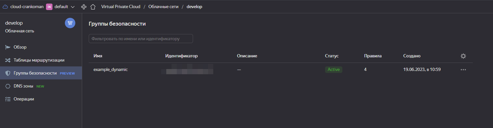
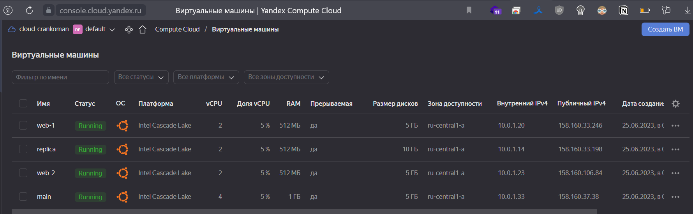
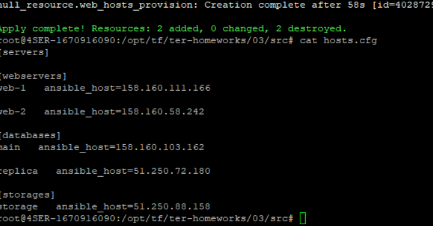

# Домашнее задание к занятию "Управляющие конструкции в коде Terraform"

### Цель задания

1. Отработать основные принципы и методы работы с управляющими конструкциями Terraform
2. Освоить работу с шаблонизатором Terraform(Interpolation Syntax)

------

### Чеклист готовности к домашнему заданию

1. Зарегистрирован аккаунт в Yandex Cloud. Использован промокод на грант.
2. Установлен инструмент yandex cli.
3. Доступен исходный код для выполнения задания в директории [**03/src**](https://github.com/netology-code/ter-homeworks/tree/main/03/src).
4. Любые ВМ, использованные при выполнении задания должны быть прерываемыми, для экономии средств.

------

### Инструменты/ дополнительные материалы, которые пригодятся для выполнения задания

1. [Консоль управления Yandex Cloud](https://console.cloud.yandex.ru/folders/<cloud_id>/vpc/security-groups).
2. [Группы безопасности](https://cloud.yandex.ru/docs/vpc/concepts/security-groups?from=int-console-help-center-or-nav).
3. [Datasource compute disk](https://terraform-eap.website.yandexcloud.net/docs/providers/yandex/d/datasource_compute_disk.html).

### Итоговый код проекта 
[код проекта](https://github.com/Crankoman/devops/tree/terraform-03/src/ter-homeworks/03)


### Задание 1

1. Изучите проект.
2. Заполните файл personal.auto.tfvars
3. Инициализируйте проект, выполните код (он выполнится даже если доступа к preview нет).

Примечание: Если у вас не активирован preview доступ к функционалу "Группы безопасности" в Yandex Cloud - запросите доступ у поддержки облачного провайдера. Обычно его выдают в течении 24-х часов.

Приложите скриншот входящих правил "Группы безопасности" в ЛК Yandex Cloud  или скриншот отказа в предоставлении доступа к preview версии.

<--

Ответ:



------

### Задание 2

1. Создайте файл count-vm.tf. 
Опишите в нем создание двух **одинаковых** ВМ  web-1 и web-2(не web-0 и web-1!), с минимальными параметрами,
используя мета-аргумент **count loop**. 
Назначьте ВМ созданную в 1-м задании группу безопасности.
2. Создайте файл for_each-vm.tf. Опишите в нем создание 2 ВМ с именами "main" и "replica" **разных** по cpu/ram/disk ,
используя мета-аргумент **for_each loop**. 
Используйте переменную типа list(object({ vm_name=string, cpu=number, ram=number, disk=number  })). 
При желании внесите в переменную все возможные параметры.
3. ВМ из пункта 2.2 должны создаваться после создания ВМ из пункта 2.1.
4. Используйте функцию file в local переменной для считывания ключа ~/.ssh/id_rsa.pub и его последующего использования в блоке metadata, взятому из ДЗ №2.
5. Инициализируйте проект, выполните код.

<--

Ответ:

count-vm.tf
```
data "yandex_compute_image" "ubuntu" {
  family = "ubuntu-2004-lts"
}

resource "yandex_compute_instance" "webs" {
  count       = 2
  name        = "web-${count.index+1}"
  platform_id = "standart-v2"
  resources {
    cores         = 2
    memory        = 0.5
    core_fraction = 5
  }
  boot_disk {
    initialize_params {
      image_id = data.yandex_compute_image.ubuntu.image_id
    }
  }
  scheduling_policy {
    preemptible = true
  }
  network_interface {
    subnet_id          = yandex_vpc_subnet.develop.id
    nat                = true
    security_group_ids = [yandex_vpc_security_group.example.id]
  }
  metadata = local.ssh_keys_and_serial_port
}
```

for_each-vm.tf

```
variable "redis_vars" {
  type = list(object({
    vm_name   = string
    cpu       = number
    ram       = number
    disk      = number
    core_frac = number
  }))
  default = [
    {
      vm_name   = "main"
      cpu       = 3
      ram       = 1
      disk      = 5
      core_frac = 5
    }, {
      vm_name   = "replica"
      cpu       = 2
      ram       = 0.5
      disk      = 10
      core_frac = 10
    },
  ]
}


resource "yandex_compute_instance" "redis" {

  depends_on = [yandex_compute_instance.webs]

  for_each    = {for vm in var.redis_vars : vm.vm_name => vm}
  platform_id = "standart-v2"
  name        = each.value.vm_name

  resources {
    cores         = each.value.cpu
    memory        = each.value.ram
    core_fraction = each.value.core_frac
  }

  boot_disk {
    initialize_params {
      image_id = data.yandex_compute_image.ubuntu.image_id
      type     = "network-hdd"
      size     = each.value.disk
    }
  }

  scheduling_policy {
    preemptible = true
  }

  network_interface {
    subnet_id          = yandex_vpc_subnet.develop.id
    nat                = true
    security_group_ids = [yandex_vpc_security_group.example.id]
  }

  metadata = local.ssh_keys_and_serial_port
}

```

locals.tf
```
locals {
  ssh_keys_and_serial_port = {
    ssh-keys           = "ubuntu:${file("~/.ssh/id_rsa.pub")}"
    serial-port-enable = 1
  }
}
```

Проверяем:


------

### Задание 3

1. Создайте 3 одинаковых виртуальных диска, размером 1 Гб с помощью ресурса yandex_compute_disk и мета-аргумента count в файле **disk_vm.tf** .
2. Создайте в том же файле одну ВМ c именем "storage" . Используйте блок **dynamic secondary_disk{..}** и мета-аргумент for_each для подключения созданных вами дополнительных дисков.

<--

Ответ:

disk_vm.tf
```
resource "yandex_compute_disk" "disk" {
  count = 3
  name  = "disk-${count.index}"
  type  = "network-hdd"
  zone  = var.default_zone
  size  = 1
}

resource "yandex_compute_instance" "storage" {
  name        = "storage"
  platform_id = "standard-v1"

  resources {
    cores         = 2
    memory        = 1
    core_fraction = 5
  }
  boot_disk {
    initialize_params {
      image_id = data.yandex_compute_image.ubuntu.image_id
      type     = "network-hdd"
      size     = 5
    }
  }

  dynamic secondary_disk {
    for_each = yandex_compute_disk.disk
    content {
      disk_id     = yandex_compute_disk.disk[secondary_disk.key].id
    }
  }

  scheduling_policy {
    preemptible = true
  }
  network_interface {
    subnet_id          = yandex_vpc_subnet.develop.id
    nat                = true
    security_group_ids = [yandex_vpc_security_group.example.id]
  }

  metadata = local.ssh_keys_and_serial_port
}
```

------

### Задание 4

1. В файле ansible.tf создайте inventory-файл для ansible.
Используйте функцию tepmplatefile и файл-шаблон для создания ansible inventory-файла из лекции.
Готовый код возьмите из демонстрации к лекции [**demonstration2**](https://github.com/netology-code/ter-homeworks/tree/main/demonstration2).
Передайте в него в качестве переменных группы виртуальных машин из задания 2.1, 2.2 и 3.2.(т.е. 5 ВМ)
2. Инвентарь должен содержать 3 группы [webservers], [databases], [storage] и быть динамическим, т.е. обработать как группу из 2-х ВМ так и 999 ВМ.
4. Выполните код. Приложите скриншот получившегося файла. 


<--

Ответ:

ansible.tf
```
resource "local_file" "hosts_cfg" {
  depends_on = [yandex_compute_instance.webs, yandex_compute_instance.redis, yandex_compute_instance.storage]
  content    = templatefile("${path.module}/hosts.tftpl",

    {
      webservers = yandex_compute_instance.webs, databases = yandex_compute_instance.redis,
      storage    = [yandex_compute_instance.storage]
    }
  )

  filename = "${abspath(path.module)}/hosts.cfg"
}


resource "null_resource" "web_hosts_provision" {
  #Ждем создания инстанса
  depends_on = [yandex_compute_instance.webs, yandex_compute_instance.redis, yandex_compute_instance.storage]

  #Добавление ПРИВАТНОГО ssh ключа в ssh-agent
  provisioner "local-exec" {
    command = "val $(ssh-agent -s) && echo $? | cat ~/.ssh/id_rsa | ssh-add -"
  }

  #Костыль!!! Даем ВМ время на первый запуск. Лучше выполнить это через wait_for port 22 на стороне ansible
  provisioner "local-exec" {
    command = "sleep 30"
  }

  #Запуск ansible-playbook
  provisioner "local-exec" {
    command     = "export ANSIBLE_HOST_KEY_CHECKING=False; ansible-playbook -i ${abspath(path.module)}/hosts.cfg ${abspath(path.module)}/test.yml"
    on_failure  = continue #Продолжить выполнение terraform pipeline в случае ошибок
    environment = { ANSIBLE_HOST_KEY_CHECKING = "False" }
    #срабатывание триггера при изменении переменных
  }
  triggers = {
    always_run        = timestamp() #всегда т.к. дата и время постоянно изменяются
    playbook_src_hash = file("${abspath(path.module)}/test.yml") # при изменении содержимого playbook файла
    ssh_public_key    = file("~/.ssh/id_rsa.pub") # при изменении переменной
  }

}
```

Результат:



------

## Дополнительные задания (со звездочкой*)

### Задание 5*(необязательное)
1. Напишите output, который отобразит все 5 созданных ВМ в виде списка словарей:
``` 
[
 {
  "name" = 'имя ВМ1'
  "id"   = 'идентификатор ВМ1'
  "fqdn" = 'Внутренний FQDN ВМ1'
 },
 {
  "name" = 'имя ВМ2'
  "id"   = 'идентификатор ВМ2'
  "fqdn" = 'Внутренний FQDN ВМ2'
 },
 ....
]
```
Приложите скриншот вывода команды ```terrafrom output```

<--

Ответ:


------

### Задание 6*(необязательное)

1. Используя null_resource и local-exec примените ansible-playbook к ВМ из ansible inventory файла.
Готовый код возьмите из демонстрации к лекции [**demonstration2**](https://github.com/netology-code/ter-homeworks/tree/main/demonstration2).
3. Дополните файл шаблон hosts.tftpl. 
Формат готового файла:
```netology-develop-platform-web-0   ansible_host="<внешний IP-address или внутренний IP-address если у ВМ отсутвует внешний адрес>"```

Для проверки работы уберите у ВМ внешние адреса. Этот вариант используется при работе через bastion сервер.
Для зачета предоставьте код вместе с основной частью задания.


<--

Ответ:

---

