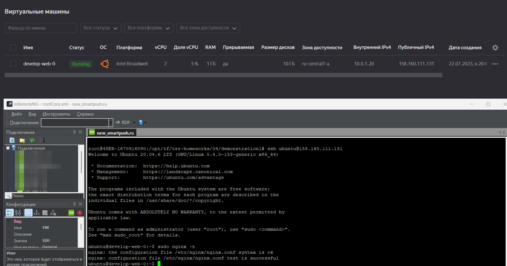

# Домашнее задание к занятию "Продвинутые методы работы с Terraform"

### Цель задания

1. Научиться использовать модули.
2. Отработать операции state.
3. Закрепить пройденный материал.

### Итоговый код проекта 
[код проекта](https://github.com/Crankoman/devops/tree/terraform-04/src/ter-homeworks/04)

### Задание 1

1. Возьмите из [демонстрации к лекции готовый код](https://github.com/netology-code/ter-homeworks/tree/main/04/demonstration1) для создания ВМ с помощью remote модуля.
2. Создайте 1 ВМ, используя данный модуль. В файле cloud-init.yml необходимо использовать переменную для ssh ключа вместо хардкода. Передайте ssh-ключ в функцию template_file в блоке vars ={} .
Воспользуйтесь [**примером**](https://grantorchard.com/dynamic-cloudinit-content-with-terraform-file-templates/). Обратите внимание что ssh-authorized-keys принимает в себя список, а не строку!
3. Добавьте в файл cloud-init.yml установку nginx.
4. Предоставьте скриншот подключения к консоли и вывод команды ```sudo nginx -t```.

<--

Ответ:

main.tf
```
...
module "test-vm" {
  source         = "git::https://github.com/udjin10/yandex_compute_instance.git?ref=main"
  env_name       = "develop"
  network_id     = yandex_vpc_network.develop.id
  subnet_zones   = ["ru-central1-a"]
  subnet_ids     = [yandex_vpc_subnet.develop.id]
  instance_name  = "web"
  instance_count = 1
  image_family   = "ubuntu-2004-lts"
  public_ip      = true

  metadata = {
    user-data          = data.template_file.cloudinit.rendered #Для демонстрации №3
    serial-port-enable = 1
  }

}

#Пример передачи cloud-config в ВМ для демонстрации №3
data "template_file" "cloudinit" {
  template = file("./cloud-init.yml")
  vars     = {
    ssh_public_key = var.ssh_public_key
  }
}
```

variables.tf
```
...
variable ssh_public_key {
  type = string
  default = "ssh-rsa AAAAB3NzaC1yc2EAAAADAQABAAABgQC8swvFYAaYlCE0Kh8YrokY+MNB0fp0OPefbytHqEkGrTWUnB74nBbiKj1gLxc15+BpFlbywP8MgRmFPHWAampy+CEZt/npYe73MnCgHKMTXynuzU5F1kIj1fb1E29RcXVIpvLHRtha4Af0hx9uIHw3Pee1V58VFPKHdubuLHzy8lXwXcWv4XbaDamHUh3//QddtGhBCKx1VOY6PuIK21z6BTjrTytbsIVQZYmFNmU8ylEu01PKCq3Ivoqih6QaOHmDzVshZNpQ+9NkHHtJbd36FQoddrohTlUvcb8hkf5FaCaGePIsbBPCv0QftuKyOUleAUy9TNxlk1KZE/UTIUgoJb9sU58CkRfy/z8+rAiUkDinlEdkLhUlXyMmd9tAsHujGTZZZFKbDnw37TplPC/TR7i7N2AtYEiYACIjAe0OVOfcgQrZJsj5sryrcFZxBRdfdoJTw7azGxTN71CD3plvuRfT9TvAWfNdOm/X8WYl5vs0VcbucRcv1jh5zq2vW00= root@4SER-1670916090.4server.su"
}
```

cloud-init.yml
```
#cloud-config
users:
  - name: ubuntu
    groups: sudo
    shell: /bin/bash
    sudo: ['ALL=(ALL) NOPASSWD:ALL']
    ssh_authorized_keys:
      - ${ssh_public_key}
package_update: true
package_upgrade: false
packages:
 - vim
 - nginx
```



------

### Задание 2

1. Напишите локальный модуль vpc, который будет создавать 2 ресурса: **одну** сеть и **одну** подсеть в зоне, объявленной при вызове модуля. например: ```ru-central1-a```.
2. Модуль должен возвращать значения vpc.id и subnet.id
3. Замените ресурсы yandex_vpc_network и yandex_vpc_subnet, созданным модулем.
4. Сгенерируйте документацию к модулю с помощью terraform-docs.    
 
Пример вызова:
```
module "vpc_dev" {
  source       = "./vpc"
  env_name     = "develop"
  zone = "ru-central1-a"
  cidr = "10.0.1.0/24"
}
```

<--

Ответ:

[main.tf](src%2Fter-homeworks%2F04%2Fsrc%2Fvpc%2Fmain.tf)
[outputs.tf](src%2Fter-homeworks%2F04%2Fsrc%2Fvpc%2Foutputs.tf)
[variables.tf](src%2Fter-homeworks%2F04%2Fsrc%2Fvpc%2Fvariables.tf)
[version.tf](src%2Fter-homeworks%2F04%2Fsrc%2Fvpc%2Fversion.tf)
README.md
```
## Requirements

| Name | Version |
|------|---------|
| <a name="requirement_terraform"></a> [terraform](#requirement\_terraform) | >=0.13 |

## Providers

| Name | Version |
|------|---------|
| <a name="provider_yandex"></a> [yandex](#provider\_yandex) | n/a |

## Modules

No modules.

## Resources

| Name | Type |
|------|------|
| [yandex_vpc_network.develop_vpc](https://registry.terraform.io/providers/yandex-cloud/yandex/latest/docs/resources/vpc_network) | resource |
| [yandex_vpc_subnet.develop_vpc_subnet](https://registry.terraform.io/providers/yandex-cloud/yandex/latest/docs/resources/vpc_subnet) | resource |

## Inputs

| Name | Description | Type | Default | Required |
|------|-------------|------|---------|:--------:|
| <a name="input_labels"></a> [labels](#input\_labels) | Labels to mark resources. | `map(string)` | `{}` | no |
| <a name="input_subnets"></a> [subnets](#input\_subnets) | vpc\_subnets description | <pre>map(object({<br>    zone = string<br>    cidr = string<br>  }))</pre> | n/a | yes |
| <a name="input_vpc_name"></a> [vpc\_name](#input\_vpc\_name) | vpc description | `string` | `"vpc"` | no |

## Outputs

| Name | Description |
|------|-------------|
| <a name="output_subnets_locations"></a> [subnets\_locations](#output\_subnets\_locations) | subnets\_locations |
| <a name="output_vpc_id"></a> [vpc\_id](#output\_vpc\_id) | vpc\_id |

```

------

### Задание 3
1. Выведите список ресурсов в стейте.
2. Полностью удалите из стейта модуль vpc.
3. Полностью удалите из стейта модуль vm.
4. Импортируйте все обратно. Проверьте terraform plan - изменений быть не должно.
Приложите список выполненных команд и скриншоты процессы.

<--

Ответ:

```commandline
terraform apply

Terraform used the selected providers to generate the following execution plan. Resource actions are indicated with the following symbols:
  + create

Terraform will perform the following actions:

  # module.vpc.yandex_vpc_network.develop_vpc will be created
  + resource "yandex_vpc_network" "develop_vpc" {
      + created_at                = (known after apply)
      + default_security_group_id = (known after apply)
      + description               = "vpc description"
      + folder_id                 = (known after apply)
      + id                        = (known after apply)
      + labels                    = (known after apply)
      + name                      = "vpc"
      + subnet_ids                = (known after apply)
    }

  # module.vpc.yandex_vpc_subnet.develop_vpc_subnet["public-ru-central1-a"] will be created
  + resource "yandex_vpc_subnet" "develop_vpc_subnet" {
      + created_at     = (known after apply)
      + description    = "vpc description"
      + folder_id      = (known after apply)
      + id             = (known after apply)
      + labels         = (known after apply)
      + name           = "public-ru-central1-a"
      + network_id     = (known after apply)
      + v4_cidr_blocks = [
          + "10.0.1.0/24",
        ]
      + v6_cidr_blocks = (known after apply)
      + zone           = "ru-central1-a"
    }

Plan: 2 to add, 0 to change, 0 to destroy.

Do you want to perform these actions?
  Terraform will perform the actions described above.
  Only 'yes' will be accepted to approve.

  Enter a value: yes

module.vpc.yandex_vpc_network.develop_vpc: Creating...
module.vpc.yandex_vpc_network.develop_vpc: Creation complete after 2s [id=enp5aerjdo4omd02rho1]
module.vpc.yandex_vpc_subnet.develop_vpc_subnet["public-ru-central1-a"]: Creating...
module.vpc.yandex_vpc_subnet.develop_vpc_subnet["public-ru-central1-a"]: Creation complete after 1s [id=e9bughfh0p23jfrumra6]

Apply complete! Resources: 2 added, 0 changed, 0 destroyed.

terraform state list
module.vpc.yandex_vpc_network.develop_vpc
module.vpc.yandex_vpc_subnet.develop_vpc_subnet["public-ru-central1-a"]

terraform state rm module.vpc
Removed module.vpc.yandex_vpc_network.develop_vpc
Removed module.vpc.yandex_vpc_subnet.develop_vpc_subnet["public-ru-central1-a"]
Successfully removed 2 resource instance(s).

terraform import 'module.vpc.yandex_vpc_network.develop_vpc' enp5aerjdo4omd02rho1
module.vpc.yandex_vpc_network.develop_vpc: Importing from ID "enph0dj3pod36r4mj1qs"...
module.vpc.yandex_vpc_network.develop_vpc: Import prepared!
  Prepared yandex_vpc_network for import
module.vpc.yandex_vpc_network.develop_vpc: Refreshing state... [id=enph0dj3pod36r4mj1qs]

Import successful!

The resources that were imported are shown above. These resources are now in
your Terraform state and will henceforth be managed by Terraform.

terraform import 'module.vpc.yandex_vpc_subnet.develop_vpc_subnet["public-ru-central1-a"]' e9bughfh0p23jfrumra6
module.vpc.yandex_vpc_subnet.develop_vpc_subnet["public-ru-central1-a"]: Importing from ID "e9bughfh0p23jfrumra6"...
module.vpc.yandex_vpc_subnet.develop_vpc_subnet["public-ru-central1-a"]: Import prepared!
  Prepared yandex_vpc_subnet for import
module.vpc.yandex_vpc_subnet.develop_vpc_subnet["public-ru-central1-a"]: Refreshing state... [id=e9bughfh0p23jfrumra6]

Import successful!

The resources that were imported are shown above. These resources are now in
your Terraform state and will henceforth be managed by Terraform.

terraform plan
module.vpc.yandex_vpc_network.develop_vpc: Refreshing state... [id=enp5aerjdo4omd02rho1]
module.vpc.yandex_vpc_subnet.develop_vpc_subnet["public-ru-central1-a"]: Refreshing state... [id=e9bughfh0p23jfrumra6]

No changes. Your infrastructure matches the configuration.

Terraform has compared your real infrastructure against your configuration and found no differences, so no changes are needed.
```


------
