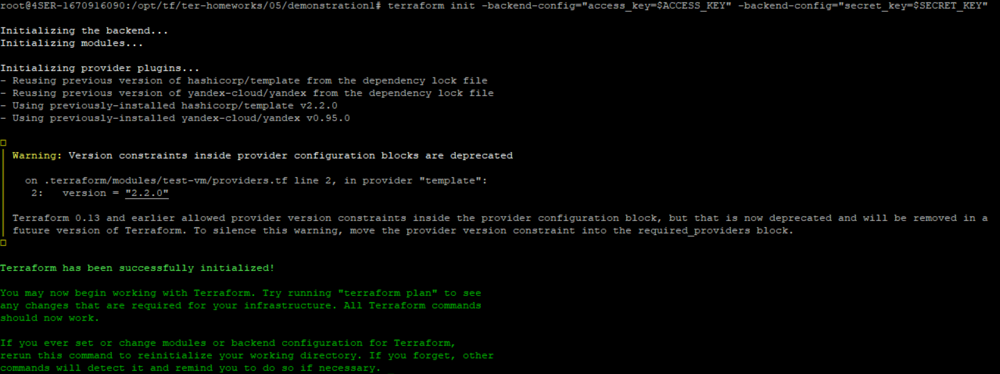

# Домашнее задание к занятию "Использование Terraform в команде"

### Цель задания

1. Научиться использовать remote state.
2. Освоить приемы командной работы.


------

### Задание 1

1. Возьмите код:
- из [ДЗ к лекции №04](https://github.com/netology-code/ter-homeworks/tree/main/04/src) 
- из [демо к лекции №04](https://github.com/netology-code/ter-homeworks/tree/main/04/demonstration1).
2. Проверьте код с помощью tflint и checkov. Вам не нужно инициализировать этот проект.
3. Перечислите какие **типы** ошибок обнаружены в проекте (без дублей).

<--

Ответ:

tflint
```
Warning: Missing version constraint for provider "***" in `required_providers` (terraform_required_providers)
Warning: Module source "git::https://github.com/udjin10/yandex_compute_instance.git?ref=main" uses a default branch as ref (main) (terraform_module_pinned_source)
Warning: [Fixable] variable "***" is declared but not used (terraform_unused_declarations)
```


checkov
```
Check: CKV_TF_1: "Ensure Terraform module sources use a commit hash"
```
------

### Задание 2

1. Возьмите ваш GitHub репозиторий с **выполненным ДЗ №4** в ветке 'terraform-04' и сделайте из него ветку 'terraform-05'
2. Повторите демонстрацию лекции: настройте YDB, S3 bucket, yandex service account, права доступа и мигрируйте State проекта в S3 с блокировками. Предоставьте скриншоты процесса в качестве ответа.
3. Закомитьте в ветку 'terraform-05' все изменения.
4. Откройте в проекте terraform console, а в другом окне из этой же директории попробуйте запустить terraform apply.
5. Пришлите ответ об ошибке доступа к State.
6. Принудительно разблокируйте State. Пришлите команду и вывод.

<--

Ответ:

[код](https://github.com/Crankoman/devops/tree/terraform-05/src/ter-homeworks/04/demonstration1)



```commandline
terraform apply
Acquiring state lock. This may take a few moments...
╷
│ Error: Error acquiring the state lock
│
│ Error message: 2 errors occurred:
│       * AccessDeniedException: request-id = 41e0296a-3935-4380-9423-9238285b374f rpc error: code = PermissionDenied desc = Permission denied
│       status code: 403, request id: c2b46261-d433-406e-b7b8-7c1ebfcb5742
│       * AccessDeniedException: request-id = bc5e100e-c590-4d2d-a34b-6092c63ae0c1 rpc error: code = PermissionDenied desc = Permission denied
│       status code: 403, request id: 749adeb9-f31c-4c2a-af4d-8689c834504e
│
│
│
│ Terraform acquires a state lock to protect the state from being written
│ by multiple users at the same time. Please resolve the issue above and try
│ again. For most commands, you can disable locking with the "-lock=false"
│ flag, but this is not recommended.
```

```commandline
terraform apply -lock=false
data.template_file.cloudinit: Reading...
data.template_file.cloudinit: Read complete after 0s [id=e9c7bcc359c3105ffbad2117def620c79758b74c72079b79fea8a203a81e5a65]
module.test-vm.data.yandex_compute_image.my_image: Reading...
yandex_vpc_network.develop: Refreshing state... [id=enprbngdd6omhngr946g]
module.test-vm.data.yandex_compute_image.my_image: Read complete after 1s [id=fd85f37uh98ldl1omk30]
yandex_vpc_subnet.develop: Refreshing state... [id=e9b84mp97b2n2d54na62]
module.test-vm.yandex_compute_instance.vm[0]: Refreshing state... [id=fhmlts8rnp8b5v9upgg0]

No changes. Your infrastructure matches the configuration.

Terraform has compared your real infrastructure against your configuration and found no differences, so no changes are needed.
╷
│ Warning: Version constraints inside provider configuration blocks are deprecated
│
│   on .terraform/modules/test-vm/providers.tf line 2, in provider "template":
│    2:   version = "2.2.0"
│
│ Terraform 0.13 and earlier allowed provider version constraints inside the provider configuration block, but that is now deprecated and will be removed in a
│ future version of Terraform. To silence this warning, move the provider version constraint into the required_providers block.
╵

Apply complete! Resources: 0 added, 0 changed, 0 destroyed.
```

------
### Задание 3  

1. Сделайте в GitHub из ветки 'terraform-05' новую ветку 'terraform-hotfix'.
2. Проверье код с помощью tflint и checkov, исправьте все предупреждения и ошибки в 'terraform-hotfix', сделайте комит.
3. Откройте новый pull request 'terraform-hotfix' --> 'terraform-05'. 
4. Вставьте в комментарий PR результат анализа tflint и checkov, план изменений инфраструктуры из вывода команды terraform plan.
5. Пришлите ссылку на PR для ревью(вливать код в 'terraform-05' не нужно).

<--

Ответ:

------
### Задание 4

1. Напишите переменные с валидацией и протестируйте их, заполнив default верными и неверными значениями. Предоставьте скриншоты проверок из terraform console. 

- type=string, description="ip-адрес", проверка что значение переменной содержит верный IP-адрес с помощью функций cidrhost() или regex(). Тесты:  "192.168.0.1" и "1920.1680.0.1"
- type=list(string), description="список ip-адресов", проверка что все адреса верны.  Тесты:  ["192.168.0.1", "1.1.1.1", "127.0.0.1"] и ["192.168.0.1", "1.1.1.1", "1270.0.0.1"]

<--

Ответ:

------