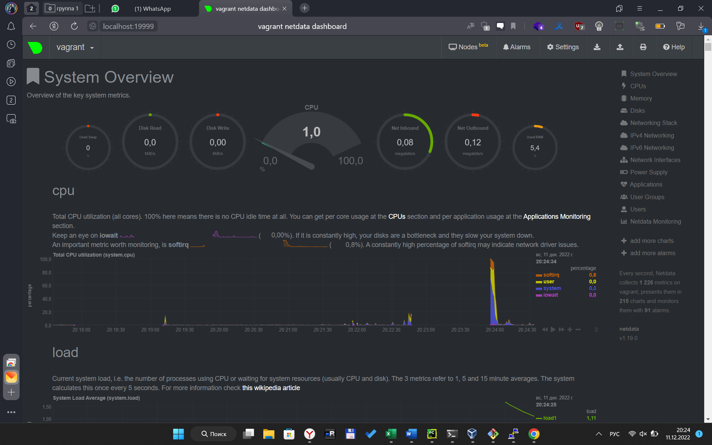

# Домашнее задание к занятию "3.4. Операционные системы. Лекция 2"


## 1. На лекции мы познакомились с [node_exporter](https://github.com/prometheus/node_exporter/releases). 
В демонстрации его исполняемый файл запускался в background. 
Этого достаточно для демо, но не для настоящей production-системы, где процессы должны находиться под внешним управлением. 
Используя знания из лекции по systemd, создайте самостоятельно простой [unit-файл](https://www.freedesktop.org/software/systemd/man/systemd.service.html) для node_exporter:

    * поместите его в автозагрузку,
    * предусмотрите возможность добавления опций к запускаемому процессу через внешний файл (посмотрите, например, на `systemctl cat cron`),
    * удостоверьтесь, что с помощью systemctl процесс корректно стартует, завершается, а после перезагрузки автоматически поднимается.
<-
Подготовка виртуальной машины: Обновляем все пакеты, ставим make. Подключаем репозиторий go для того что бы потом собрать node_exporter нужна последняя версия go и пакет tidy

     sudo apt update && upgrade -y
     sudo apt install -y  make
     sudo add-apt-repository ppa:longsleep/golang-backports
     sudo apt update
     sudo apt install golang-go
     go mod tidy
Клонируем репозиторий node_exportern
    
    git clone https://github.com/prometheus/node_exporter.git
Собираем node_exporter из исходников
    
    cd node_exporter && make build

Копируем бинарник node_exporter 
   
    sudo cp node_exporter /usr/local/bin/node_exporter

создаем systemd unit-файл /etc/systemd/system/node_exporter.service с содержимым:

    [Unit]
    # описание
    Description=Node Exporter
    # запускать после запска сети
    After=network.target 
    
    [Service]
    # тип простой
    Type=simple 
    # путь до бинарника, который запускаем
    ExecStart=/usr/local/bin/node_exporter 
    
    [Install]
    # каталог с именем multi-user.target.wants будет создан внутри /etc/systemd/system (если он еще не доступен), и внутри него будет размещена символическая ссылка на текущий модуль.
    WantedBy=multi-user.target

Перезагружаем конфиг

    sudo systemctl daemon-reload

Запускаем сервис

    sudo systemctl start node_exporter

Проверяем что сервис запустился 

    vagrant@vagrant:~$ service node_exporter status
    ● node_exporter.service - Node Exporter
         Loaded: loaded (/etc/systemd/system/node_exporter.service; disabled; vendor preset: enabled)
         Active: active (running) since Sun 2022-12-11 11:54:39 UTC; 13s ago
       Main PID: 2096 (node_exporter)
          Tasks: 7 (limit: 4653)
         Memory: 3.1M
         CGroup: /system.slice/node_exporter.service
                 └─2096 /usr/local/bin/node_exporter

Добавляем в автозапуск   

    sudo systemctl enable node_exporter
    Created symlink /etc/systemd/system/multi-user.target.wants/node_exporter.service → /etc/systemd/system/node_exporter.service.

Проверяем что сервис поднялся

<details>  
<summary>подробнее</summary>

    vagrant@vagrant:~$ sudo reboot
    Connection to 127.0.0.1 closed by remote host.
    Connection to 127.0.0.1 closed.
    PS C:\Users\Crank\PycharmProjects\devops\vagrant> vagrant.exe ssh
    Welcome to Ubuntu 20.04.5 LTS (GNU/Linux 5.4.0-135-generic x86_64)
    
     * Documentation:  https://help.ubuntu.com
     * Management:     https://landscape.canonical.com
     * Support:        https://ubuntu.com/advantage
    
      System information as of Sun 11 Dec 2022 11:58:24 AM UTC
    
      System load:  1.28               Processes:             150
      Usage of /:   18.1% of 30.58GB   Users logged in:       0
      Memory usage: 6%                 IPv4 address for eth0: 10.0.2.15
      Swap usage:   0%
    
    
    This system is built by the Bento project by Chef Software
    More information can be found at https://github.com/chef/bento
    Last login: Sun Dec 11 11:56:34 2022 from 10.0.2.2
    vagrant@vagrant:~$ service node_exporter status
    ● node_exporter.service - Node Exporter
         Loaded: loaded (/etc/systemd/system/node_exporter.service; enabled; vendor preset: enabled)
         Active: active (running) since Sun 2022-12-11 11:58:11 UTC; 17s ago
       Main PID: 710 (node_exporter)
          Tasks: 5 (limit: 4653)
         Memory: 15.5M
         CGroup: /system.slice/node_exporter.service
                 └─710 /usr/local/bin/node_exporter
</details>

Все ОК

----
## 2. Ознакомьтесь с опциями node_exporter и выводом `/metrics` по-умолчанию.
Приведите несколько опций, которые вы бы выбрали для базового мониторинга хоста по CPU, памяти, диску и сети.
<-
Посмотреть результаты работы быстро можно через `curl http://localhost:9100/metrics` или в браузере пробросив порт 9100 на хостовую машину (надо добавить в конфиг vagrant `config.vm.network "forwarded_port", guest: 9100, host: 9100`)

Посмотрим список всех метрик `curl http://localhost:9100/metrics | grep TYPE | sort`

CPU - node_cpu_guest_seconds_total, node_cpu_seconds_total
Память - node_memory_MemAvailable_bytes, node_memory_MemFree_bytes, node_memory_SwapFree_bytes
Диск - node_disk_io_now, node_disk_io_time_seconds_total
Сеть - node_network_receive_errs_total, node_network_transmit_errs_total, node_network_transmit_queue_length

----
## 3. Установите в свою виртуальную машину [Netdata](https://github.com/netdata/netdata). Воспользуйтесь [готовыми пакетами](https://packagecloud.io/netdata/netdata/install) для установки (`sudo apt install -y netdata`). 
   
   После успешной установки:
    * в конфигурационном файле `/etc/netdata/netdata.conf` в секции [web] замените значение с localhost на `bind to = 0.0.0.0`,
    * добавьте в Vagrantfile проброс порта Netdata на свой локальный компьютер и сделайте `vagrant reload`:
sudo apt install -y netdata
    ```bash
    config.vm.network "forwarded_port", guest: 19999, host: 19999
    ```

    После успешной перезагрузки в браузере *на своем ПК* (не в виртуальной машине) вы должны суметь зайти на `localhost:19999`. Ознакомьтесь с метриками, которые по умолчанию собираются Netdata и с комментариями, которые даны к этим метрикам.
<-
Готово



----
## 4. Можно ли по выводу `dmesg` понять, осознает ли ОС, что загружена не на настоящем оборудовании, а на системе виртуализации?
<-
Да. `dmesg -H` Через DMI по названию BIOS и наличию Гипервизора.

    [  +0.000000] DMI: innotek GmbH VirtualBox/VirtualBox, BIOS VirtualBox 12/01/2006
    [  +0.000000] Hypervisor detected: KVM
----
## 5. Как настроен sysctl `fs.nr_open` на системе по-умолчанию? Определите, что означает этот параметр. Какой другой существующий лимит не позволит достичь такого числа (`ulimit --help`)?
<-
vagrant@vagrant:~$ sudo sysctl -a | grep -s fs.nr_open
fs.nr_open = 1048576

nr_open - лимит открытых файлов для каждого отдельного процесса
выполним ulimit -n что бы вывести ограничение на `ulimit -n` - open files - количество одновременно открытых файлов
   
    vagrant@vagrant:~$ ulimit -n
    1024
Видем ограничение в 1024 это и не дас достигнуть лимита открытых файлов для каждого отдельного процесса
----
## 6. Запустите любой долгоживущий процесс (не `ls`, который отработает мгновенно, а, например, `sleep 1h`) в отдельном неймспейсе процессов; покажите, что ваш процесс работает под PID 1 через `nsenter`. Для простоты работайте в данном задании под root (`sudo -i`). Под обычным пользователем требуются дополнительные опции (`--map-root-user`) и т.д.
<-
Выполняем `sudo -i`

Далее запускаем процесс в отдельном namespace через nohup что бы освободить терминал ключи: --fork - разветвить указанную программу как дочерний процесс unshare, а не запускать ее напрямую , --pid -создать новый PID namespace --mount-proc - непосредственно перед запуском программы смонтируйте файловую систему proc в точке монтирования (по умолчанию /proc)
`unshare --fork --pid --mount-proc nohup sleep 1h&`

Проверяем что создался отдельный namespace через `lsns`, который выводит список всех namespace'ов и ищем там через `grep sleep`

    root@vagrant:~# lsns | grep sleep
    4026532192 mnt         2  1744 root            unshare --fork --pid --mount-proc nohup sleep 1h
    4026532193 pid         4  1745 root            sleep 1h
Видим его PID 1745

Переходим в namespace PID 1745 через `nsenter`, ключи -t - указываем PID целевого процесса чей контекст хотим получить, -p - взять пространство имен PID целевого процесса, -m - взять пространство имен монтирования целевого процесса

    root@vagrant:~# nsenter -t 1745 -p -m
    root@vagrant:/# ps
        PID TTY          TIME CMD
          1 pts/0    00:00:00 sleep
          2 pts/0    00:00:00 bash
         13 pts/0    00:00:00 ps

Видим PID 1 у процесса sleep

----
## 7. Найдите информацию о том, что такое `:(){ :|:& };:`. Запустите эту команду в своей виртуальной машине Vagrant с Ubuntu 20.04 (**это важно, поведение в других ОС не проверялось**). Некоторое время все будет "плохо", после чего (минуты) – ОС должна стабилизироваться. Вызов `dmesg` расскажет, какой механизм помог автоматической стабилизации.  
Как настроен этот механизм по-умолчанию, и как изменить число процессов, которое можно создать в сессии?

*В качестве решения ответьте на вопросы и опишите каким образом эти ответы были получены*
<-
`:(){ :|:& };:` - fork bomb. Из чего она состоит:

`:(){...}` - запуск функции `:`
Внутри функции `:|:` - рекурсивный запуск функции, по сути дважды, с передачей результатов через пайп в туже самую функцию
`&` – Помещает вызов функции в фоновый режим, чтобы дочерние процессы не могли умереть и начали потреблять системные ресурсы.
`;` – завершение описания функции.
`:` – Запускает определенную ранее функцию `:`
Суть бомбы - запуск бесконечного количества дочерних процессов, которые в итоге потребляют все ресурсы

После запуска терминал заполняется записями `-bash: fork: retry: Resource temporarily unavailable`
После того как система отвиснет выполняем `dmesg -HT | less` где видим сразу после запуска fork bomb и как только ВМ отвиснит: 
`[Sun Dec 11 00:11:12 2022] cgroup: fork rejected by pids controller in /user.slice/user-1000.slice/session-3.scope`
Как настроен этот механизм по-умолчанию? - сработал механизм systemd.resource-control параметры по умолчанию: TasksMax=33% в /usr/lib/systemd/system/user-.slice.d/10-defaults.conf 
Как изменить число процессов, которое можно создать в сессии укакзать в /usr/lib/systemd/system/user-.slice.d/10-defaults.conf `TasksMax` в секции `[Slice]` в %
----
