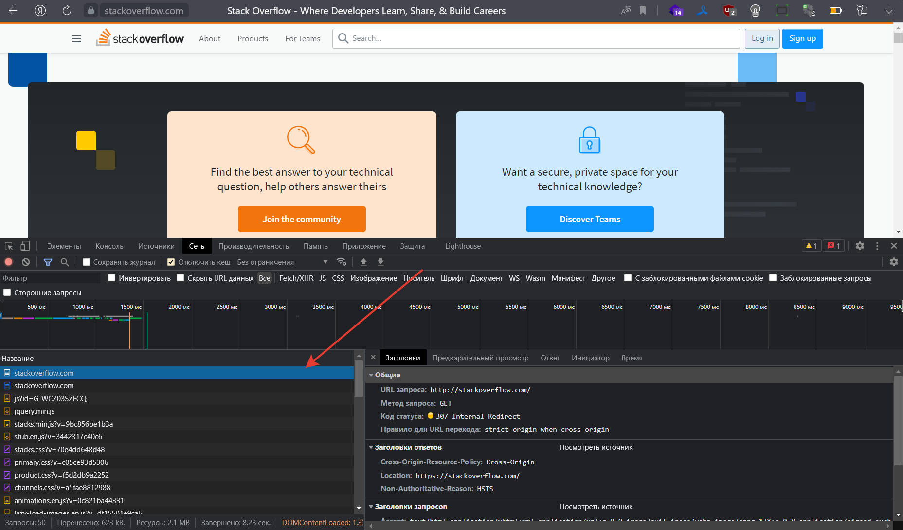
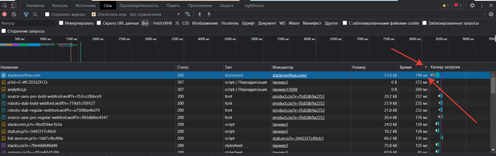

# Домашнее задание к занятию "3.6. Компьютерные сети. Лекция 1"


## 1. Работа c HTTP через телнет.
- Подключитесь утилитой телнет к сайту stackoverflow.com
`telnet stackoverflow.com 80`
- Отправьте HTTP запрос
```bash
GET /questions HTTP/1.0
HOST: stackoverflow.com
[press enter]
[press enter]
```
*В ответе укажите полученный HTTP код, что он означает?*

<-
Результат
<details>
<summary>Подробнее</summary>

    vagrant@sysadm-fs:~$ telnet stackoverflow.com 80
    Trying 151.101.1.69...
    Connected to stackoverflow.com.
    Escape character is '^]'.
    GET /questions HTTP/1.0
    HOST: stackoverflow.com
    
    HTTP/1.1 403 Forbidden
    Connection: close
    Content-Length: 1915
    Server: Varnish
    Retry-After: 0
    Content-Type: text/html
    Accept-Ranges: bytes
    Date: Sun, 18 Dec 2022 10:08:02 GMT
    Via: 1.1 varnish
    X-Served-By: cache-fra-eddf8230077-FRA
    X-Cache: MISS
    X-Cache-Hits: 0
    X-Timer: S1671358082.999785,VS0,VE2
    X-DNS-Prefetch-Control: off
    
    <!DOCTYPE html>
    <html>
    <head>
        <meta http-equiv="Content-Type" content="text/html; charset=UTF-8" />
        <title>Forbidden - Stack Exchange</title>
        <style type="text/css">
                    body
                    {
                            color: #333;
                            font-family: 'Helvetica Neue', Arial, sans-serif;
                            font-size: 14px;
                            background: #fff url('img/bg-noise.png') repeat left top;
                            line-height: 1.4;
                    }
                    h1
                    {
                            font-size: 170%;
                            line-height: 34px;
                            font-weight: normal;
                    }
                    a { color: #366fb3; }
                    a:visited { color: #12457c; }
                    .wrapper {
                            width:960px;
                            margin: 100px auto;
                            text-align:left;
                    }
                    .msg {
                            float: left;
                            width: 700px;
                            padding-top: 18px;
                            margin-left: 18px;
                    }
        </style>
    </head>
    <body>
        <div class="wrapper">
                    <div style="float: left;">
                            
                    </div>
                    <div class="msg">
                            <h1>Access Denied</h1>
                            <p>This IP address (46.138.29.46) has been blocked from access to our services. If you believe this to be in error, please contact us at <a href="mailto:team@stackexchange.com?Subject=Blocked%2046.138.29.46%20(Request%20ID%3A%20266423334-FRA)">team@stackexchange.com</a>.</p>
                            <p>When contacting us, please include the following information in the email:</p>
                            <p>Method: block</p>
                            <p>XID: 266423334-FRA</p>
                            <p>IP: 46.138.29.46</p>
                            <p>X-Forwarded-For: </p>
                            <p>User-Agent: </p>
    
                            <p>Time: Sun, 18 Dec 2022 10:08:02 GMT</p>
                            <p>URL: stackoverflow.com/questions</p>
                            <p>Browser Location: <span id="jslocation">(not loaded)</span></p>
                    </div>
            </div>
            <script>document.getElementById('jslocation').innerHTML = window.location.href;</script>
    </body>
    </html>Connection closed by foreign host.
</details>

----
## 2. Повторите задание 1 в браузере, используя консоль разработчика F12.
- откройте вкладку `Network`
- отправьте запрос http://stackoverflow.com
- найдите первый ответ HTTP сервера, откройте вкладку `Headers`
- укажите в ответе полученный HTTP код
- проверьте время загрузки страницы, какой запрос обрабатывался дольше всего?
- приложите скриншот консоли браузера в ответ.

<-
Первый ответ с кодом `307 Internal Redirect`  редирект на https адрес

Дольше всего загружалась страница https://stackoverflow.com/ ***752,48 миллисекунд***

----
## 3. Какой IP адрес у вас в интернете?
<-
Используем `curl` с ключом `-w \n'`  что бы добавить перевод строки в конце и обратимся к сайту `http://ident.me`

    vagrant@sysadm-fs:~$ curl -w '\n'  http://ident.me
    46.138.*.*
----
## 4. Какому провайдеру принадлежит ваш IP адрес? Какой автономной системе AS? Воспользуйтесь утилитой `whois`
<-
Выполним `whois` по внешнему ip

<details>
<summary>Подробнее</summary>

    vagrant@sysadm-fs:~$ whois 46.138.*.*
    % This is the RIPE Database query service.
    % The objects are in RPSL format.
    %
    % The RIPE Database is subject to Terms and Conditions.
    % See http://www.ripe.net/db/support/db-terms-conditions.pdf
    
    % Note: this output has been filtered.
    %       To receive output for a database update, use the "-B" flag.
    
    % Information related to '46.138.0.0 - 46.138.127.255'
    
    % Abuse contact for '46.138.0.0 - 46.138.127.255' is 'abuse@spd-mgts.ru'
    
    inetnum:        46.138.0.0 - 46.138.127.255
    netname:        MGTS-PPPOE
    descr:          Moscow Local Telephone Network (PJSC MGTS)
    country:        RU
    admin-c:        USPD-RIPE
    tech-c:         USPD-RIPE
    status:         ASSIGNED PA
    mnt-by:         MGTS-USPD-MNT
    created:        2011-11-09T15:13:35Z
    last-modified:  2020-01-13T10:39:33Z
    source:         RIPE
    
    role:           PJSC Moscow City Telephone Network NOC
    address:        USPD MGTS
    address:        Moscow, Russia
    address:        Khachaturyana 5
    admin-c:        AGS9167-RIPE
    admin-c:        AVK103-RIPE
    admin-c:        GIA45-RIPE
    tech-c:         AVK103-RIPE
    tech-c:         VMK
    tech-c:         ANO3-RIPE
    abuse-mailbox:  abuse@spd-mgts.ru
    nic-hdl:        USPD-RIPE
    mnt-by:         MGTS-USPD-MNT
    created:        2006-09-11T07:56:01Z
    last-modified:  2022-04-04T16:36:51Z
    source:         RIPE # Filtered
    
    % Information related to '46.138.0.0/16AS25513'
    
    route:          46.138.0.0/16
    descr:          Moscow Local Telephone Network (PJSC MGTS)
    descr:          Moscow, Russia
    origin:         AS25513
    mnt-by:         MGTS-USPD-MNT
    created:        2010-11-29T19:47:08Z
    last-modified:  2020-01-13T10:32:12Z
    source:         RIPE

% This query was served by the RIPE Database Query Service version 1.105 (DEXTER)
</details>

Провайдер ***Moscow Local Telephone Network (PJSC MGTS)*** 

----
## 5. Через какие сети проходит пакет, отправленный с вашего компьютера на адрес 8.8.8.8? Через какие AS? Воспользуйтесь утилитой `traceroute`
<-
Используем `traceroute -An 8.8.8.8` где ключ `-A` выполнять поиск названий Автономных систем в реестрах маршрутизации и распечатайте результаты сразу после соответствующих адресов ,где ключ `-n` не пытаться сопоставлять IP-адреса с именами хостов при их отображении.

    traceroute to 8.8.8.8 (8.8.8.8), 30 hops max, 60 byte packets
     1  192.168.241.124 [*]  0.122 ms  0.051 ms  0.094 ms
     2  192.168.241.4 [*]  0.131 ms  0.272 ms  0.216 ms
     3  85.143.253.217 [AS56534]  1.300 ms  1.210 ms  1.525 ms
     4  81.27.241.190 [AS20764]  1.749 ms  1.740 ms  1.747 ms
     5  74.125.118.126 [AS15169]  2.382 ms  2.302 ms  2.312 ms
     6  * * *
     7  72.14.233.94 [AS15169]  1.587 ms 108.170.250.33 [AS15169]  2.553 ms  2.777 ms
     8  108.170.250.146 [AS15169]  1.946 ms 108.170.250.34 [AS15169]  2.339 ms 108.170.250.51 [AS15169]  2.168 ms
     9  142.251.78.106 [AS15169]  17.481 ms 142.251.238.84 [AS15169]  17.513 ms 72.14.234.20 [AS15169]  16.265 ms
    10  72.14.232.86 [AS15169]  17.227 ms 216.239.43.20 [AS15169]  16.974 ms 72.14.232.86 [AS15169]  17.447 ms
    11  216.239.46.139 [AS15169]  19.474 ms 172.253.51.243 [AS15169]  17.700 ms 216.239.57.229 [AS15169]  18.146 ms
    12  * * *
    13  * * *
    14  * * *
    15  * * *
    16  * * *
    17  * * *
    18  * * *
    19  * * *
    20  * * *
    21  8.8.8.8 [AS15169]  18.399 ms *  16.741 ms

Выясним кому принадлежат AS через whois

    traceroute -A 8.8.8.8 | grep -o 'AS\w*' | sort -r -u | xargs -n 1 whois | grep -iE '^(ASName|as-name)'
    as-name:        PIRIX-INET-AS
    as-name:        RASCOM-AS
    ASName:         GOOGLE


----
## 6. Повторите задание 5 в утилите `mtr`. На каком участке наибольшая задержка - delay?
<-
Воспользуемся mtr с ключом `-z` - показать AS, с ключом `-n` не искать DNS имя, с ключом `-r` - использовать режим вывода, а не интерактивный

    mtr 8.8.8.8 -rzn
    Start: 2022-12-18T23:45:39+0300
    HOST: 260831.simplecloud.ru       Loss%   Snt   Last   Avg  Best  Wrst StDev
      1. AS???    192.168.241.124      0.0%    10    0.3   0.3   0.2   0.3   0.0
      2. AS???    192.168.241.4        0.0%    10    0.5   0.3   0.2   0.5   0.1
      3. AS56534  85.143.253.217       0.0%    10    1.3   2.2   1.3   5.9   1.6
      4. AS20764  81.27.241.190        0.0%    10    4.2   2.2   1.7   4.2   0.8
      5. AS15169  74.125.118.126       0.0%    10    2.5   2.5   2.4   2.6   0.1
      6. AS15169  209.85.250.231       0.0%    10    2.4   2.0   1.9   2.4   0.2
      7. AS15169  108.170.250.99       0.0%    10    2.5   2.5   2.2   2.9   0.2
      8. AS15169  142.251.238.82       0.0%    10   19.6  19.7  19.6  19.8   0.1
      9. AS15169  142.251.238.68       0.0%    10   18.9  20.8  18.8  28.7   3.3
     10. AS15169  72.14.236.73         0.0%    10   19.7  19.8  19.6  20.5   0.3
     11. AS???    ???                 100.0    10    0.0   0.0   0.0   0.0   0.0
     12. AS???    ???                 100.0    10    0.0   0.0   0.0   0.0   0.0
     13. AS???    ???                 100.0    10    0.0   0.0   0.0   0.0   0.0
     14. AS???    ???                 100.0    10    0.0   0.0   0.0   0.0   0.0
     15. AS???    ???                 100.0    10    0.0   0.0   0.0   0.0   0.0
     16. AS???    ???                 100.0    10    0.0   0.0   0.0   0.0   0.0
     17. AS???    ???                 100.0    10    0.0   0.0   0.0   0.0   0.0
     18. AS???    ???                 100.0    10    0.0   0.0   0.0   0.0   0.0
     19. AS???    ???                 100.0    10    0.0   0.0   0.0   0.0   0.0
     20. AS15169  8.8.8.8              0.0%    10   18.7  18.8  18.6  19.0   0.1

Найдем самый долгий участок ***10-й 19.6 мс***

    mtr 8.8.8.8 -rzn | sort -r -nk9 | head -n 1
    9. AS15169  142.251.238.68       0.0%    10   19.1  19.4  18.8  22.0   0.9


----
## 7. Какие DNS сервера отвечают за доменное имя dns.google? Какие A записи? Воспользуйтесь утилитой `dig`
<-
Используем `dig NS` что бы вернуть NS-записи

    dig NS dns.google
    
    ; <<>> DiG 9.16.1-Ubuntu <<>> NS dns.google
    ;; global options: +cmd
    ;; Got answer:
    ;; ->>HEADER<<- opcode: QUERY, status: NOERROR, id: 33545
    ;; flags: qr rd ra; QUERY: 1, ANSWER: 4, AUTHORITY: 0, ADDITIONAL: 1
    
    ;; OPT PSEUDOSECTION:
    ; EDNS: version: 0, flags:; udp: 65494
    ;; QUESTION SECTION:
    ;dns.google.                    IN      NS
    
    ;; ANSWER SECTION:
    dns.google.             17902   IN      NS      ns4.zdns.google.
    dns.google.             17902   IN      NS      ns3.zdns.google.
    dns.google.             17902   IN      NS      ns2.zdns.google.
    dns.google.             17902   IN      NS      ns1.zdns.google.
    
    ;; Query time: 19 msec
    ;; SERVER: 127.0.0.53#53(127.0.0.53)
    ;; WHEN: Sun Dec 18 23:49:16 MSK 2022
    ;; MSG SIZE  rcvd: 116

Видим: 
DNS-сервера: ns4.zdns.google, ns3.zdns.google, ns2.zdns.google, ns1.zdns.google
    
Используем `dig A` что бы вернуть A записи
    
dig A dns.google
    
    ; <<>> DiG 9.16.1-Ubuntu <<>> A dns.google
    ;; global options: +cmd
    ;; Got answer:
    ;; ->>HEADER<<- opcode: QUERY, status: NOERROR, id: 30859
    ;; flags: qr rd ra; QUERY: 1, ANSWER: 2, AUTHORITY: 0, ADDITIONAL: 1
    
    ;; OPT PSEUDOSECTION:
    ; EDNS: version: 0, flags:; udp: 65494
    ;; QUESTION SECTION:
    ;dns.google.                    IN      A
    
    ;; ANSWER SECTION:
    dns.google.             850     IN      A       8.8.4.4
    dns.google.             850     IN      A       8.8.8.8
    
    ;; Query time: 0 msec
    ;; SERVER: 127.0.0.53#53(127.0.0.53)
    ;; WHEN: Sun Dec 18 23:52:31 MSK 2022
    ;; MSG SIZE  rcvd: 71

Видим: 
А-записи: 8.8.4.4, 8.8.8.8
----
## 8. Проверьте PTR записи для IP адресов из задания 7. Какое доменное имя привязано к IP? Воспользуйтесь утилитой `dig`
<-
Используем `dig` с ключом `+short` для короткого вывода и -x что бы сделать обратного запроса ***reverse lookups*** 

    dig +short -x 8.8.8.8 
    dns.google.
    dig +short -x 8.8.1.1
    dns.google.

Ответ: ***dns.google***

----
