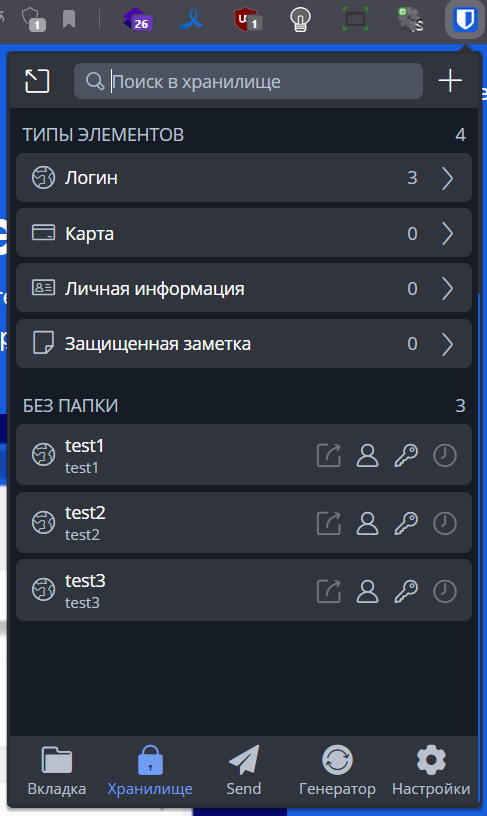
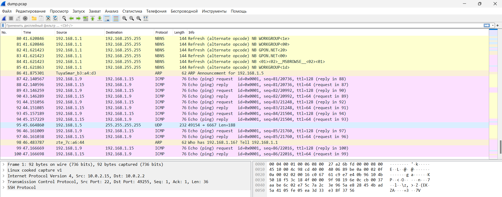

# Домашнее задание к занятию "3.9. Элементы безопасности информационных систем"


## 1. Установите Bitwarden плагин для браузера. Зарегистрируйтесь и сохраните несколько паролей.

<-

Скачиваем и устанавливаем клиент https://chrome.google.com/webstore/detail/bitwarden-free-password-m/nngceckbapebfimnlniiiahkandclblb/related

Регистрируемся и создаем пароли




----
## 2. Установите Google authenticator на мобильный телефон. Настройте вход в Bitwarden аккаунт через Google authenticator OTP.

<- 


----
## 3. Установите apache2, сгенерируйте самоподписанный сертификат, настройте тестовый сайт для работы по HTTPS.

<-

Устанавливаем апач `apt install apache2 -y`
````
Enabling module access_compat.
Enabling module authn_file.
Enabling module authz_user.
Enabling module alias.
Enabling module dir.
Enabling module autoindex.
Enabling module env.
Enabling module mime.
Enabling module negotiation.
Enabling module setenvif.
Enabling module filter.
Enabling module deflate.
Enabling module status.
Enabling module reqtimeout.
Enabling conf charset.
Enabling conf localized-error-pages.
Enabling conf other-vhosts-access-log.
Enabling conf security.
Enabling conf serve-cgi-bin.
Enabling site 000-default.
Created symlink /etc/systemd/system/multi-user.target.wants/apache2.service → /lib/systemd/system/apache2.service.
Created symlink /etc/systemd/system/multi-user.target.wants/apache-htcacheclean.service → /lib/systemd/system/apache-htcacheclean.service.
Processing triggers for ufw (0.36-6ubuntu1) ...
Processing triggers for systemd (245.4-4ubuntu3.19) ...
Processing triggers for man-db (2.9.1-1) ...
Processing triggers for libc-bin (2.31-0ubuntu9.9) ...
````
Подключаем ssl модуль `a2enmod ssl`
````
Considering dependency setenvif for ssl:
Module setenvif already enabled
Considering dependency mime for ssl:
Module mime already enabled
Considering dependency socache_shmcb for ssl:
Enabling module socache_shmcb.
Enabling module ssl.
See /usr/share/doc/apache2/README.Debian.gz on how to configure SSL and create self-signed certificates.
To activate the new configuration, you need to run:
  systemctl restart apache2
````
Перезапускаем веб-сервер `service apache2 restart`

Генерируем самоподписанный сертификат с помощью `openssl`

````
openssl req -x509 -nodes -days 365 -newkey rsa:2048 \
> -keyout /etc/ssl/private/apache-selfsigned.key \
> -out /etc/ssl/certs/apache-selfsigned.crt \
> -subj "/C=RU/ST=Moscow/L=Moscow/O=Company Name/OU=Org/CN=test.test"
Generating a RSA private key
......................+++++
............+++++
writing new private key to '/etc/ssl/private/apache-selfsigned.key'
-----
````
Добавляем домен `echo "127.0.0.1 test.test" >> /etc/hosts`

Создаем конфигурационный файл `/etc/apache2/sites-available/test.test.conf`
````
<VirtualHost *:443>
ServerName test.test
DocumentRoot /var/www/test.test
SSLEngine on
SSLCertificateFile /etc/ssl/certs/apache-selfsigned.crt
SSLCertificateKeyFile /etc/ssl/private/apache-selfsigned.key
</VirtualHost>
````
Создаем файл для веб-сервера
````
mkdir /var/www/test.test
echo "TEST" > /var/www/test.test/index.html
````
Активируем сайт `a2ensite test.test.conf`
````
Enabling site test.test.
To activate the new configuration, you need to run:
  systemctl reload apache2
````

Перезапускаем веб-сервер `service apache2 restart`

Проверяем с помощью curl и ключа `-k` что бы работать с самоподписанными сертификатами
````
curl -k https://test.test
TEST
````
----
## 4. Проверьте на TLS уязвимости произвольный сайт в интернете (кроме сайтов МВД, ФСБ, МинОбр, НацБанк, РосКосмос, РосАтом, РосНАНО и любых госкомпаний, объектов КИИ, ВПК ... и тому подобное).

<-
mkdir /test/ssltest && cd /test/ssltest
git clone --depth 1 https://github.com/drwetter/testssl.sh.git
cd testssl.sh
./testssl.sh -U --sneaky https://www.km.ru/

Результат
<details>                         
    <summary>подробнее</summary>

````
###########################################################
    testssl.sh       3.2rc2 from https://testssl.sh/dev/
    (7670275 2022-12-27 22:06:12)

      This program is free software. Distribution and
             modification under GPLv2 permitted.
      USAGE w/o ANY WARRANTY. USE IT AT YOUR OWN RISK!

       Please file bugs @ https://testssl.sh/bugs/

###########################################################

 Using "OpenSSL 1.0.2-bad (1.0.2k-dev)" [~183 ciphers]
 on vagrant:./bin/openssl.Linux.x86_64
 (built: "Sep  1 14:03:44 2022", platform: "linux-x86_64")


Testing all IPv4 addresses (port 443): 172.67.145.29 104.21.63.94
--------------------------------------------------------------------------------
 Start 2023-01-04 17:02:25        -->> 172.67.145.29:443 (www.km.ru) <<--

 Further IP addresses:   104.21.63.94 2606:4700:3030::6815:3f5e 2606:4700:3034::ac43:911d
 rDNS (172.67.145.29):   --
 Service detected:       HTTP


 Testing vulnerabilities

 Heartbleed (CVE-2014-0160)                not vulnerable (OK), no heartbeat extension
 CCS (CVE-2014-0224)                       not vulnerable (OK)
 Ticketbleed (CVE-2016-9244), experiment.  not vulnerable (OK), no session tickets
 ROBOT                                     Server does not support any cipher suites that use RSA key transport
 Secure Renegotiation (RFC 5746)           OpenSSL handshake didn't succeed
 Secure Client-Initiated Renegotiation     not vulnerable (OK)
 CRIME, TLS (CVE-2012-4929)                not vulnerable (OK)
 BREACH (CVE-2013-3587)                    potentially NOT ok, "br gzip" HTTP compression detected. - only supplied "/" tested
                                           Can be ignored for static pages or if no secrets in the page
 POODLE, SSL (CVE-2014-3566)               not vulnerable (OK)
 TLS_FALLBACK_SCSV (RFC 7507)              Downgrade attack prevention supported (OK)
 SWEET32 (CVE-2016-2183, CVE-2016-6329)    not vulnerable (OK)
 FREAK (CVE-2015-0204)                     not vulnerable (OK)
 DROWN (CVE-2016-0800, CVE-2016-0703)      not vulnerable on this host and port (OK)
                                           no RSA certificate, thus certificate can't be used with SSLv2 elsewhere
 LOGJAM (CVE-2015-4000), experimental      not vulnerable (OK): no DH EXPORT ciphers, no DH key detected with <= TLS 1.2
 BEAST (CVE-2011-3389)                     TLS1: ECDHE-ECDSA-AES128-SHA ECDHE-ECDSA-AES256-SHA
                                           VULNERABLE -- but also supports higher protocols  TLSv1.1 TLSv1.2 (likely mitigated)
 LUCKY13 (CVE-2013-0169), experimental     potentially VULNERABLE, uses cipher block chaining (CBC) ciphers with TLS. Check patches
 Winshock (CVE-2014-6321), experimental    not vulnerable (OK)
 RC4 (CVE-2013-2566, CVE-2015-2808)        no RC4 ciphers detected (OK)


 Done 2023-01-04 17:02:57 [  33s] -->> 172.67.145.29:443 (www.km.ru) <<--

--------------------------------------------------------------------------------
 Start 2023-01-04 17:02:58        -->> 104.21.63.94:443 (www.km.ru) <<--

 Further IP addresses:   172.67.145.29 2606:4700:3030::6815:3f5e 2606:4700:3034::ac43:911d
 rDNS (104.21.63.94):    --
 Service detected:       HTTP


 Testing vulnerabilities

 Heartbleed (CVE-2014-0160)                not vulnerable (OK), no heartbeat extension
 CCS (CVE-2014-0224)                       not vulnerable (OK)
 Ticketbleed (CVE-2016-9244), experiment.  not vulnerable (OK), no session tickets
 ROBOT                                     Server does not support any cipher suites that use RSA key transport
 Secure Renegotiation (RFC 5746)           OpenSSL handshake didn't succeed
 Secure Client-Initiated Renegotiation     not vulnerable (OK)
 CRIME, TLS (CVE-2012-4929)                not vulnerable (OK)
 BREACH (CVE-2013-3587)                    potentially NOT ok, "br gzip" HTTP compression detected. - only supplied "/" tested
                                           Can be ignored for static pages or if no secrets in the page
 POODLE, SSL (CVE-2014-3566)               not vulnerable (OK)
 TLS_FALLBACK_SCSV (RFC 7507)              Downgrade attack prevention supported (OK)
 SWEET32 (CVE-2016-2183, CVE-2016-6329)    not vulnerable (OK)
 FREAK (CVE-2015-0204)                     not vulnerable (OK)
 DROWN (CVE-2016-0800, CVE-2016-0703)      not vulnerable on this host and port (OK)
                                           no RSA certificate, thus certificate can't be used with SSLv2 elsewhere
 LOGJAM (CVE-2015-4000), experimental      not vulnerable (OK): no DH EXPORT ciphers, no DH key detected with <= TLS 1.2
 BEAST (CVE-2011-3389)                     TLS1: ECDHE-ECDSA-AES128-SHA ECDHE-ECDSA-AES256-SHA
                                           VULNERABLE -- but also supports higher protocols  TLSv1.1 TLSv1.2 (likely mitigated)
 LUCKY13 (CVE-2013-0169), experimental     potentially VULNERABLE, uses cipher block chaining (CBC) ciphers with TLS. Check patches
 Winshock (CVE-2014-6321), experimental    not vulnerable (OK)
 RC4 (CVE-2013-2566, CVE-2015-2808)        no RC4 ciphers detected (OK)


 Done 2023-01-04 17:03:42 [  78s] -->> 104.21.63.94:443 (www.km.ru) <<--

--------------------------------------------------------------------------------
Done testing now all IP addresses (on port 443): 172.67.145.29 104.21.63.94
````
</details>  

----
## 5. Установите на Ubuntu ssh сервер, сгенерируйте новый приватный ключ. Скопируйте свой публичный ключ на другой сервер. Подключитесь к серверу по SSH-ключу.

<-
Устанавливаем openssh-server 
````
apt install openssh-server
systemctl start sshd.service
systemctl enable sshd.service
````

Генерируем ключи
````
ssh-keygen
Generating public/private rsa key pair.
Enter file in which to save the key (/home/vagrant/.ssh/id_rsa):
Enter passphrase (empty for no passphrase):
Enter same passphrase again:
Your identification has been saved in /home/vagrant/.ssh/id_rsa
Your public key has been saved in /home/vagrant/.ssh/id_rsa.pub
The key fingerprint is:
SHA256:4Tab1qKlTVCt7Sdg9LRNA45HG+9yO0Wr59swRi109C0 vagrant@vagrant2
The key's randomart image is:
+---[RSA 3072]----+
|          +     .|
|         = =   .o|
|        = * + E +|
|       + B = + = |
|      . S = + = .|
|       + B o = . |
|        B + = =  |
|       B . o = + |
|      o .     o..|
+----[SHA256]-----+
````
Копируем свой публичный ключ на удаленный сервер

````
ssh-copy-id vagrant@192.168.1.22
/usr/bin/ssh-copy-id: INFO: Source of key(s) to be installed: "/home/vagrant/.ssh/id_rsa.pub"
The authenticity of host '192.168.1.22 (192.168.1.22)' can't be established.
ECDSA key fingerprint is SHA256:8Lb/tKqeyNQllMhaDRbn8d8aX/ef6T2IkQ5EWnKa01s.
Are you sure you want to continue connecting (yes/no/[fingerprint])? yes
/usr/bin/ssh-copy-id: INFO: attempting to log in with the new key(s), to filter out any that are already installed
/usr/bin/ssh-copy-id: INFO: 1 key(s) remain to be installed -- if you are prompted now it is to install the new keys
vagrant@192.168.1.22's password:

Number of key(s) added: 1

Now try logging into the machine, with:   "ssh 'vagrant@192.168.1.22'"
and check to make sure that only the key(s) you wanted were added.
````
Пробуем подключится к серверу по ключу
````
vagrant@vagrant2:~$ ssh vagrant@192.168.1.22
Welcome to Ubuntu 20.04.5 LTS (GNU/Linux 5.4.0-135-generic x86_64)

 * Documentation:  https://help.ubuntu.com
 * Management:     https://landscape.canonical.com
 * Support:        https://ubuntu.com/advantage

  System information as of Thu 05 Jan 2023 09:03:13 PM UTC

  System load:  0.08               Processes:             109
  Usage of /:   13.2% of 30.58GB   Users logged in:       1
  Memory usage: 39%                IPv4 address for eth0: 10.0.2.15
  Swap usage:   0%                 IPv4 address for eth2: 192.168.1.22


This system is built by the Bento project by Chef Software
More information can be found at https://github.com/chef/bento
Last login: Thu Jan  5 20:51:55 2023 from 10.0.2.2
vagrant@vagrant3:~$
````
Все получилось

----
## 6. Переименуйте файлы ключей из задания 5. Настройте файл конфигурации SSH клиента, так чтобы вход на удаленный сервер осуществлялся по имени сервера.

<-
Переименовываем ключ

    mv .ssh/id_rsa .ssh/id_rsa_new

Перенастраиваем файл конфигурации клиента `~/.ssh/config`
````
Host vagrant3
    HostName 192.168.1.22
    User vagrant
    IdentityFile ~/.ssh/id_rsa_new
````
Проверяем
````
vagrant@vagrant2:~$ ssh vagrant3
Welcome to Ubuntu 20.04.5 LTS (GNU/Linux 5.4.0-135-generic x86_64)

 * Documentation:  https://help.ubuntu.com
 * Management:     https://landscape.canonical.com
 * Support:        https://ubuntu.com/advantage

  System information as of Thu 05 Jan 2023 09:13:33 PM UTC

  System load:  0.0                Processes:             108
  Usage of /:   13.2% of 30.58GB   Users logged in:       1
  Memory usage: 39%                IPv4 address for eth0: 10.0.2.15
  Swap usage:   0%                 IPv4 address for eth2: 192.168.1.22


This system is built by the Bento project by Chef Software
More information can be found at https://github.com/chef/bento
Last login: Thu Jan  5 21:03:13 2023 from 192.168.1.15
vagrant@vagrant3:~$
````
Все получилось

----


## 7. Соберите дамп трафика утилитой tcpdump в формате pcap, 100 пакетов. Откройте файл pcap в Wireshark.

<-
Выполним сбор пакетов с помощью `tcpdump`, где ключ  `-i any` - означает собирать со всех интерфейсов, `-c 100` - 100 пакетов, `-w /tmp/dump.pcap` - куда сохранять дамп
````
tcpdump -i any -c 100 -w /tmp/dump.pcap
tcpdump: listening on any, link-type LINUX_SLL (Linux cooked v1), capture size 262144 bytes
100 packets captured
100 packets received by filter
0 packets dropped by kernel
````
Открытый файл в Wireshark



----

## 8. Просканируйте хост scanme.nmap.org. Какие сервисы запущены?

<-
Используем утилиту `nmap`

Установим ее с помощью `apt install nmap`

Запускаем сканирование `nmap --open scanme.nmap.org`, где ключ `--open`  используется что бы показывать только открытые порты 
````
nmap --open scanme.nmap.org
Starting Nmap 7.80 ( https://nmap.org ) at 2023-01-05 09:59 UTC
Nmap scan report for scanme.nmap.org (45.33.32.156)
Host is up (0.20s latency).
Other addresses for scanme.nmap.org (not scanned): 2600:3c01::f03c:91ff:fe18:bb2f
Not shown: 996 filtered ports
Some closed ports may be reported as filtered due to --defeat-rst-ratelimit
PORT      STATE SERVICE
22/tcp    open  ssh
80/tcp    open  http
9929/tcp  open  nping-echo
31337/tcp open  Elite
````

Выполним доп. запросы, что бы уточнить сервисы:

 - 22/tcp - OpenSSH_6.6.1p1 Ubuntu-2ubuntu2.13
````telnet scanme.nmap.org 22
Trying 45.33.32.156...
Connected to scanme.nmap.org.
Escape character is '^]'.
SSH-2.0-OpenSSH_6.6.1p1 Ubuntu-2ubuntu2.13
````
 - 80/tcp - Apache/2.4.7 (Ubuntu)
````
curl -s -I http://scanme.nmap.org:80 | grep -i server
Server: Apache/2.4.7 (Ubuntu)
````
 - 9929/tcp - nping-echo, нет стандартных сервисов кто использует
 - 31337/tcp - порт, который используется троянами и бекдорами или ловушка для обнаружения сканирования портов
----

## 9. Установите и настройте фаервол ufw на web-сервер из задания 3. Откройте доступ снаружи только к портам 22,80,443

<-
Проверяем статус ufw
````
ufw status
Status: inactive
````
Добавляем правила на ssh
````
ufw allow 22
Rule added
Rule added (v6)
````
ufw отключен, включаем и добавляем в автозапуск
````
ufw enable
Command may disrupt existing ssh connections. Proceed with operation (y|n)? y
Firewall is active and enabled on system startup
````
Добавляем дополнительные правила
````
ufw allow 80
Rule added
Rule added (v6)

ufw allow 443
Rule added
Rule added (v6)
````
Проверяем
````
ufw status
Status: active

To                         Action      From
--                         ------      ----
22                         ALLOW       Anywhere
80                         ALLOW       Anywhere
443                        ALLOW       Anywhere
22 (v6)                    ALLOW       Anywhere (v6)
80 (v6)                    ALLOW       Anywhere (v6)
443 (v6)                   ALLOW       Anywhere (v6)
````
----