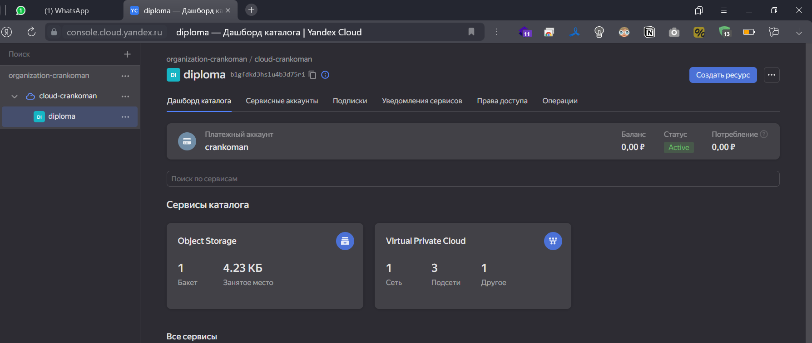

# Дипломный проект Муртазина Р.Г., группа DEVOPS-24 #

## Цели: ##

1. Подготовить облачную инфраструктуру на базе облачного провайдера Яндекс.Облако.
2. Запустить и сконфигурировать Kubernetes кластер.
3. Установить и настроить систему мониторинга.
4. Настроить и автоматизировать сборку тестового приложения с использованием Docker-контейнеров.
5. Настроить CI для автоматической сборки и тестирования.
6. Настроить CD для автоматического развёртывания приложения.

Описание самого задания [задание на дипломную практику](./task.md)

### 1. Создание облачной инфраструктуры ###

Для подгтовки облачной инфрастуктуры использем terraform и платформу Yandex.Cloud.
0. Готовим предпологаемую [схему будущего решения](./Схема.drawio). 
1. Создаем сервисный аккаунт в Yandex.Cloud с минимальными, но достаточными правами (`admin` в специальном каталоге `diploma`).
   Создаем папку `yc resource-manager folder create --name diploma`
   Создаем аккаунт `yc iam service-account create --name diploma-sa --folder-name diploma` 
   и назначаем права `yc resource-manager folder add-access-binding diploma --role admin --subject serviceAccount:aje*`
   получаем ключ `yc iam key create --folder-name diploma --service-account-name diploma-sa --output key.json`

2. Готовим terraform который создаст специальную сервисную учетку `tf-sa` и S3 бакет для terraform backend в основном проекте [в отдельной папке](./preparation/) и запускаем его
    Результат:

`terraform apply --auto-approve`
<details>
    <summary>подробнее</summary>

```shell
Terraform used the selected providers to generate the following execution plan. Resource actions are indicated with the following symbols:
  + create

Terraform will perform the following actions:

  # local_file.backend-conf will be created
  + resource "local_file" "backend-conf" {
      + content              = (sensitive value)
      + content_base64sha256 = (known after apply)
      + content_base64sha512 = (known after apply)
      + content_md5          = (known after apply)
      + content_sha1         = (known after apply)
      + content_sha256       = (known after apply)
      + content_sha512       = (known after apply)
      + directory_permission = "0777"
      + file_permission      = "0777"
      + filename             = "../terraform/backend.key"
      + id                   = (known after apply)
    }

  # null_resource.example will be created
  + resource "null_resource" "example" {
      + id = (known after apply)
    }

  # yandex_iam_service_account.tf-sa will be created
  + resource "yandex_iam_service_account" "tf-sa" {
      + created_at = (known after apply)
      + folder_id  = (known after apply)
      + id         = (known after apply)
      + name       = "tf-sa"
    }

  # yandex_iam_service_account_static_access_key.tf-key will be created
  + resource "yandex_iam_service_account_static_access_key" "tf-key" {
      + access_key           = (known after apply)
      + created_at           = (known after apply)
      + encrypted_secret_key = (known after apply)
      + id                   = (known after apply)
      + key_fingerprint      = (known after apply)
      + secret_key           = (sensitive value)
      + service_account_id   = (known after apply)
    }

  # yandex_resourcemanager_folder_iam_member.tf-sa-editor will be created
  + resource "yandex_resourcemanager_folder_iam_member" "tf-sa-editor" {
      + folder_id = "b1gfdkd3hs1u4b3d75ri"
      + id        = (known after apply)
      + member    = (known after apply)
      + role      = "editor"
    }

  # yandex_storage_bucket.s3-backet will be created
  + resource "yandex_storage_bucket" "s3-backet" {
      + access_key            = (known after apply)
      + bucket                = "diploma-bucket-mrg"
      + bucket_domain_name    = (known after apply)
      + default_storage_class = (known after apply)
      + folder_id             = (known after apply)
      + force_destroy         = true
      + id                    = (known after apply)
      + secret_key            = (sensitive value)
      + website_domain        = (known after apply)
      + website_endpoint      = (known after apply)

      + anonymous_access_flags {
          + list = false
          + read = false
        }
    }

Plan: 6 to add, 0 to change, 0 to destroy.

Do you want to perform these actions?
  Terraform will perform the actions described above.
  Only 'yes' will be accepted to approve.

  Enter a value: yes

yandex_iam_service_account.tf-sa: Creating...
yandex_iam_service_account.tf-sa: Creation complete after 2s [id=ajeojd3c14kdhu5ff7s7]
yandex_resourcemanager_folder_iam_member.tf-sa-editor: Creating...
yandex_resourcemanager_folder_iam_member.tf-sa-editor: Creation complete after 3s [id=b1gfdkd3hs1u4b3d75ri/editor/serviceAccount:ajeojd3c14kdhu5ff7s7]
yandex_iam_service_account_static_access_key.tf-key: Creating...
null_resource.example: Creating...
null_resource.example: Provisioning with 'local-exec'...
null_resource.example (local-exec): Executing: ["/bin/sh" "-c" "yc iam key create --folder-name diploma --service-account-name tf-sa --output ../terraform/key.json"]
yandex_iam_service_account_static_access_key.tf-key: Creation complete after 2s [id=ajeb4va4p201dttmh682]
yandex_storage_bucket.s3-backet: Creating...
null_resource.example (local-exec): id: ajeu890n8pg7sgc6gcr6
null_resource.example (local-exec): service_account_id: ajeojd3c14kdhu5ff7s7
null_resource.example (local-exec): created_at: "2024-02-18T13:07:50.000436976Z"
null_resource.example (local-exec): key_algorithm: RSA_2048

null_resource.example: Creation complete after 3s [id=9201043436021380133]
yandex_storage_bucket.s3-backet: Creation complete after 7s [id=diploma-bucket-mrg]
local_file.backend-conf: Creating...
local_file.backend-conf: Creation complete after 0s [id=8d42cd261bfb489bd1f36f0ea54277836ecfa277]

Apply complete! Resources: 6 added, 0 changed, 0 destroyed.
```
</details>

3. Готовим [основновной манифест](./terraform/) terraform с VPC и запускаем егоиспользуя ключи из `backend.key` которые получили на прошлом шаге
    Результат:
`terraform init -backend-config="access_key=***" -backend-config="secret_key=***"`
`terraform apply --auto-approve`

<details>
    <summary>подробнее</summary>

```shell
Terraform used the selected providers to generate the following execution plan. Resource actions are indicated with the following symbols:
  + create

Terraform will perform the following actions:

  # yandex_vpc_network.net will be created
  + resource "yandex_vpc_network" "net" {
      + created_at                = (known after apply)
      + default_security_group_id = (known after apply)
      + folder_id                 = "b1gfdkd3hs1u4b3d75ri"
      + id                        = (known after apply)
      + labels                    = (known after apply)
      + name                      = "net"
      + subnet_ids                = (known after apply)
    }

  # yandex_vpc_subnet.central1-a will be created
  + resource "yandex_vpc_subnet" "central1-a" {
      + created_at     = (known after apply)
      + folder_id      = (known after apply)
      + id             = (known after apply)
      + labels         = (known after apply)
      + name           = "central1-a"
      + network_id     = (known after apply)
      + v4_cidr_blocks = [
          + "10.0.1.0/24",
        ]
      + v6_cidr_blocks = (known after apply)
      + zone           = "ru-central1-a"
    }

  # yandex_vpc_subnet.central1-b will be created
  + resource "yandex_vpc_subnet" "central1-b" {
      + created_at     = (known after apply)
      + folder_id      = (known after apply)
      + id             = (known after apply)
      + labels         = (known after apply)
      + name           = "central1-b"
      + network_id     = (known after apply)
      + v4_cidr_blocks = [
          + "10.0.2.0/24",
        ]
      + v6_cidr_blocks = (known after apply)
      + zone           = "ru-central1-b"
    }

  # yandex_vpc_subnet.central1-d will be created
  + resource "yandex_vpc_subnet" "central1-d" {
      + created_at     = (known after apply)
      + folder_id      = (known after apply)
      + id             = (known after apply)
      + labels         = (known after apply)
      + name           = "central1-d"
      + network_id     = (known after apply)
      + v4_cidr_blocks = [
          + "10.0.3.0/24",
        ]
      + v6_cidr_blocks = (known after apply)
      + zone           = "ru-central1-d"
    }

Plan: 4 to add, 0 to change, 0 to destroy.

Do you want to perform these actions?
  Terraform will perform the actions described above.
  Only 'yes' will be accepted to approve.

  Enter a value: yes

yandex_vpc_network.net: Creating...
yandex_vpc_network.net: Creation complete after 2s [id=enpap2ros4da48s7rhog]
yandex_vpc_subnet.central1-a: Creating...
yandex_vpc_subnet.central1-b: Creating...
yandex_vpc_subnet.central1-d: Creating...
yandex_vpc_subnet.central1-a: Creation complete after 1s [id=e9bdj2gfsb4ecrblt15h]
yandex_vpc_subnet.central1-d: Creation complete after 1s [id=fl8rjil4vn08v4oadkdb]
yandex_vpc_subnet.central1-b: Creation complete after 2s [id=e2ls33l4msj3emotbiqp]

Apply complete! Resources: 4 added, 0 changed, 0 destroyed.
```
</details>

4. Проверяем `terraform destroy` и `terraform apply`
    Результат:
    
<details>
    <summary>подробнее</summary>

```shell
terraform destroy
yandex_vpc_network.net: Refreshing state... [id=enpap2ros4da48s7rhog]
yandex_vpc_subnet.central1-a: Refreshing state... [id=e9bdj2gfsb4ecrblt15h]
yandex_vpc_subnet.central1-d: Refreshing state... [id=fl8rjil4vn08v4oadkdb]
yandex_vpc_subnet.central1-b: Refreshing state... [id=e2ls33l4msj3emotbiqp]

Terraform used the selected providers to generate the following execution plan. Resource actions are indicated with the following symbols:
  - destroy

Terraform will perform the following actions:

  # yandex_vpc_network.net will be destroyed
  - resource "yandex_vpc_network" "net" {
      - created_at                = "2024-02-18T14:52:06Z" -> null
      - default_security_group_id = "enpdm55p76otmo1k30vf" -> null
      - folder_id                 = "b1gfdkd3hs1u4b3d75ri" -> null
      - id                        = "enpap2ros4da48s7rhog" -> null
      - labels                    = {} -> null
      - name                      = "net" -> null
      - subnet_ids                = [
          - "e2ls33l4msj3emotbiqp",
          - "e9bdj2gfsb4ecrblt15h",
          - "fl8rjil4vn08v4oadkdb",
        ] -> null
    }

  # yandex_vpc_subnet.central1-a will be destroyed
  - resource "yandex_vpc_subnet" "central1-a" {
      - created_at     = "2024-02-18T14:52:08Z" -> null
      - folder_id      = "b1gfdkd3hs1u4b3d75ri" -> null
      - id             = "e9bdj2gfsb4ecrblt15h" -> null
      - labels         = {} -> null
      - name           = "central1-a" -> null
      - network_id     = "enpap2ros4da48s7rhog" -> null
      - v4_cidr_blocks = [
          - "10.0.1.0/24",
        ] -> null
      - v6_cidr_blocks = [] -> null
      - zone           = "ru-central1-a" -> null
    }

  # yandex_vpc_subnet.central1-b will be destroyed
  - resource "yandex_vpc_subnet" "central1-b" {
      - created_at     = "2024-02-18T14:52:09Z" -> null
      - folder_id      = "b1gfdkd3hs1u4b3d75ri" -> null
      - id             = "e2ls33l4msj3emotbiqp" -> null
      - labels         = {} -> null
      - name           = "central1-b" -> null
      - network_id     = "enpap2ros4da48s7rhog" -> null
      - v4_cidr_blocks = [
          - "10.0.2.0/24",
        ] -> null
      - v6_cidr_blocks = [] -> null
      - zone           = "ru-central1-b" -> null
    }

  # yandex_vpc_subnet.central1-d will be destroyed
  - resource "yandex_vpc_subnet" "central1-d" {
      - created_at     = "2024-02-18T14:52:08Z" -> null
      - folder_id      = "b1gfdkd3hs1u4b3d75ri" -> null
      - id             = "fl8rjil4vn08v4oadkdb" -> null
      - labels         = {} -> null
      - name           = "central1-d" -> null
      - network_id     = "enpap2ros4da48s7rhog" -> null
      - v4_cidr_blocks = [
          - "10.0.3.0/24",
        ] -> null
      - v6_cidr_blocks = [] -> null
      - zone           = "ru-central1-d" -> null
    }

Plan: 0 to add, 0 to change, 4 to destroy.

Do you really want to destroy all resources?
  Terraform will destroy all your managed infrastructure, as shown above.
  There is no undo. Only 'yes' will be accepted to confirm.

  Enter a value: yes

yandex_vpc_subnet.central1-a: Destroying... [id=e9bdj2gfsb4ecrblt15h]
yandex_vpc_subnet.central1-b: Destroying... [id=e2ls33l4msj3emotbiqp]
yandex_vpc_subnet.central1-d: Destroying... [id=fl8rjil4vn08v4oadkdb]
yandex_vpc_subnet.central1-a: Destruction complete after 1s
yandex_vpc_subnet.central1-d: Destruction complete after 1s
yandex_vpc_subnet.central1-b: Destruction complete after 2s
yandex_vpc_network.net: Destroying... [id=enpap2ros4da48s7rhog]
yandex_vpc_network.net: Destruction complete after 1s

Destroy complete! Resources: 4 destroyed.

terraform apply

Terraform used the selected providers to generate the following execution plan. Resource actions are indicated with the following symbols:
  + create

Terraform will perform the following actions:

  # yandex_vpc_network.net will be created
  + resource "yandex_vpc_network" "net" {
      + created_at                = (known after apply)
      + default_security_group_id = (known after apply)
      + folder_id                 = "b1gfdkd3hs1u4b3d75ri"
      + id                        = (known after apply)
      + labels                    = (known after apply)
      + name                      = "net"
      + subnet_ids                = (known after apply)
    }

  # yandex_vpc_subnet.central1-a will be created
  + resource "yandex_vpc_subnet" "central1-a" {
      + created_at     = (known after apply)
      + folder_id      = (known after apply)
      + id             = (known after apply)
      + labels         = (known after apply)
      + name           = "central1-a"
      + network_id     = (known after apply)
      + v4_cidr_blocks = [
          + "10.0.1.0/24",
        ]
      + v6_cidr_blocks = (known after apply)
      + zone           = "ru-central1-a"
    }

  # yandex_vpc_subnet.central1-b will be created
  + resource "yandex_vpc_subnet" "central1-b" {
      + created_at     = (known after apply)
      + folder_id      = (known after apply)
      + id             = (known after apply)
      + labels         = (known after apply)
      + name           = "central1-b"
      + network_id     = (known after apply)
      + v4_cidr_blocks = [
          + "10.0.2.0/24",
        ]
      + v6_cidr_blocks = (known after apply)
      + zone           = "ru-central1-b"
    }

  # yandex_vpc_subnet.central1-d will be created
  + resource "yandex_vpc_subnet" "central1-d" {
      + created_at     = (known after apply)
      + folder_id      = (known after apply)
      + id             = (known after apply)
      + labels         = (known after apply)
      + name           = "central1-d"
      + network_id     = (known after apply)
      + v4_cidr_blocks = [
          + "10.0.3.0/24",
        ]
      + v6_cidr_blocks = (known after apply)
      + zone           = "ru-central1-d"
    }

Plan: 4 to add, 0 to change, 0 to destroy.

Do you want to perform these actions?
  Terraform will perform the actions described above.
  Only 'yes' will be accepted to approve.

  Enter a value: yes

yandex_vpc_network.net: Creating...
yandex_vpc_network.net: Creation complete after 3s [id=enphu03trs71ktj82oq7]
yandex_vpc_subnet.central1-d: Creating...
yandex_vpc_subnet.central1-a: Creating...
yandex_vpc_subnet.central1-b: Creating...
yandex_vpc_subnet.central1-d: Creation complete after 0s [id=fl8vgfkjai1etvvb1ec9]
yandex_vpc_subnet.central1-b: Creation complete after 1s [id=e2lbsbv8tlurjhd8fl2e]
yandex_vpc_subnet.central1-a: Creation complete after 2s [id=e9b5bqc79b2016l1452u]

Apply complete! Resources: 4 added, 0 changed, 0 destroyed.
```
</details>




---
### 2. Создание Kubernetes кластера

Для создание k8s-кластера нам потребуются создать по 3-и master и worker ноды размещенные в разных расположениях в соответсвии со схемой.

используем манифесты `./terraform/k8s-masters.tf` и `./terraform/k8s-workers.tf` `./terraform/ansible.tf`. Которые поднимут ВМ и через kubespray развернут кластер.

Установим kubespray, он будет находится в `./ansible/kubespray`

```shell
wget https://github.com/kubernetes-sigs/kubespray/archive/refs/tags/v2.21.0.tar.gz
tar -xvzf v2.21.0.tar.gz
mv kubespray-2.21.0 kubespray
python3 -m pip install --upgrade pip
pip3 install -r kubespray/requirements.txt
```

Запустим `terraform apply --auto-approve` (не буду приводить листинг)

Проверим кластер

<details>
    <summary>подробнее</summary>

```shell
kubectl get nodes -A -owide
NAME       STATUS   ROLES           AGE   VERSION   INTERNAL-IP   EXTERNAL-IP   OS-IMAGE           KERNEL-VERSION     CONTAINER-RUNTIME
master-1   Ready    control-plane   36m   v1.25.6   10.0.1.5      <none>        Ubuntu 20.04 LTS   5.4.0-26-generic   containerd://1.6.15
master-2   Ready    control-plane   35m   v1.25.6   10.0.2.33     <none>        Ubuntu 20.04 LTS   5.4.0-26-generic   containerd://1.6.15
master-3   Ready    control-plane   35m   v1.25.6   10.0.3.31     <none>        Ubuntu 20.04 LTS   5.4.0-26-generic   containerd://1.6.15
worker-1   Ready    <none>          32m   v1.25.6   10.0.1.27     <none>        Ubuntu 20.04 LTS   5.4.0-26-generic   containerd://1.6.15
worker-2   Ready    <none>          32m   v1.25.6   10.0.2.32     <none>        Ubuntu 20.04 LTS   5.4.0-26-generic   containerd://1.6.15
worker-3   Ready    <none>          32m   v1.25.6   10.0.3.18     <none>        Ubuntu 20.04 LTS   5.4.0-26-generic   containerd://1.6.15

kubectl get pods -A -owide
NAMESPACE     NAME                                       READY   STATUS    RESTARTS      AGE   IP               NODE       NOMINATED NODE   READINESS GATES
kube-system   calico-kube-controllers-75748cc9fd-cvk52   1/1     Running   0             29m   10.233.125.65    worker-3   <none>           <none>
kube-system   calico-node-4zh7w                          1/1     Running   0             31m   10.0.3.18        worker-3   <none>           <none>
kube-system   calico-node-74xz9                          1/1     Running   0             31m   10.0.3.31        master-3   <none>           <none>
kube-system   calico-node-kc5c8                          1/1     Running   0             31m   10.0.2.33        master-2   <none>           <none>
kube-system   calico-node-lcb8t                          1/1     Running   0             31m   10.0.1.27        worker-1   <none>           <none>
kube-system   calico-node-qx7jh                          1/1     Running   0             31m   10.0.1.5         master-1   <none>           <none>
kube-system   calico-node-v4fz8                          1/1     Running   0             31m   10.0.2.32        worker-2   <none>           <none>
kube-system   coredns-588bb58b94-blqlg                   1/1     Running   0             28m   10.233.80.65     master-3   <none>           <none>
kube-system   coredns-588bb58b94-sx9js                   1/1     Running   0             27m   10.233.118.129   master-1   <none>           <none>
kube-system   dns-autoscaler-5b9959d7fc-9jrx5            1/1     Running   0             27m   10.233.78.65     master-2   <none>           <none>
kube-system   kube-apiserver-master-1                    1/1     Running   1             36m   10.0.1.5         master-1   <none>           <none>
kube-system   kube-apiserver-master-2                    1/1     Running   1             35m   10.0.2.33        master-2   <none>           <none>
kube-system   kube-apiserver-master-3                    1/1     Running   1             34m   10.0.3.31        master-3   <none>           <none>
kube-system   kube-controller-manager-master-1           1/1     Running   1             36m   10.0.1.5         master-1   <none>           <none>
kube-system   kube-controller-manager-master-2           1/1     Running   1             35m   10.0.2.33        master-2   <none>           <none>
kube-system   kube-controller-manager-master-3           1/1     Running   2 (30m ago)   34m   10.0.3.31        master-3   <none>           <none>
kube-system   kube-proxy-9tjwt                           1/1     Running   0             32m   10.0.1.27        worker-1   <none>           <none>
kube-system   kube-proxy-bp2k2                           1/1     Running   0             32m   10.0.2.33        master-2   <none>           <none>
kube-system   kube-proxy-gtr2p                           1/1     Running   0             32m   10.0.3.18        worker-3   <none>           <none>
kube-system   kube-proxy-nkkmj                           1/1     Running   0             32m   10.0.3.31        master-3   <none>           <none>
kube-system   kube-proxy-pzrmj                           1/1     Running   0             32m   10.0.1.5         master-1   <none>           <none>
kube-system   kube-proxy-r8fff                           1/1     Running   0             32m   10.0.2.32        worker-2   <none>           <none>
kube-system   kube-scheduler-master-1                    1/1     Running   1             36m   10.0.1.5         master-1   <none>           <none>
kube-system   kube-scheduler-master-2                    1/1     Running   2 (30m ago)   35m   10.0.2.33        master-2   <none>           <none>
kube-system   kube-scheduler-master-3                    1/1     Running   1             34m   10.0.3.31        master-3   <none>           <none>
kube-system   nginx-proxy-worker-1                       1/1     Running   0             31m   10.0.1.27        worker-1   <none>           <none>
kube-system   nginx-proxy-worker-2                       1/1     Running   0             31m   10.0.2.32        worker-2   <none>           <none>
kube-system   nginx-proxy-worker-3                       1/1     Running   0             31m   10.0.3.18        worker-3   <none>           <none>
kube-system   nodelocaldns-ckb45                         1/1     Running   0             27m   10.0.1.5         master-1   <none>           <none>
kube-system   nodelocaldns-fgq4z                         1/1     Running   0             27m   10.0.1.27        worker-1   <none>           <none>
kube-system   nodelocaldns-hk8hn                         1/1     Running   0             27m   10.0.2.33        master-2   <none>           <none>
kube-system   nodelocaldns-kzlkd                         1/1     Running   0             27m   10.0.3.31        master-3   <none>           <none>
kube-system   nodelocaldns-tz8sb                         1/1     Running   0             27m   10.0.2.32        worker-2   <none>           <none>
kube-system   nodelocaldns-zrjwx                         1/1     Running   0             27m   10.0.3.18        worker-3   <none>           <none>

```
</details>

---
### 3. Создание тестового приложения

Создадим отдельны репозиторий для тестого приложения [отдельный репозиторий для тестового приложения](https://github.com/Crankoman/testapp). Раместим там страницу и Docker-файл создающий конетейнер с nginx, который отображает ее.


напишем набор bash команд, которые скопируют из репозитория файлы, соберут образ и запушат их в dockerhub.

<details>
    <summary>подробнее</summary>

Скачиваем подготовленный репозитарий

```shell
git clone https://github.com/Crankoman/testapp
Cloning into 'testapp'...
remote: Enumerating objects: 6, done.
remote: Counting objects: 100% (6/6), done.
remote: Compressing objects: 100% (5/5), done.
remote: Total 6 (delta 0), reused 6 (delta 0), pack-reused 0
Receiving objects: 100% (6/6), done.

cd testapp/
```

Проверяем версию докера (который поставил ранее), и авторизиовывемся в dockerhub

```shell
docker --version
Docker version 25.0.4, build 1a576c5

docker login
Log in with your Docker ID or email address to push and pull images from Docker Hub. If you don't have a Docker ID, head over to https://hub.docker.com/ to create one.
You can log in with your password or a Personal Access Token (PAT). Using a limited-scope PAT grants better security and is required for organizations using SSO. Learn more at https://docs.docker.com/go/access-tokens/

Username: crankoman
Password:
WARNING! Your password will be stored unencrypted in /home/devops/.docker/config.json.
Configure a credential helper to remove this warning. See
https://docs.docker.com/engine/reference/commandline/login/#credentials-store

Login Succeeded
```

Билдим образ и пушим в докерхаб

```shell
sudo docker build -t crankoman/testapp:v1.0.0 .
[+] Building 27.1s (8/8) FINISHED                                                                                                                  docker:default
 => [internal] load build definition from Dockerfile                                                                                                         0.3s
 => => transferring dockerfile: 89B                                                                                                                          0.0s
 => [internal] load metadata for docker.io/library/nginx:latest                                                                                              4.0s
 => [auth] library/nginx:pull token for registry-1.docker.io                                                                                                 0.0s
 => [internal] load .dockerignore                                                                                                                            0.2s
 => => transferring context: 2B                                                                                                                              0.0s
 => [internal] load build context                                                                                                                            0.4s
 => => transferring context: 1.28kB                                                                                                                          0.0s
 => [1/2] FROM docker.io/library/nginx:latest@sha256:c26ae7472d624ba1fafd296e73cecc4f93f853088e6a9c13c0d52f6ca5865107                                       21.2s
 => => resolve docker.io/library/nginx:latest@sha256:c26ae7472d624ba1fafd296e73cecc4f93f853088e6a9c13c0d52f6ca5865107                                        0.3s
 => => sha256:88f6f236f401ac07aa5309d8ade2b0c9d24b9f526bd4e73311bf5c1787cfd49c 41.39MB / 41.39MB                                                             9.6s
 => => sha256:c26ae7472d624ba1fafd296e73cecc4f93f853088e6a9c13c0d52f6ca5865107 9.85kB / 9.85kB                                                               0.0s
 => => sha256:e4720093a3c1381245b53a5a51b417963b3c4472d3f47fc301930a4f3b17666a 7.04kB / 7.04kB                                                               0.0s
 => => sha256:05aa73005987caaed48ea8213696b0df761ccd600d2c53fc0a1a97a180301d71 2.29kB / 2.29kB                                                               0.0s
 => => sha256:e1caac4eb9d2ec24aa3618e5992208321a92492aef5fef5eb9e470895f771c56 29.12MB / 29.12MB                                                             8.7s
 => => sha256:c3ea3344e711fd7111dee02f17deebceb725ed1d0ee998f7fb472114dc1399ce 629B / 629B                                                                   1.0s
 => => sha256:cc1bb4345a3a849289cfb3e2471c096f374423ec1ef74766137b9de546498612 957B / 957B                                                                   1.3s
 => => sha256:da8fa4352481b358fc60d40ee20d92da64124d2cf405115640d45980339f47e5 394B / 394B                                                                   1.8s
 => => sha256:c7f80e9cdab20387cd09e3c47121ef0eb531043cf0aca1a52aab659de3ccb704 1.21kB / 1.21kB                                                               2.1s
 => => sha256:18a869624cb60aaa916942dc71c22b194a078dcbbb9b8f54d40512eba55f70b8 1.40kB / 1.40kB                                                               2.4s
 => => extracting sha256:e1caac4eb9d2ec24aa3618e5992208321a92492aef5fef5eb9e470895f771c56                                                                    4.4s
 => => extracting sha256:88f6f236f401ac07aa5309d8ade2b0c9d24b9f526bd4e73311bf5c1787cfd49c                                                                    4.1s
 => => extracting sha256:c3ea3344e711fd7111dee02f17deebceb725ed1d0ee998f7fb472114dc1399ce                                                                    0.0s
 => => extracting sha256:cc1bb4345a3a849289cfb3e2471c096f374423ec1ef74766137b9de546498612                                                                    0.0s
 => => extracting sha256:da8fa4352481b358fc60d40ee20d92da64124d2cf405115640d45980339f47e5                                                                    0.0s
 => => extracting sha256:c7f80e9cdab20387cd09e3c47121ef0eb531043cf0aca1a52aab659de3ccb704                                                                    0.0s
 => => extracting sha256:18a869624cb60aaa916942dc71c22b194a078dcbbb9b8f54d40512eba55f70b8                                                                    0.0s
 => [2/2] COPY content /usr/share/nginx/html                                                                                                                 1.0s
 => exporting to image                                                                                                                                       0.2s
 => => exporting layers                                                                                                                                      0.1s
 => => writing image sha256:190d0aaf1d28b2390eb27406e54ee7930840245bd65edc53463128d58b933fca                                                                 0.0s
 => => naming to docker.io/crankoman/testapp:v1.0.0  
```

```shell
sudo docker push crankoman/testapp:v1.0.0
The push refers to repository [docker.io/crankoman/testapp]
5926c692aecb: Pushed
61a7fb4dabcd: Mounted from library/nginx
bcc6856722b7: Mounted from library/nginx
188d128a188c: Mounted from library/nginx
7d52a4114c36: Mounted from library/nginx
3137f8f0c641: Mounted from library/nginx
84619992a45b: Mounted from library/nginx
ceb365432eec: Mounted from library/nginx
v1.0.0: digest: sha256:086af7bac23a5bc38d0d433c0f6d71744e47520ce3c063ee23c75bb6867f0a7a size: 1985
```

</details>

---
### 4. Подготовка cистемы мониторинга и деплой приложения

Скопируем [репозиторий kube-prometheus](https://github.com/prometheus-operator/kube-prometheus)

```shell
git clone https://github.com/prometheus-operator/kube-prometheus
Cloning into 'kube-prometheus'...
remote: Enumerating objects: 19363, done.
remote: Counting objects: 100% (5825/5825), done.
remote: Compressing objects: 100% (469/469), done.
remote: Total 19363 (delta 5569), reused 5440 (delta 5330), pack-reused 13538
Receiving objects: 100% (19363/19363), 10.21 MiB | 6.14 MiB/s, done.
Resolving deltas: 100% (13159/13159), done.
cd kube-prometheus
```

Развернем его в кластере продублируем код в `./terraform/monitoring.tf`

```shell
kubectl apply --server-side -f manifests/setup
customresourcedefinition.apiextensions.k8s.io/alertmanagerconfigs.monitoring.coreos.com serverside-applied
customresourcedefinition.apiextensions.k8s.io/alertmanagers.monitoring.coreos.com serverside-applied
customresourcedefinition.apiextensions.k8s.io/podmonitors.monitoring.coreos.com serverside-applied
customresourcedefinition.apiextensions.k8s.io/probes.monitoring.coreos.com serverside-applied
customresourcedefinition.apiextensions.k8s.io/prometheuses.monitoring.coreos.com serverside-applied
customresourcedefinition.apiextensions.k8s.io/prometheusagents.monitoring.coreos.com serverside-applied
customresourcedefinition.apiextensions.k8s.io/prometheusrules.monitoring.coreos.com serverside-applied
customresourcedefinition.apiextensions.k8s.io/scrapeconfigs.monitoring.coreos.com serverside-applied
customresourcedefinition.apiextensions.k8s.io/servicemonitors.monitoring.coreos.com serverside-applied
customresourcedefinition.apiextensions.k8s.io/thanosrulers.monitoring.coreos.com serverside-applied
namespace/monitoring serverside-applied

kubectl wait \
	--for condition=Established \
	--all CustomResourceDefinition \
	--namespace=monitoring
customresourcedefinition.apiextensions.k8s.io/alertmanagerconfigs.monitoring.coreos.com condition met
customresourcedefinition.apiextensions.k8s.io/alertmanagers.monitoring.coreos.com condition met
customresourcedefinition.apiextensions.k8s.io/bgpconfigurations.crd.projectcalico.org condition met
customresourcedefinition.apiextensions.k8s.io/bgppeers.crd.projectcalico.org condition met
customresourcedefinition.apiextensions.k8s.io/blockaffinities.crd.projectcalico.org condition met
customresourcedefinition.apiextensions.k8s.io/caliconodestatuses.crd.projectcalico.org condition met
customresourcedefinition.apiextensions.k8s.io/clusterinformations.crd.projectcalico.org condition met
customresourcedefinition.apiextensions.k8s.io/felixconfigurations.crd.projectcalico.org condition met
customresourcedefinition.apiextensions.k8s.io/globalnetworkpolicies.crd.projectcalico.org condition met
customresourcedefinition.apiextensions.k8s.io/globalnetworksets.crd.projectcalico.org condition met
customresourcedefinition.apiextensions.k8s.io/hostendpoints.crd.projectcalico.org condition met
customresourcedefinition.apiextensions.k8s.io/ipamblocks.crd.projectcalico.org condition met
customresourcedefinition.apiextensions.k8s.io/ipamconfigs.crd.projectcalico.org condition met
customresourcedefinition.apiextensions.k8s.io/ipamhandles.crd.projectcalico.org condition met
customresourcedefinition.apiextensions.k8s.io/ippools.crd.projectcalico.org condition met
customresourcedefinition.apiextensions.k8s.io/ipreservations.crd.projectcalico.org condition met
customresourcedefinition.apiextensions.k8s.io/kubecontrollersconfigurations.crd.projectcalico.org condition met
customresourcedefinition.apiextensions.k8s.io/networkpolicies.crd.projectcalico.org condition met
customresourcedefinition.apiextensions.k8s.io/networksets.crd.projectcalico.org condition met
customresourcedefinition.apiextensions.k8s.io/podmonitors.monitoring.coreos.com condition met
customresourcedefinition.apiextensions.k8s.io/probes.monitoring.coreos.com condition met
customresourcedefinition.apiextensions.k8s.io/prometheusagents.monitoring.coreos.com condition met
customresourcedefinition.apiextensions.k8s.io/prometheuses.monitoring.coreos.com condition met
customresourcedefinition.apiextensions.k8s.io/prometheusrules.monitoring.coreos.com condition met
customresourcedefinition.apiextensions.k8s.io/scrapeconfigs.monitoring.coreos.com condition met
customresourcedefinition.apiextensions.k8s.io/servicemonitors.monitoring.coreos.com condition met
customresourcedefinition.apiextensions.k8s.io/thanosrulers.monitoring.coreos.com condition met

kubectl apply -f manifests/
alertmanager.monitoring.coreos.com/main created
networkpolicy.networking.k8s.io/alertmanager-main created
poddisruptionbudget.policy/alertmanager-main created
prometheusrule.monitoring.coreos.com/alertmanager-main-rules created
secret/alertmanager-main created
service/alertmanager-main created
serviceaccount/alertmanager-main created
servicemonitor.monitoring.coreos.com/alertmanager-main created
clusterrole.rbac.authorization.k8s.io/blackbox-exporter created
clusterrolebinding.rbac.authorization.k8s.io/blackbox-exporter created
configmap/blackbox-exporter-configuration created
deployment.apps/blackbox-exporter created
networkpolicy.networking.k8s.io/blackbox-exporter created
service/blackbox-exporter created
serviceaccount/blackbox-exporter created
servicemonitor.monitoring.coreos.com/blackbox-exporter created
secret/grafana-config created
secret/grafana-datasources created
configmap/grafana-dashboard-alertmanager-overview created
configmap/grafana-dashboard-apiserver created
configmap/grafana-dashboard-cluster-total created
configmap/grafana-dashboard-controller-manager created
configmap/grafana-dashboard-grafana-overview created
configmap/grafana-dashboard-k8s-resources-cluster created
configmap/grafana-dashboard-k8s-resources-multicluster created
configmap/grafana-dashboard-k8s-resources-namespace created
configmap/grafana-dashboard-k8s-resources-node created
configmap/grafana-dashboard-k8s-resources-pod created
configmap/grafana-dashboard-k8s-resources-workload created
configmap/grafana-dashboard-k8s-resources-workloads-namespace created
configmap/grafana-dashboard-kubelet created
configmap/grafana-dashboard-namespace-by-pod created
configmap/grafana-dashboard-namespace-by-workload created
configmap/grafana-dashboard-node-cluster-rsrc-use created
configmap/grafana-dashboard-node-rsrc-use created
configmap/grafana-dashboard-nodes-darwin created
configmap/grafana-dashboard-nodes created
configmap/grafana-dashboard-persistentvolumesusage created
configmap/grafana-dashboard-pod-total created
configmap/grafana-dashboard-prometheus-remote-write created
configmap/grafana-dashboard-prometheus created
configmap/grafana-dashboard-proxy created
configmap/grafana-dashboard-scheduler created
configmap/grafana-dashboard-workload-total created
configmap/grafana-dashboards created
deployment.apps/grafana created
networkpolicy.networking.k8s.io/grafana created
prometheusrule.monitoring.coreos.com/grafana-rules created
service/grafana created
serviceaccount/grafana created
servicemonitor.monitoring.coreos.com/grafana created
prometheusrule.monitoring.coreos.com/kube-prometheus-rules created
clusterrole.rbac.authorization.k8s.io/kube-state-metrics created
clusterrolebinding.rbac.authorization.k8s.io/kube-state-metrics created
deployment.apps/kube-state-metrics created
networkpolicy.networking.k8s.io/kube-state-metrics created
prometheusrule.monitoring.coreos.com/kube-state-metrics-rules created
service/kube-state-metrics created
serviceaccount/kube-state-metrics created
servicemonitor.monitoring.coreos.com/kube-state-metrics created
prometheusrule.monitoring.coreos.com/kubernetes-monitoring-rules created
servicemonitor.monitoring.coreos.com/kube-apiserver created
servicemonitor.monitoring.coreos.com/coredns created
servicemonitor.monitoring.coreos.com/kube-controller-manager created
servicemonitor.monitoring.coreos.com/kube-scheduler created
servicemonitor.monitoring.coreos.com/kubelet created
clusterrole.rbac.authorization.k8s.io/node-exporter created
clusterrolebinding.rbac.authorization.k8s.io/node-exporter created
daemonset.apps/node-exporter created
networkpolicy.networking.k8s.io/node-exporter created
prometheusrule.monitoring.coreos.com/node-exporter-rules created
service/node-exporter created
serviceaccount/node-exporter created
servicemonitor.monitoring.coreos.com/node-exporter created
clusterrole.rbac.authorization.k8s.io/prometheus-k8s created
clusterrolebinding.rbac.authorization.k8s.io/prometheus-k8s created
networkpolicy.networking.k8s.io/prometheus-k8s created
poddisruptionbudget.policy/prometheus-k8s created
prometheus.monitoring.coreos.com/k8s created
prometheusrule.monitoring.coreos.com/prometheus-k8s-prometheus-rules created
rolebinding.rbac.authorization.k8s.io/prometheus-k8s-config created
rolebinding.rbac.authorization.k8s.io/prometheus-k8s created
rolebinding.rbac.authorization.k8s.io/prometheus-k8s created
rolebinding.rbac.authorization.k8s.io/prometheus-k8s created
role.rbac.authorization.k8s.io/prometheus-k8s-config created
role.rbac.authorization.k8s.io/prometheus-k8s created
role.rbac.authorization.k8s.io/prometheus-k8s created
role.rbac.authorization.k8s.io/prometheus-k8s created
service/prometheus-k8s created
serviceaccount/prometheus-k8s created
servicemonitor.monitoring.coreos.com/prometheus-k8s created
apiservice.apiregistration.k8s.io/v1beta1.metrics.k8s.io created
clusterrole.rbac.authorization.k8s.io/prometheus-adapter created
clusterrole.rbac.authorization.k8s.io/system:aggregated-metrics-reader created
clusterrolebinding.rbac.authorization.k8s.io/prometheus-adapter created
clusterrolebinding.rbac.authorization.k8s.io/resource-metrics:system:auth-delegator created
clusterrole.rbac.authorization.k8s.io/resource-metrics-server-resources created
configmap/adapter-config created
deployment.apps/prometheus-adapter created
networkpolicy.networking.k8s.io/prometheus-adapter created
poddisruptionbudget.policy/prometheus-adapter created
rolebinding.rbac.authorization.k8s.io/resource-metrics-auth-reader created
service/prometheus-adapter created
serviceaccount/prometheus-adapter created
servicemonitor.monitoring.coreos.com/prometheus-adapter created
clusterrole.rbac.authorization.k8s.io/prometheus-operator created
clusterrolebinding.rbac.authorization.k8s.io/prometheus-operator created
deployment.apps/prometheus-operator created
networkpolicy.networking.k8s.io/prometheus-operator created
prometheusrule.monitoring.coreos.com/prometheus-operator-rules created
service/prometheus-operator created
serviceaccount/prometheus-operator created
servicemonitor.monitoring.coreos.com/prometheus-operator created

```

Подготовим network_load_balancer для доступа к grafana и testapp `./terraform/nlb.tf`

настроим развертывание в k8s тестового приложения `./terraform/nlb.tf`


---
### 5. Установка и настройка CI/CD

---