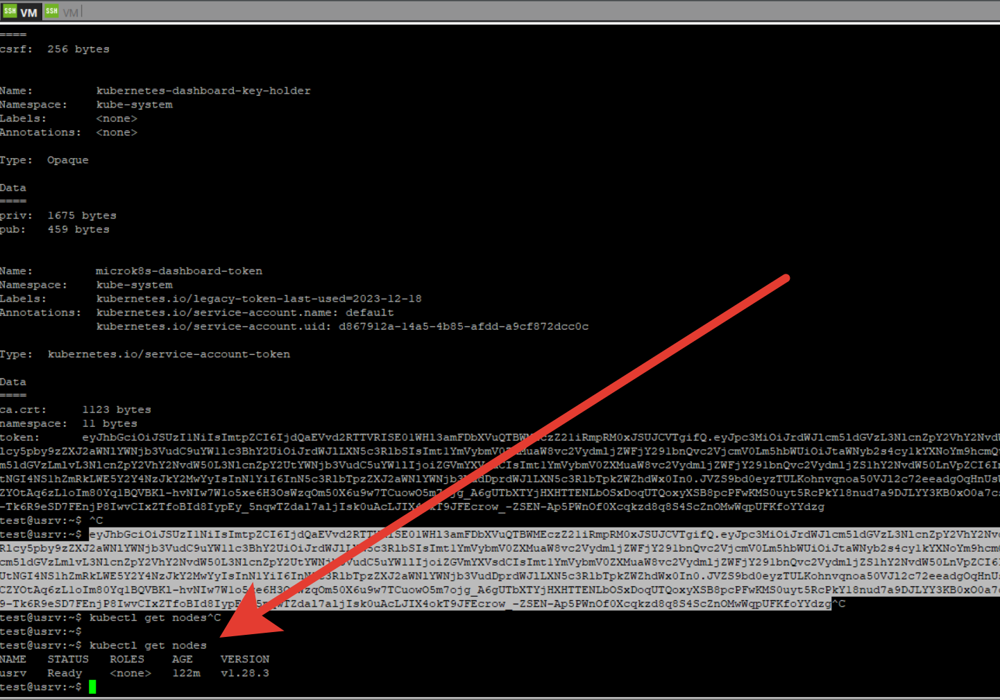
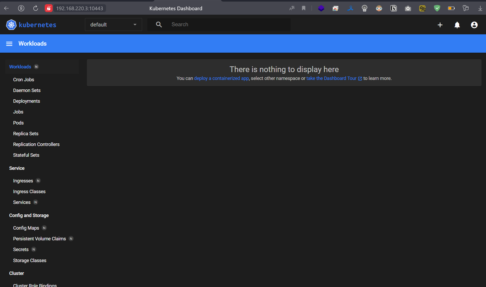

# Домашнее задание к занятию «Kubernetes. Причины появления. Команда kubectl»

### Цель задания

Для экспериментов и валидации ваших решений вам нужно подготовить тестовую среду для работы с Kubernetes. Оптимальное решение — развернуть на рабочей машине или на отдельной виртуальной машине MicroK8S.

------

### Задание 1. Установка MicroK8S

1. Установить MicroK8S на локальную машину или на удалённую виртуальную машину.
2. Установить dashboard.
3. Сгенерировать сертификат для подключения к внешнему ip-адресу.

------

### Задание 2. Установка и настройка локального kubectl
1. Установить на локальную машину kubectl.
2. Настроить локально подключение к кластеру.
3. Подключиться к дашборду с помощью port-forward.

------

<-- Ответ

1. После установки по инструкции microk8s и kubectl надо настроить подключение kubectl к ксласетру.
Выполним `microk8s config > /home/test/.kube/config`
2. После выполним проброс порта dashbord и разрешаем подключение с любого IP, запусим через nohup `nohup kubectl port-forward -n kube-system service/kubernetes-dashboard 10443:443 --address 0.0.0.0 &`

авторизуемся используя токен, который получим через `token=$(kubectl -n kube-system get secret | grep default-token | cut -d " " -f1) kubectl -n kube-system describe secret $token`

Скриншот `kubectl get nodes`

Скриншот дашборда
