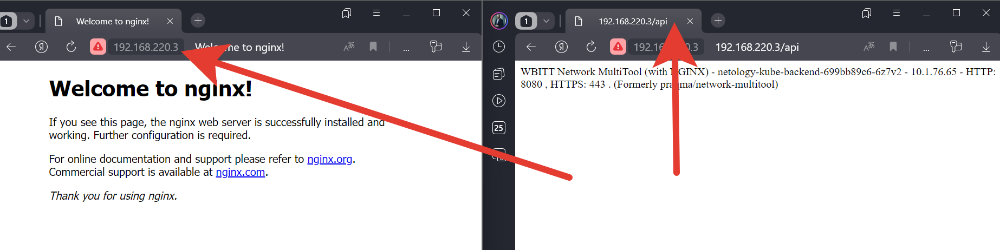

# Домашнее задание к занятию «Сетевое взаимодействие в K8S. Часть 2»

### Цель задания

В тестовой среде Kubernetes необходимо обеспечить доступ к двум приложениям снаружи кластера по разным путям.

------

### Задание 1. Создать Deployment приложений backend и frontend

1. Создать Deployment приложения _frontend_ из образа nginx с количеством реплик 3 шт.
2. Создать Deployment приложения _backend_ из образа multitool. 
3. Добавить Service, которые обеспечат доступ к обоим приложениям внутри кластера. 
4. Продемонстрировать, что приложения видят друг друга с помощью Service.
5. Предоставить манифесты Deployment и Service в решении, а также скриншоты или вывод команды п.4.

<-- Ответ

1. Создаем deployment_frontend [deployment_frontend.yaml](deployment_frontend.yaml) и развртываем `kubectl apply -f deployment_frontend.yaml`
2. Создаем deployment_frontend [deployment_backend.yaml](deployment_backend.yaml) и развртываем `kubectl apply -f deployment_backend.yaml`
3. Создаем deployment_frontend [service_frontend.yaml](service_frontend.yaml) и развртываем `kubectl apply -f service_frontend.yaml` и Создаем deployment_frontend [service_backend.yaml](service_backend.yaml) и развртываем `kubectl apply -f service_backend.yaml`
4. и 5. Проверяем:

```commandline
kubectl get all
NAME                                          READY   STATUS    RESTARTS   AGE
pod/netology-kube-frontend-7d5f94dcc8-qxm2l   1/1     Running   0          22s
pod/netology-kube-frontend-7d5f94dcc8-s5dvm   1/1     Running   0          22s
pod/netology-kube-frontend-7d5f94dcc8-kndg2   1/1     Running   0          22s
pod/netology-kube-backend-699bb89c6-6z7v2     1/1     Running   0          18s

NAME                             TYPE        CLUSTER-IP      EXTERNAL-IP   PORT(S)   AGE
service/kubernetes               ClusterIP   10.152.183.1    <none>        443/TCP   18d
service/netology-kube-frontend   ClusterIP   10.152.183.97   <none>        80/TCP    12s
service/netology-kube-backend    ClusterIP   10.152.183.78   <none>        80/TCP    8s

NAME                                     READY   UP-TO-DATE   AVAILABLE   AGE
deployment.apps/netology-kube-frontend   3/3     3            3           22s
deployment.apps/netology-kube-backend    1/1     1            1           18s

NAME                                                DESIRED   CURRENT   READY   AGE
replicaset.apps/netology-kube-frontend-7d5f94dcc8   3         3         3       22s
replicaset.apps/netology-kube-backend-699bb89c6     1         1         1       18s

kubectl exec -it netology-kube-backend-699bb89c6-6z7v2 -- curl netology-kube-frontend:80
<!DOCTYPE html>
<html>
<head>
<title>Welcome to nginx!</title>
<style>
    body {
        width: 35em;
        margin: 0 auto;
        font-family: Tahoma, Verdana, Arial, sans-serif;
    }
</style>
</head>
<body>
<h1>Welcome to nginx!</h1>
<p>If you see this page, the nginx web server is successfully installed and
working. Further configuration is required.</p>

<p>For online documentation and support please refer to
<a href="http://nginx.org/">nginx.org</a>.<br/>
Commercial support is available at
<a href="http://nginx.com/">nginx.com</a>.</p>

<p><em>Thank you for using nginx.</em></p>
</body>
</html>
```

------

### Задание 2. Создать Ingress и обеспечить доступ к приложениям снаружи кластера

1. Включить Ingress-controller в MicroK8S.
2. Создать Ingress, обеспечивающий доступ снаружи по IP-адресу кластера MicroK8S так, чтобы при запросе только по адресу открывался _frontend_ а при добавлении /api - _backend_.
3. Продемонстрировать доступ с помощью браузера или `curl` с локального компьютера.
4. Предоставить манифесты и скриншоты или вывод команды п.2.

<-- Ответ

1. Включаем ingress

```commandline
microk8s enable ingress
Infer repository core for addon ingress
Enabling Ingress
ingressclass.networking.k8s.io/public created
ingressclass.networking.k8s.io/nginx created
namespace/ingress created
serviceaccount/nginx-ingress-microk8s-serviceaccount created
clusterrole.rbac.authorization.k8s.io/nginx-ingress-microk8s-clusterrole created
role.rbac.authorization.k8s.io/nginx-ingress-microk8s-role created
clusterrolebinding.rbac.authorization.k8s.io/nginx-ingress-microk8s created
rolebinding.rbac.authorization.k8s.io/nginx-ingress-microk8s created
configmap/nginx-load-balancer-microk8s-conf created
configmap/nginx-ingress-tcp-microk8s-conf created
configmap/nginx-ingress-udp-microk8s-conf created
daemonset.apps/nginx-ingress-microk8s-controller created
Ingress is enabled
```

2. Создаем ingress [ingress.yaml](ingress.yaml) и развртываем `kubectl apply -f ingress.yaml` и проверяем

```commandline
kubectl apply -f ingress.yaml 
ingress.networking.k8s.io/my-ingress created

kubectl get ingress
NAME         CLASS    HOSTS   ADDRESS     PORTS   AGE
my-ingress   public   *       127.0.0.1   80      116s
```

3. Проверяем доступ


------