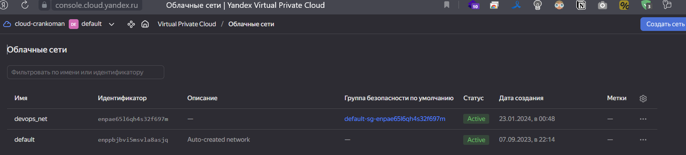
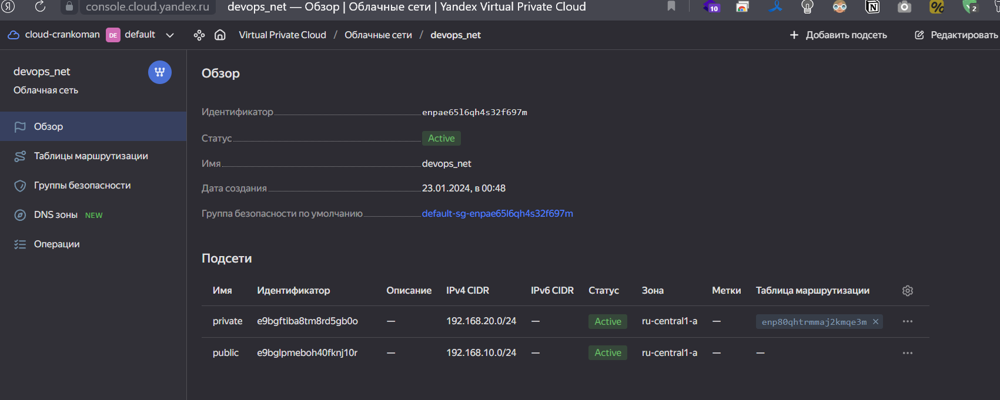
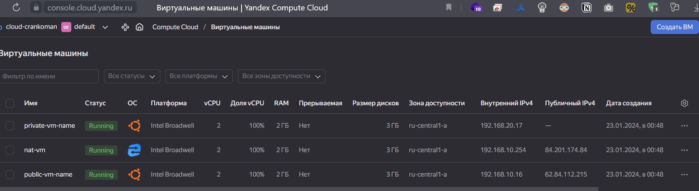

# Домашнее задание к занятию «Организация сети»

### Подготовка к выполнению задания

1. Домашнее задание состоит из обязательной части, которую нужно выполнить на провайдере Yandex Cloud, и дополнительной части в AWS (выполняется по желанию). 
2. Все домашние задания в блоке 15 связаны друг с другом и в конце представляют пример законченной инфраструктуры.  
3. Все задания нужно выполнить с помощью Terraform. Результатом выполненного домашнего задания будет код в репозитории. 
4. Перед началом работы настройте доступ к облачным ресурсам из Terraform, используя материалы прошлых лекций и домашнее задание по теме «Облачные провайдеры и синтаксис Terraform». Заранее выберите регион (в случае AWS) и зону.

---
### Задание 1. Yandex Cloud 

**Что нужно сделать**

1. Создать пустую VPC. Выбрать зону.
2. Публичная подсеть.

 - Создать в VPC subnet с названием public, сетью 192.168.10.0/24.
 - Создать в этой подсети NAT-инстанс, присвоив ему адрес 192.168.10.254. В качестве image_id использовать fd80mrhj8fl2oe87o4e1.
 - Создать в этой публичной подсети виртуалку с публичным IP, подключиться к ней и убедиться, что есть доступ к интернету.
3. Приватная подсеть.
 - Создать в VPC subnet с названием private, сетью 192.168.20.0/24.
 - Создать route table. Добавить статический маршрут, направляющий весь исходящий трафик private сети в NAT-инстанс.
 - Создать в этой приватной подсети виртуалку с внутренним IP, подключиться к ней через виртуалку, созданную ранее, и убедиться, что есть доступ к интернету.

Resource Terraform для Yandex Cloud:

- [VPC subnet](https://registry.terraform.io/providers/yandex-cloud/yandex/latest/docs/resources/vpc_subnet).
- [Route table](https://registry.terraform.io/providers/yandex-cloud/yandex/latest/docs/resources/vpc_route_table).
- [Compute Instance](https://registry.terraform.io/providers/yandex-cloud/yandex/latest/docs/resources/compute_instance).

<-- Ответ
0. Ставим terraform и yc

```shell
wget https://hashicorp-releases.yandexcloud.net/terraform/1.7.0/terraform_1.7.0_linux_amd64.zip
unzip terraform_1.7.0_linux_amd64.zip 

sudo mv terraform /usr/local/bin/
curl -sSL https://storage.yandexcloud.net/yandexcloud-yc/install.sh | bash
```

Создаем сервисный аккаунт, авторизованный ключ и профиль

```shell
yc iam key create \
  --service-account-id ajegvr41d58uen5le51j \
  --folder-name default \
  --output key.json

yc config profile create sa-devops

yc config set service-account-key key.json
yc config set cloud-id b1g6121uk1rv68o6cmjm
yc config set folder-id b1g5vv7mvebufecjtbri  

export YC_TOKEN=$(yc iam create-token)
export YC_CLOUD_ID=$(yc config get cloud-id)
export YC_FOLDER_ID=$(yc config get folder-id)
```

Создаем манифесты и прописываем креды в `personal.auto.tfvars`

[main.tf](./main.tf)
[network.tf](./network.tf)
[outputs.tf](./outputs.tf)
[providers.tf](./providers.tf)
[variables.tf](./variables.tf)
[terraformrc](./terraformrc)
[variables.tf](./variables.tf)

Запускаем terraform

`terraform init`

<details>                         
    <summary>подробнее</summary>

```shell
Initializing the backend...

Initializing provider plugins...
- Finding latest version of yandex-cloud/yandex...
- Installing yandex-cloud/yandex v0.105.0...
- Installed yandex-cloud/yandex v0.105.0 (unauthenticated)

Terraform has created a lock file .terraform.lock.hcl to record the provider
selections it made above. Include this file in your version control repository
so that Terraform can guarantee to make the same selections by default when
you run "terraform init" in the future.

╷
│ Warning: Incomplete lock file information for providers
│ 
│ Due to your customized provider installation methods, Terraform was forced to calculate lock file checksums locally for the following providers:
│   - yandex-cloud/yandex
│ 
│ The current .terraform.lock.hcl file only includes checksums for linux_amd64, so Terraform running on another platform will fail to install these providers.
│ 
│ To calculate additional checksums for another platform, run:
│   terraform providers lock -platform=linux_amd64
│ (where linux_amd64 is the platform to generate)
╵

Terraform has been successfully initialized!

You may now begin working with Terraform. Try running "terraform plan" to see
any changes that are required for your infrastructure. All Terraform commands
should now work.

If you ever set or change modules or backend configuration for Terraform,
rerun this command to reinitialize your working directory. If you forget, other
commands will detect it and remind you to do so if necessary.
```
</details>  


`terraform apply --auto-approve`

<details>                         
    <summary>подробнее</summary>

```shell
Terraform used the selected providers to generate the following execution plan. Resource actions are indicated with the following symbols:
  + create

Terraform will perform the following actions:

  # yandex_compute_instance.nat-instance will be created
  + resource "yandex_compute_instance" "nat-instance" {
      + created_at                = (known after apply)
      + folder_id                 = (known after apply)
      + fqdn                      = (known after apply)
      + gpu_cluster_id            = (known after apply)
      + hostname                  = (known after apply)
      + id                        = (known after apply)
      + maintenance_grace_period  = (known after apply)
      + maintenance_policy        = (known after apply)
      + metadata                  = {
          + "ssh-keys" = <<-EOT
                ubuntu:ssh-rsa AAAAB3NzaC1yc2EAAAADAQABAAABgQCwcK6AMVsw1RoPhjWyhAjSF2DMPWG/O8aFcAVWVBkEsY+pKrpegYgeU8c203BdBmOwPZJrhIQ3eTzguD68q2CHUk7kg4xk6pFGhrWbLTinX3LYY9gbL9v4wcPqJIb5hlGMNzDb9FhqzUVYsc5hMoxu7LBqDXFL95L7t0mmWcTiFjtacz4rbEY3OqsdYTcTkV4DemgKnQxweqg7wz7RVozXB4fM835CRnrmCrA2MSOVEh8gmRjRI0luHAANJM1J/wJYOiVvFL8RTpgKQAiifdztdAX+Ho0z5Ckd/hqljjosFxs2lbPQJOeoxrpNOUQJyXl8OmiRi9n9Wu5WFSACYMzp+1zSKdo51TWwR52eVwhB0JUQ/asX9FdtGSDExBgJfjGTMIjSecCIbp+xDVBv4lSPTeqhtZ8a7gEf5P/+ndbeMox3HZeVa8KjSBKvNDIB5p4NKU+gZUBm5VDsgRAqmShNq22mYxcv9pC9kLmxOCZ1iK4xCS1db5vmLVJMIfiX3F0= devops@4SER-1670916090.4server.su
            EOT
        }
      + name                      = "nat-vm"
      + network_acceleration_type = "standard"
      + platform_id               = "standard-v1"
      + service_account_id        = (known after apply)
      + status                    = (known after apply)
      + zone                      = "ru-central1-a"

      + boot_disk {
          + auto_delete = true
          + device_name = (known after apply)
          + disk_id     = (known after apply)
          + mode        = (known after apply)

          + initialize_params {
              + block_size  = (known after apply)
              + description = (known after apply)
              + image_id    = "fd80mrhj8fl2oe87o4e1"
              + name        = (known after apply)
              + size        = (known after apply)
              + snapshot_id = (known after apply)
              + type        = "network-hdd"
            }
        }

      + network_interface {
          + index              = (known after apply)
          + ip_address         = "192.168.10.254"
          + ipv4               = true
          + ipv6               = (known after apply)
          + ipv6_address       = (known after apply)
          + mac_address        = (known after apply)
          + nat                = true
          + nat_ip_address     = (known after apply)
          + nat_ip_version     = (known after apply)
          + security_group_ids = (known after apply)
          + subnet_id          = (known after apply)
        }

      + resources {
          + core_fraction = 100
          + cores         = 2
          + memory        = 2
        }
    }

  # yandex_compute_instance.private-instance will be created
  + resource "yandex_compute_instance" "private-instance" {
      + created_at                = (known after apply)
      + folder_id                 = (known after apply)
      + fqdn                      = (known after apply)
      + gpu_cluster_id            = (known after apply)
      + hostname                  = (known after apply)
      + id                        = (known after apply)
      + maintenance_grace_period  = (known after apply)
      + maintenance_policy        = (known after apply)
      + metadata                  = {
          + "ssh-keys" = <<-EOT
                ubuntu:ssh-rsa AAAAB3NzaC1yc2EAAAADAQABAAABgQCwcK6AMVsw1RoPhjWyhAjSF2DMPWG/O8aFcAVWVBkEsY+pKrpegYgeU8c203BdBmOwPZJrhIQ3eTzguD68q2CHUk7kg4xk6pFGhrWbLTinX3LYY9gbL9v4wcPqJIb5hlGMNzDb9FhqzUVYsc5hMoxu7LBqDXFL95L7t0mmWcTiFjtacz4rbEY3OqsdYTcTkV4DemgKnQxweqg7wz7RVozXB4fM835CRnrmCrA2MSOVEh8gmRjRI0luHAANJM1J/wJYOiVvFL8RTpgKQAiifdztdAX+Ho0z5Ckd/hqljjosFxs2lbPQJOeoxrpNOUQJyXl8OmiRi9n9Wu5WFSACYMzp+1zSKdo51TWwR52eVwhB0JUQ/asX9FdtGSDExBgJfjGTMIjSecCIbp+xDVBv4lSPTeqhtZ8a7gEf5P/+ndbeMox3HZeVa8KjSBKvNDIB5p4NKU+gZUBm5VDsgRAqmShNq22mYxcv9pC9kLmxOCZ1iK4xCS1db5vmLVJMIfiX3F0= devops@4SER-1670916090.4server.su
            EOT
        }
      + name                      = "private-vm-name"
      + network_acceleration_type = "standard"
      + platform_id               = "standard-v1"
      + service_account_id        = (known after apply)
      + status                    = (known after apply)
      + zone                      = "ru-central1-a"

      + boot_disk {
          + auto_delete = true
          + device_name = (known after apply)
          + disk_id     = (known after apply)
          + mode        = (known after apply)

          + initialize_params {
              + block_size  = (known after apply)
              + description = (known after apply)
              + image_id    = "fd8ba0ukgkn46r0qr1gi"
              + name        = (known after apply)
              + size        = (known after apply)
              + snapshot_id = (known after apply)
              + type        = "network-hdd"
            }
        }

      + network_interface {
          + index              = (known after apply)
          + ip_address         = (known after apply)
          + ipv4               = true
          + ipv6               = (known after apply)
          + ipv6_address       = (known after apply)
          + mac_address        = (known after apply)
          + nat                = false
          + nat_ip_address     = (known after apply)
          + nat_ip_version     = (known after apply)
          + security_group_ids = (known after apply)
          + subnet_id          = (known after apply)
        }

      + resources {
          + core_fraction = 100
          + cores         = 2
          + memory        = 2
        }
    }

  # yandex_compute_instance.public-instance will be created
  + resource "yandex_compute_instance" "public-instance" {
      + created_at                = (known after apply)
      + folder_id                 = (known after apply)
      + fqdn                      = (known after apply)
      + gpu_cluster_id            = (known after apply)
      + hostname                  = (known after apply)
      + id                        = (known after apply)
      + maintenance_grace_period  = (known after apply)
      + maintenance_policy        = (known after apply)
      + metadata                  = {
          + "ssh-keys" = <<-EOT
                ubuntu:ssh-rsa AAAAB3NzaC1yc2EAAAADAQABAAABgQCwcK6AMVsw1RoPhjWyhAjSF2DMPWG/O8aFcAVWVBkEsY+pKrpegYgeU8c203BdBmOwPZJrhIQ3eTzguD68q2CHUk7kg4xk6pFGhrWbLTinX3LYY9gbL9v4wcPqJIb5hlGMNzDb9FhqzUVYsc5hMoxu7LBqDXFL95L7t0mmWcTiFjtacz4rbEY3OqsdYTcTkV4DemgKnQxweqg7wz7RVozXB4fM835CRnrmCrA2MSOVEh8gmRjRI0luHAANJM1J/wJYOiVvFL8RTpgKQAiifdztdAX+Ho0z5Ckd/hqljjosFxs2lbPQJOeoxrpNOUQJyXl8OmiRi9n9Wu5WFSACYMzp+1zSKdo51TWwR52eVwhB0JUQ/asX9FdtGSDExBgJfjGTMIjSecCIbp+xDVBv4lSPTeqhtZ8a7gEf5P/+ndbeMox3HZeVa8KjSBKvNDIB5p4NKU+gZUBm5VDsgRAqmShNq22mYxcv9pC9kLmxOCZ1iK4xCS1db5vmLVJMIfiX3F0= devops@4SER-1670916090.4server.su
            EOT
        }
      + name                      = "public-vm-name"
      + network_acceleration_type = "standard"
      + platform_id               = "standard-v1"
      + service_account_id        = (known after apply)
      + status                    = (known after apply)
      + zone                      = "ru-central1-a"

      + boot_disk {
          + auto_delete = true
          + device_name = (known after apply)
          + disk_id     = (known after apply)
          + mode        = (known after apply)

          + initialize_params {
              + block_size  = (known after apply)
              + description = (known after apply)
              + image_id    = "fd8ba0ukgkn46r0qr1gi"
              + name        = (known after apply)
              + size        = (known after apply)
              + snapshot_id = (known after apply)
              + type        = "network-hdd"
            }
        }

      + network_interface {
          + index              = (known after apply)
          + ip_address         = (known after apply)
          + ipv4               = true
          + ipv6               = (known after apply)
          + ipv6_address       = (known after apply)
          + mac_address        = (known after apply)
          + nat                = true
          + nat_ip_address     = (known after apply)
          + nat_ip_version     = (known after apply)
          + security_group_ids = (known after apply)
          + subnet_id          = (known after apply)
        }

      + resources {
          + core_fraction = 100
          + cores         = 2
          + memory        = 2
        }
    }

  # yandex_vpc_network.devops_net will be created
  + resource "yandex_vpc_network" "devops_net" {
      + created_at                = (known after apply)
      + default_security_group_id = (known after apply)
      + folder_id                 = (known after apply)
      + id                        = (known after apply)
      + labels                    = (known after apply)
      + name                      = "devops_net"
      + subnet_ids                = (known after apply)
    }

  # yandex_vpc_route_table.nat-route-table will be created
  + resource "yandex_vpc_route_table" "nat-route-table" {
      + created_at = (known after apply)
      + folder_id  = (known after apply)
      + id         = (known after apply)
      + labels     = (known after apply)
      + network_id = (known after apply)

      + static_route {
          + destination_prefix = "0.0.0.0/0"
          + next_hop_address   = "192.168.10.254"
        }
    }

  # yandex_vpc_subnet.private-subnet will be created
  + resource "yandex_vpc_subnet" "private-subnet" {
      + created_at     = (known after apply)
      + folder_id      = (known after apply)
      + id             = (known after apply)
      + labels         = (known after apply)
      + name           = "private"
      + network_id     = (known after apply)
      + route_table_id = (known after apply)
      + v4_cidr_blocks = [
          + "192.168.20.0/24",
        ]
      + v6_cidr_blocks = (known after apply)
      + zone           = "ru-central1-a"
    }

  # yandex_vpc_subnet.public-subnet will be created
  + resource "yandex_vpc_subnet" "public-subnet" {
      + created_at     = (known after apply)
      + folder_id      = (known after apply)
      + id             = (known after apply)
      + labels         = (known after apply)
      + name           = "public"
      + network_id     = (known after apply)
      + v4_cidr_blocks = [
          + "192.168.10.0/24",
        ]
      + v6_cidr_blocks = (known after apply)
      + zone           = "ru-central1-a"
    }

Plan: 7 to add, 0 to change, 0 to destroy.

Changes to Outputs:
  + nat-instance_ip        = "192.168.10.254"
  + nat-instance_nat_ip    = (known after apply)
  + private-instance_ip    = (known after apply)
  + public-instance_ip     = (known after apply)
  + public-instance_nat_ip = (known after apply)
yandex_vpc_network.devops_net: Creating...
yandex_vpc_network.devops_net: Creation complete after 2s [id=enpae65l6qh4s32f697m]
yandex_vpc_route_table.nat-route-table: Creating...
yandex_vpc_subnet.public-subnet: Creating...
yandex_vpc_subnet.public-subnet: Creation complete after 1s [id=e9bglpmeboh40fknj10r]
yandex_compute_instance.public-instance: Creating...
yandex_compute_instance.nat-instance: Creating...
yandex_vpc_route_table.nat-route-table: Creation complete after 2s [id=enp80qhtrmmaj2kmqe3m]
yandex_vpc_subnet.private-subnet: Creating...
yandex_vpc_subnet.private-subnet: Creation complete after 0s [id=e9bgftiba8tm8rd5gb0o]
yandex_compute_instance.private-instance: Creating...
yandex_compute_instance.public-instance: Still creating... [10s elapsed]
yandex_compute_instance.nat-instance: Still creating... [10s elapsed]
yandex_compute_instance.private-instance: Still creating... [10s elapsed]
yandex_compute_instance.public-instance: Still creating... [20s elapsed]
yandex_compute_instance.nat-instance: Still creating... [20s elapsed]
yandex_compute_instance.private-instance: Still creating... [20s elapsed]
yandex_compute_instance.public-instance: Still creating... [30s elapsed]
yandex_compute_instance.nat-instance: Still creating... [30s elapsed]
yandex_compute_instance.public-instance: Creation complete after 31s [id=fhmvuo73fpn6jh48j2pe]
yandex_compute_instance.private-instance: Still creating... [30s elapsed]
yandex_compute_instance.private-instance: Creation complete after 31s [id=fhm3u7d631lhfrgi3thv]
yandex_compute_instance.nat-instance: Still creating... [40s elapsed]
yandex_compute_instance.nat-instance: Still creating... [50s elapsed]
yandex_compute_instance.nat-instance: Still creating... [1m0s elapsed]
yandex_compute_instance.nat-instance: Creation complete after 1m4s [id=fhmfoov96dpqdrapl2tm]

Apply complete! Resources: 7 added, 0 changed, 0 destroyed.

Outputs:

nat-instance_ip = "192.168.10.254"
nat-instance_nat_ip = "84.201.174.84"
private-instance_ip = "192.168.20.17"
public-instance_ip = "192.168.10.16"
public-instance_nat_ip = "62.84.112.215"
```
</details> 

Проверяем ВМ public

```shell
ssh ubuntu@62.84.112.215
The authenticity of host '62.84.112.215 (62.84.112.215)' can't be established.
ED25519 key fingerprint is SHA256:Ob5ui+rX65gzaT4HRZ1l4d2OLUxmjXJRsmEKw5oIeyQ.
This key is not known by any other names
Are you sure you want to continue connecting (yes/no/[fingerprint])? yes
Warning: Permanently added '62.84.112.215' (ED25519) to the list of known hosts.
Welcome to Ubuntu 20.04.3 LTS (GNU/Linux 5.4.0-42-generic x86_64)

 * Documentation:  https://help.ubuntu.com
 * Management:     https://landscape.canonical.com
 * Support:        https://ubuntu.com/advantage

The programs included with the Ubuntu system are free software;
the exact distribution terms for each program are described in the
individual files in /usr/share/doc/*/copyright.

Ubuntu comes with ABSOLUTELY NO WARRANTY, to the extent permitted by
applicable law.

To run a command as administrator (user "root"), use "sudo <command>".
See "man sudo_root" for details.

ubuntu@fhmvuo73fpn6jh48j2pe:~$ ping ya.ru
PING ya.ru (5.255.255.242) 56(84) bytes of data.
64 bytes from ya.ru (5.255.255.242): icmp_seq=1 ttl=56 time=0.720 ms
64 bytes from ya.ru (5.255.255.242): icmp_seq=2 ttl=56 time=0.404 ms
```

Закидываем ключ на ВМ public и проверяем ВМ privat

```shell
scp /home/devops/.ssh/id_rsa ubuntu@62.84.112.215:/tmp/id_rsa

ssh ubuntu@62.84.112.215
ubuntu@fhmvuo73fpn6jh48j2pe:~$ ssh ubuntu@192.168.20.17 -i /tmp/id_rsa
ubuntu@fhm3u7d631lhfrgi3thv:~$ ping ya.ru
PING ya.ru (77.88.55.242) 56(84) bytes of data.
64 bytes from ya.ru (77.88.55.242): icmp_seq=1 ttl=52 time=4.74 ms
64 bytes from ya.ru (77.88.55.242): icmp_seq=2 ttl=52 time=4.04 ms
64 bytes from ya.ru (77.88.55.242): icmp_seq=3 ttl=52 time=3.77 ms
ubuntu@fhm3u7d631lhfrgi3thv:~$ tracepath ya.ru -n
 1?: [LOCALHOST]                      pmtu 1500
 1:  192.168.20.1                                          0.350ms 
 1:  192.168.20.1                                          0.310ms 
 2:  no reply
 3:  192.168.10.254                                        0.575ms asymm  4 
 4:  192.168.10.254                                        0.327ms 
 5:  no reply
```

Скриншоты клауда




`terraform destroy  --auto-approve`
------


---
### Задание 2. AWS* (задание со звёздочкой)

Это необязательное задание. Его выполнение не влияет на получение зачёта по домашней работе.

**Что нужно сделать**

1. Создать пустую VPC с подсетью 10.10.0.0/16.
2. Публичная подсеть.

 - Создать в VPC subnet с названием public, сетью 10.10.1.0/24.
 - Разрешить в этой subnet присвоение public IP по-умолчанию.
 - Создать Internet gateway.
 - Добавить в таблицу маршрутизации маршрут, направляющий весь исходящий трафик в Internet gateway.
 - Создать security group с разрешающими правилами на SSH и ICMP. Привязать эту security group на все, создаваемые в этом ДЗ, виртуалки.
 - Создать в этой подсети виртуалку и убедиться, что инстанс имеет публичный IP. Подключиться к ней, убедиться, что есть доступ к интернету.
 - Добавить NAT gateway в public subnet.
3. Приватная подсеть.
 - Создать в VPC subnet с названием private, сетью 10.10.2.0/24.
 - Создать отдельную таблицу маршрутизации и привязать её к private подсети.
 - Добавить Route, направляющий весь исходящий трафик private сети в NAT.
 - Создать виртуалку в приватной сети.
 - Подключиться к ней по SSH по приватному IP через виртуалку, созданную ранее в публичной подсети, и убедиться, что с виртуалки есть выход в интернет.

Resource Terraform:

1. [VPC](https://registry.terraform.io/providers/hashicorp/aws/latest/docs/resources/vpc).
1. [Subnet](https://registry.terraform.io/providers/hashicorp/aws/latest/docs/resources/subnet).
1. [Internet Gateway](https://registry.terraform.io/providers/hashicorp/aws/latest/docs/resources/internet_gateway).

### Правила приёма работы

Домашняя работа оформляется в своём Git репозитории в файле README.md. Выполненное домашнее задание пришлите ссылкой на .md-файл в вашем репозитории.
Файл README.md должен содержать скриншоты вывода необходимых команд, а также скриншоты результатов.
Репозиторий должен содержать тексты манифестов или ссылки на них в файле README.md.