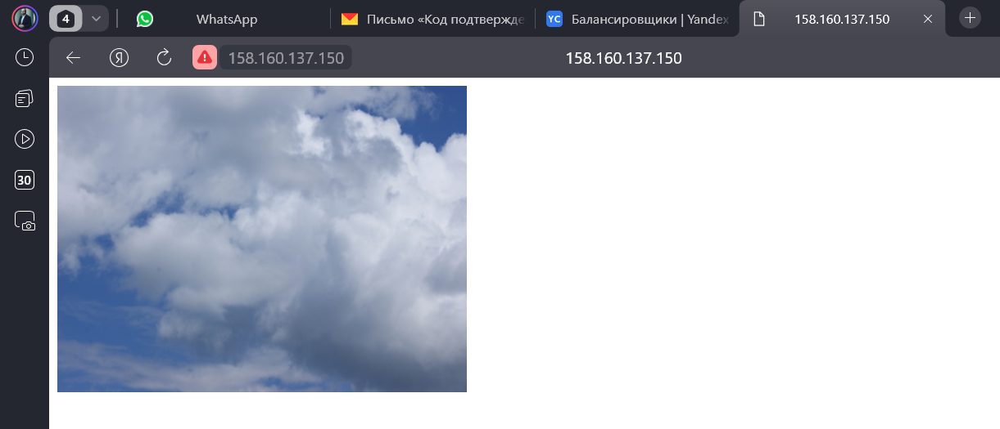
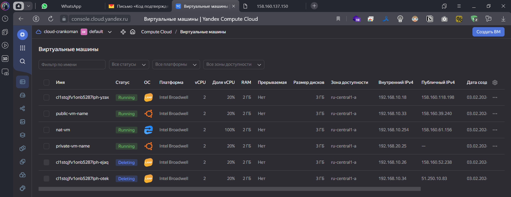
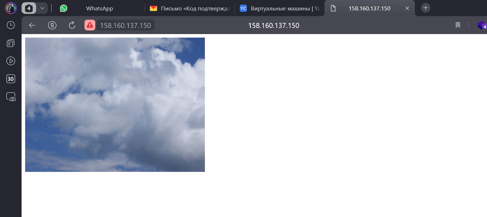

# Домашнее задание к занятию «Вычислительные мощности. Балансировщики нагрузки»  

### Подготовка к выполнению задания

1. Домашнее задание состоит из обязательной части, которую нужно выполнить на провайдере Yandex Cloud, и дополнительной части в AWS (выполняется по желанию). 
2. Все домашние задания в блоке 15 связаны друг с другом и в конце представляют пример законченной инфраструктуры.  
3. Все задания нужно выполнить с помощью Terraform. Результатом выполненного домашнего задания будет код в репозитории. 
4. Перед началом работы настройте доступ к облачным ресурсам из Terraform, используя материалы прошлых лекций и домашних заданий.

---
## Задание 1. Yandex Cloud 

**Что нужно сделать**

1. Создать бакет Object Storage и разместить в нём файл с картинкой:

 - Создать бакет в Object Storage с произвольным именем (например, _имя_студента_дата_).
 - Положить в бакет файл с картинкой.
 - Сделать файл доступным из интернета.
 
2. Создать группу ВМ в public подсети фиксированного размера с шаблоном LAMP и веб-страницей, содержащей ссылку на картинку из бакета:

 - Создать Instance Group с тремя ВМ и шаблоном LAMP. Для LAMP рекомендуется использовать `image_id = fd827b91d99psvq5fjit`.
 - Для создания стартовой веб-страницы рекомендуется использовать раздел `user_data` в [meta_data](https://cloud.yandex.ru/docs/compute/concepts/vm-metadata).
 - Разместить в стартовой веб-странице шаблонной ВМ ссылку на картинку из бакета.
 - Настроить проверку состояния ВМ.
 
3. Подключить группу к сетевому балансировщику:

 - Создать сетевой балансировщик.
 - Проверить работоспособность, удалив одну или несколько ВМ.
4. (дополнительно)* Создать Application Load Balancer с использованием Instance group и проверкой состояния.

<-- Ответ

Прописываем манифесты в той же папке и запускаем 

`terraform apply --auto-approve`
<details>                         
    <summary>подробнее</summary>

```shell
Terraform used the selected providers to generate the following execution plan. Resource actions are indicated with the following
symbols:
  + create

Terraform will perform the following actions:

  # yandex_compute_instance.nat-instance will be created
  + resource "yandex_compute_instance" "nat-instance" {
      + created_at                = (known after apply)
      + folder_id                 = (known after apply)
      + fqdn                      = (known after apply)
      + gpu_cluster_id            = (known after apply)
      + hostname                  = (known after apply)
      + id                        = (known after apply)
      + maintenance_grace_period  = (known after apply)
      + maintenance_policy        = (known after apply)
      + metadata                  = {
          + "ssh-keys" = <<-EOT
                ubuntu:ssh-rsa AAAAB3NzaC1yc2EAAAADAQABAAABgQCwcK6AMVsw1RoPhjWyhAjSF2DMPWG/O8aFcAVWVBkEsY+pKrpegYgeU8c203BdBmOwPZJrhIQ3eTzguD68q2CHUk7kg4xk6pFGhrWbLTinX3LYY9gbL9v4wcPqJIb5hlGMNzDb9FhqzUVYsc5hMoxu7LBqDXFL95L7t0mmWcTiFjtacz4rbEY3OqsdYTcTkV4DemgKnQxweqg7wz7RVozXB4fM835CRnrmCrA2MSOVEh8gmRjRI0luHAANJM1J/wJYOiVvFL8RTpgKQAiifdztdAX+Ho0z5Ckd/hqljjosFxs2lbPQJOeoxrpNOUQJyXl8OmiRi9n9Wu5WFSACYMzp+1zSKdo51TWwR52eVwhB0JUQ/asX9FdtGSDExBgJfjGTMIjSecCIbp+xDVBv4lSPTeqhtZ8a7gEf5P/+ndbeMox3HZeVa8KjSBKvNDIB5p4NKU+gZUBm5VDsgRAqmShNq22mYxcv9pC9kLmxOCZ1iK4xCS1db5vmLVJMIfiX3F0= devops@4SER-1670916090.4server.su
            EOT
        }
      + name                      = "nat-vm"
      + network_acceleration_type = "standard"
      + platform_id               = "standard-v1"
      + service_account_id        = (known after apply)
      + status                    = (known after apply)
      + zone                      = "ru-central1-a"

      + boot_disk {
          + auto_delete = true
          + device_name = (known after apply)
          + disk_id     = (known after apply)
          + mode        = (known after apply)

          + initialize_params {
              + block_size  = (known after apply)
              + description = (known after apply)
              + image_id    = "fd80mrhj8fl2oe87o4e1"
              + name        = (known after apply)
              + size        = (known after apply)
              + snapshot_id = (known after apply)
              + type        = "network-hdd"
            }
        }

      + network_interface {
          + index              = (known after apply)
          + ip_address         = "192.168.10.254"
          + ipv4               = true
          + ipv6               = (known after apply)
          + ipv6_address       = (known after apply)
          + mac_address        = (known after apply)
          + nat                = true
          + nat_ip_address     = (known after apply)
          + nat_ip_version     = (known after apply)
          + security_group_ids = (known after apply)
          + subnet_id          = (known after apply)
        }

      + resources {
          + core_fraction = 100
          + cores         = 2
          + memory        = 2
        }
    }

  # yandex_compute_instance.private-instance will be created
  + resource "yandex_compute_instance" "private-instance" {
      + created_at                = (known after apply)
      + folder_id                 = (known after apply)
      + fqdn                      = (known after apply)
      + gpu_cluster_id            = (known after apply)
      + hostname                  = (known after apply)
      + id                        = (known after apply)
      + maintenance_grace_period  = (known after apply)
      + maintenance_policy        = (known after apply)
      + metadata                  = {
          + "ssh-keys" = <<-EOT
                ubuntu:ssh-rsa AAAAB3NzaC1yc2EAAAADAQABAAABgQCwcK6AMVsw1RoPhjWyhAjSF2DMPWG/O8aFcAVWVBkEsY+pKrpegYgeU8c203BdBmOwPZJrhIQ3eTzguD68q2CHUk7kg4xk6pFGhrWbLTinX3LYY9gbL9v4wcPqJIb5hlGMNzDb9FhqzUVYsc5hMoxu7LBqDXFL95L7t0mmWcTiFjtacz4rbEY3OqsdYTcTkV4DemgKnQxweqg7wz7RVozXB4fM835CRnrmCrA2MSOVEh8gmRjRI0luHAANJM1J/wJYOiVvFL8RTpgKQAiifdztdAX+Ho0z5Ckd/hqljjosFxs2lbPQJOeoxrpNOUQJyXl8OmiRi9n9Wu5WFSACYMzp+1zSKdo51TWwR52eVwhB0JUQ/asX9FdtGSDExBgJfjGTMIjSecCIbp+xDVBv4lSPTeqhtZ8a7gEf5P/+ndbeMox3HZeVa8KjSBKvNDIB5p4NKU+gZUBm5VDsgRAqmShNq22mYxcv9pC9kLmxOCZ1iK4xCS1db5vmLVJMIfiX3F0= devops@4SER-1670916090.4server.su
            EOT
        }
      + name                      = "private-vm-name"
      + network_acceleration_type = "standard"
      + platform_id               = "standard-v1"
      + service_account_id        = (known after apply)
      + status                    = (known after apply)
      + zone                      = "ru-central1-a"

      + boot_disk {
          + auto_delete = true
          + device_name = (known after apply)
          + disk_id     = (known after apply)
          + mode        = (known after apply)

          + initialize_params {
              + block_size  = (known after apply)
              + description = (known after apply)
              + image_id    = "fd8ba0ukgkn46r0qr1gi"
              + name        = (known after apply)
              + size        = (known after apply)
              + snapshot_id = (known after apply)
              + type        = "network-hdd"
            }
        }

      + network_interface {
          + index              = (known after apply)
          + ip_address         = (known after apply)
          + ipv4               = true
          + ipv6               = (known after apply)
          + ipv6_address       = (known after apply)
          + mac_address        = (known after apply)
          + nat                = false
          + nat_ip_address     = (known after apply)
          + nat_ip_version     = (known after apply)
          + security_group_ids = (known after apply)
          + subnet_id          = (known after apply)
        }

      + resources {
          + core_fraction = 20
          + cores         = 2
          + memory        = 2
        }
    }

  # yandex_compute_instance.public-instance will be created
  + resource "yandex_compute_instance" "public-instance" {
      + created_at                = (known after apply)
      + folder_id                 = (known after apply)
      + fqdn                      = (known after apply)
      + gpu_cluster_id            = (known after apply)
      + hostname                  = (known after apply)
      + id                        = (known after apply)
      + maintenance_grace_period  = (known after apply)
      + maintenance_policy        = (known after apply)
      + metadata                  = {
          + "ssh-keys" = <<-EOT
                ubuntu:ssh-rsa AAAAB3NzaC1yc2EAAAADAQABAAABgQCwcK6AMVsw1RoPhjWyhAjSF2DMPWG/O8aFcAVWVBkEsY+pKrpegYgeU8c203BdBmOwPZJrhIQ3eTzguD68q2CHUk7kg4xk6pFGhrWbLTinX3LYY9gbL9v4wcPqJIb5hlGMNzDb9FhqzUVYsc5hMoxu7LBqDXFL95L7t0mmWcTiFjtacz4rbEY3OqsdYTcTkV4DemgKnQxweqg7wz7RVozXB4fM835CRnrmCrA2MSOVEh8gmRjRI0luHAANJM1J/wJYOiVvFL8RTpgKQAiifdztdAX+Ho0z5Ckd/hqljjosFxs2lbPQJOeoxrpNOUQJyXl8OmiRi9n9Wu5WFSACYMzp+1zSKdo51TWwR52eVwhB0JUQ/asX9FdtGSDExBgJfjGTMIjSecCIbp+xDVBv4lSPTeqhtZ8a7gEf5P/+ndbeMox3HZeVa8KjSBKvNDIB5p4NKU+gZUBm5VDsgRAqmShNq22mYxcv9pC9kLmxOCZ1iK4xCS1db5vmLVJMIfiX3F0= devops@4SER-1670916090.4server.su
            EOT
        }
      + name                      = "public-vm-name"
      + network_acceleration_type = "standard"
      + platform_id               = "standard-v1"
      + service_account_id        = (known after apply)
      + status                    = (known after apply)
      + zone                      = "ru-central1-a"

      + boot_disk {
          + auto_delete = true
          + device_name = (known after apply)
          + disk_id     = (known after apply)
          + mode        = (known after apply)

          + initialize_params {
              + block_size  = (known after apply)
              + description = (known after apply)
              + image_id    = "fd8ba0ukgkn46r0qr1gi"
              + name        = (known after apply)
              + size        = (known after apply)
              + snapshot_id = (known after apply)
              + type        = "network-hdd"
            }
        }

      + network_interface {
          + index              = (known after apply)
          + ip_address         = (known after apply)
          + ipv4               = true
          + ipv6               = (known after apply)
          + ipv6_address       = (known after apply)
          + mac_address        = (known after apply)
          + nat                = true
          + nat_ip_address     = (known after apply)
          + nat_ip_version     = (known after apply)
          + security_group_ids = (known after apply)
          + subnet_id          = (known after apply)
        }

      + resources {
          + core_fraction = 20
          + cores         = 2
          + memory        = 2
        }
    }

  # yandex_compute_instance_group.cig-1 will be created
  + resource "yandex_compute_instance_group" "cig-1" {
      + created_at          = (known after apply)
      + deletion_protection = false
      + folder_id           = "b1g5vv7mvebufecjtbri"
      + id                  = (known after apply)
      + instances           = (known after apply)
      + name                = "cig-1"
      + service_account_id  = (known after apply)
      + status              = (known after apply)

      + allocation_policy {
          + zones = [
              + "ru-central1-a",
            ]
        }

      + deploy_policy {
          + max_creating     = 3
          + max_deleting     = 1
          + max_expansion    = 1
          + max_unavailable  = 1
          + startup_duration = 0
          + strategy         = (known after apply)
        }

      + health_check {
          + healthy_threshold   = 2
          + unhealthy_threshold = 2

          + http_options {
              + path = "/"
              + port = 80
            }
        }

      + instance_template {
          + labels      = (known after apply)
          + metadata    = (known after apply)
          + platform_id = "standard-v1"

          + boot_disk {
              + device_name = (known after apply)
              + mode        = "READ_WRITE"

              + initialize_params {
                  + image_id    = "fd827b91d99psvq5fjit"
                  + size        = (known after apply)
                  + snapshot_id = (known after apply)
                  + type        = "network-hdd"
                }
            }

          + network_interface {
              + ip_address   = (known after apply)
              + ipv4         = true
              + ipv6         = (known after apply)
              + ipv6_address = (known after apply)
              + nat          = true
              + subnet_ids   = (known after apply)
            }

          + network_settings {
              + type = "STANDARD"
            }

          + resources {
              + core_fraction = 20
              + cores         = 2
              + memory        = 2
            }
        }

      + load_balancer {
          + status_message    = (known after apply)
          + target_group_id   = (known after apply)
          + target_group_name = "target-group"
        }

      + scale_policy {
          + fixed_scale {
              + size = 3
            }
        }
    }

  # yandex_iam_service_account.sa will be created
  + resource "yandex_iam_service_account" "sa" {
      + created_at = (known after apply)
      + folder_id  = "b1g5vv7mvebufecjtbri"
      + id         = (known after apply)
      + name       = "tf-test-sa"
    }

  # yandex_iam_service_account.sa1 will be created
  + resource "yandex_iam_service_account" "sa1" {
      + created_at = (known after apply)
      + folder_id  = "b1g5vv7mvebufecjtbri"
      + id         = (known after apply)
      + name       = "tf-test1-sa"
    }

  # yandex_iam_service_account_static_access_key.sa-static-key will be created
  + resource "yandex_iam_service_account_static_access_key" "sa-static-key" {
      + access_key           = (known after apply)
      + created_at           = (known after apply)
      + description          = "static access key for object storage"
      + encrypted_secret_key = (known after apply)
      + id                   = (known after apply)
      + key_fingerprint      = (known after apply)
      + secret_key           = (sensitive value)
      + service_account_id   = (known after apply)
    }

  # yandex_lb_network_load_balancer.lb1 will be created
  + resource "yandex_lb_network_load_balancer" "lb1" {
      + created_at          = (known after apply)
      + deletion_protection = (known after apply)
      + folder_id           = (known after apply)
      + id                  = (known after apply)
      + name                = "my-network-load-balancer"
      + region_id           = (known after apply)
      + type                = "external"

      + attached_target_group {
          + target_group_id = (known after apply)

          + healthcheck {
              + healthy_threshold   = 2
              + interval            = 2
              + name                = "http"
              + timeout             = 1
              + unhealthy_threshold = 2

              + http_options {
                  + path = "/"
                  + port = 80
                }
            }
        }

      + listener {
          + name        = "test-listener"
          + port        = 80
          + protocol    = (known after apply)
          + target_port = (known after apply)

          + external_address_spec {
              + address    = (known after apply)
              + ip_version = "ipv4"
            }
        }
    }

  # yandex_resourcemanager_folder_iam_member.sa-editor will be created
  + resource "yandex_resourcemanager_folder_iam_member" "sa-editor" {
      + folder_id = "b1g5vv7mvebufecjtbri"
      + id        = (known after apply)
      + member    = (known after apply)
      + role      = "storage.editor"
    }

  # yandex_resourcemanager_folder_iam_member.sa-editor1 will be created
  + resource "yandex_resourcemanager_folder_iam_member" "sa-editor1" {
      + folder_id = "b1g5vv7mvebufecjtbri"
      + id        = (known after apply)
      + member    = (known after apply)
      + role      = "editor"
    }

  # yandex_storage_bucket.test-bucket will be created
  + resource "yandex_storage_bucket" "test-bucket" {
      + access_key            = (known after apply)
      + acl                   = "public-read"
      + bucket                = "tf-ruslan-030224-bucket"
      + bucket_domain_name    = (known after apply)
      + default_storage_class = (known after apply)
      + folder_id             = (known after apply)
      + force_destroy         = false
      + id                    = (known after apply)
      + secret_key            = (sensitive value)
      + website_domain        = (known after apply)
      + website_endpoint      = (known after apply)
    }

  # yandex_storage_object.image-upload will be created
  + resource "yandex_storage_object" "image-upload" {
      + access_key                    = (known after apply)
      + acl                           = "public-read"
      + bucket                        = "tf-ruslan-030224-bucket"
      + content_type                  = (known after apply)
      + id                            = (known after apply)
      + key                           = "sample-clouds-400x300.jpg"
      + object_lock_legal_hold_status = "OFF"
      + secret_key                    = (sensitive value)
      + source                        = "./sample-clouds-400x300.jpg"
    }

  # yandex_vpc_network.devops_net will be created
  + resource "yandex_vpc_network" "devops_net" {
      + created_at                = (known after apply)
      + default_security_group_id = (known after apply)
      + folder_id                 = (known after apply)
      + id                        = (known after apply)
      + labels                    = (known after apply)
      + name                      = "devops_net"
      + subnet_ids                = (known after apply)
    }

  # yandex_vpc_route_table.nat-route-table will be created
  + resource "yandex_vpc_route_table" "nat-route-table" {
      + created_at = (known after apply)
      + folder_id  = (known after apply)
      + id         = (known after apply)
      + labels     = (known after apply)
      + network_id = (known after apply)

      + static_route {
          + destination_prefix = "0.0.0.0/0"
          + next_hop_address   = "192.168.10.254"
        }
    }

  # yandex_vpc_subnet.private-subnet will be created
  + resource "yandex_vpc_subnet" "private-subnet" {
      + created_at     = (known after apply)
      + folder_id      = (known after apply)
      + id             = (known after apply)
      + labels         = (known after apply)
      + name           = "private"
      + network_id     = (known after apply)
      + route_table_id = (known after apply)
      + v4_cidr_blocks = [
          + "192.168.20.0/24",
        ]
      + v6_cidr_blocks = (known after apply)
      + zone           = "ru-central1-a"
    }

  # yandex_vpc_subnet.public-subnet will be created
  + resource "yandex_vpc_subnet" "public-subnet" {
      + created_at     = (known after apply)
      + folder_id      = (known after apply)
      + id             = (known after apply)
      + labels         = (known after apply)
      + name           = "public"
      + network_id     = (known after apply)
      + v4_cidr_blocks = [
          + "192.168.10.0/24",
        ]
      + v6_cidr_blocks = (known after apply)
      + zone           = "ru-central1-a"
    }

Plan: 16 to add, 0 to change, 0 to destroy.

Changes to Outputs:
  + nat-instance_ip        = "192.168.10.254"
  + nat-instance_nat_ip    = (known after apply)
  + private-instance_ip    = (known after apply)
  + public-instance_ip     = (known after apply)
  + public-instance_nat_ip = (known after apply)
yandex_vpc_network.devops_net: Creating...
yandex_iam_service_account.sa: Creating...
yandex_iam_service_account.sa1: Creating...
yandex_vpc_network.devops_net: Creation complete after 3s [id=enpno8qspel7uq7j7rd7]
yandex_vpc_subnet.public-subnet: Creating...
yandex_vpc_route_table.nat-route-table: Creating...
yandex_vpc_subnet.public-subnet: Creation complete after 0s [id=e9b8h6odfnkm9mci54mq]
yandex_iam_service_account.sa1: Creation complete after 4s [id=aje27ou9vfkbn6kk2oq3]
yandex_resourcemanager_folder_iam_member.sa-editor1: Creating...
yandex_compute_instance.nat-instance: Creating...
yandex_compute_instance.public-instance: Creating...
yandex_vpc_route_table.nat-route-table: Creation complete after 2s [id=enpk60oni04fvoklh6fo]
yandex_vpc_subnet.private-subnet: Creating...
yandex_iam_service_account.sa: Creation complete after 6s [id=ajesnst638sm2d58ar41]
yandex_iam_service_account_static_access_key.sa-static-key: Creating...
yandex_resourcemanager_folder_iam_member.sa-editor: Creating...
yandex_vpc_subnet.private-subnet: Creation complete after 2s [id=e9bs39tlgtpieol24hh4]
yandex_compute_instance.private-instance: Creating...
yandex_resourcemanager_folder_iam_member.sa-editor1: Creation complete after 3s [id=b1g5vv7mvebufecjtbri/editor/serviceAccount:aje27ou9vfkbn6kk2oq3]
yandex_iam_service_account_static_access_key.sa-static-key: Creation complete after 2s [id=ajeop32mkca91eqtvhgm]
yandex_storage_bucket.test-bucket: Creating...
yandex_resourcemanager_folder_iam_member.sa-editor: Creation complete after 3s [id=b1g5vv7mvebufecjtbri/storage.editor/serviceAccount:ajesnst638sm2d58ar41]
yandex_storage_bucket.test-bucket: Creation complete after 3s [id=tf-ruslan-030224-bucket]
yandex_storage_object.image-upload: Creating...
yandex_compute_instance_group.cig-1: Creating...
yandex_storage_object.image-upload: Creation complete after 1s [id=sample-clouds-400x300.jpg]
yandex_compute_instance.nat-instance: Still creating... [10s elapsed]
yandex_compute_instance.public-instance: Still creating... [10s elapsed]
yandex_compute_instance.private-instance: Still creating... [10s elapsed]
yandex_compute_instance_group.cig-1: Still creating... [10s elapsed]
yandex_compute_instance.nat-instance: Still creating... [20s elapsed]
yandex_compute_instance.public-instance: Still creating... [20s elapsed]
yandex_compute_instance.private-instance: Still creating... [20s elapsed]
yandex_compute_instance_group.cig-1: Still creating... [20s elapsed]
yandex_compute_instance.nat-instance: Still creating... [30s elapsed]
yandex_compute_instance.public-instance: Still creating... [30s elapsed]
yandex_compute_instance.private-instance: Still creating... [30s elapsed]
yandex_compute_instance.public-instance: Creation complete after 36s [id=fhmcpjsvolm064e1pkq3]
yandex_compute_instance_group.cig-1: Still creating... [30s elapsed]
yandex_compute_instance.private-instance: Creation complete after 35s [id=fhmo3ebjdtabhuon3rcp]
yandex_compute_instance.nat-instance: Still creating... [40s elapsed]
yandex_compute_instance_group.cig-1: Still creating... [40s elapsed]
yandex_compute_instance.nat-instance: Still creating... [50s elapsed]
yandex_compute_instance_group.cig-1: Still creating... [50s elapsed]
yandex_compute_instance.nat-instance: Still creating... [1m0s elapsed]
yandex_compute_instance.nat-instance: Creation complete after 1m7s [id=fhmmcu3hcqg133thqo2n]
yandex_compute_instance_group.cig-1: Still creating... [1m0s elapsed]
yandex_compute_instance_group.cig-1: Still creating... [1m10s elapsed]
yandex_compute_instance_group.cig-1: Still creating... [1m20s elapsed]
yandex_compute_instance_group.cig-1: Still creating... [1m30s elapsed]
yandex_compute_instance_group.cig-1: Still creating... [1m40s elapsed]
yandex_compute_instance_group.cig-1: Still creating... [1m50s elapsed]
yandex_compute_instance_group.cig-1: Still creating... [2m0s elapsed]
yandex_compute_instance_group.cig-1: Still creating... [2m10s elapsed]
yandex_compute_instance_group.cig-1: Still creating... [2m20s elapsed]
yandex_compute_instance_group.cig-1: Still creating... [2m30s elapsed]
yandex_compute_instance_group.cig-1: Still creating... [2m40s elapsed]
yandex_compute_instance_group.cig-1: Still creating... [2m50s elapsed]
yandex_compute_instance_group.cig-1: Still creating... [3m0s elapsed]
yandex_compute_instance_group.cig-1: Still creating... [3m10s elapsed]
yandex_compute_instance_group.cig-1: Creation complete after 3m17s [id=cl1stqjfv1onb5287lph]
yandex_lb_network_load_balancer.lb1: Creating...
yandex_lb_network_load_balancer.lb1: Creation complete after 3s [id=enpku6qop2l3epv9otps]

Apply complete! Resources: 16 added, 0 changed, 0 destroyed.

Outputs:

nat-instance_ip = "192.168.10.254"
nat-instance_nat_ip = "158.160.61.156"
private-instance_ip = "192.168.20.25"
public-instance_ip = "192.168.10.33"
public-instance_nat_ip = "158.160.39.240"
```
</details>

Проверяем 



Удаляем ВМ




```bash
curl http://158.160.137.150/
<html></html>
```

------

Полезные документы:

- [Compute instance group](https://registry.terraform.io/providers/yandex-cloud/yandex/latest/docs/resources/compute_instance_group).
- [Network Load Balancer](https://registry.terraform.io/providers/yandex-cloud/yandex/latest/docs/resources/lb_network_load_balancer).
- [Группа ВМ с сетевым балансировщиком](https://cloud.yandex.ru/docs/compute/operations/instance-groups/create-with-balancer).

---
## Задание 2*. AWS (задание со звёздочкой)

Это необязательное задание. Его выполнение не влияет на получение зачёта по домашней работе.

**Что нужно сделать**

Используя конфигурации, выполненные в домашнем задании из предыдущего занятия, добавить к Production like сети Autoscaling group из трёх EC2-инстансов с  автоматической установкой веб-сервера в private домен.

1. Создать бакет S3 и разместить в нём файл с картинкой:

 - Создать бакет в S3 с произвольным именем (например, _имя_студента_дата_).
 - Положить в бакет файл с картинкой.
 - Сделать доступным из интернета.
2. Сделать Launch configurations с использованием bootstrap-скрипта с созданием веб-страницы, на которой будет ссылка на картинку в S3. 
3. Загрузить три ЕС2-инстанса и настроить LB с помощью Autoscaling Group.

Resource Terraform:

- [S3 bucket](https://registry.terraform.io/providers/hashicorp/aws/latest/docs/resources/s3_bucket)
- [Launch Template](https://registry.terraform.io/providers/hashicorp/aws/latest/docs/resources/launch_template).
- [Autoscaling group](https://registry.terraform.io/providers/hashicorp/aws/latest/docs/resources/autoscaling_group).
- [Launch configuration](https://registry.terraform.io/providers/hashicorp/aws/latest/docs/resources/launch_configuration).

Пример bootstrap-скрипта:

```
#!/bin/bash
yum install httpd -y
service httpd start
chkconfig httpd on
cd /var/www/html
echo "<html><h1>My cool web-server</h1></html>" > index.html
```
### Правила приёма работы

Домашняя работа оформляется в своём Git репозитории в файле README.md. Выполненное домашнее задание пришлите ссылкой на .md-файл в вашем репозитории.
Файл README.md должен содержать скриншоты вывода необходимых команд, а также скриншоты результатов.
Репозиторий должен содержать тексты манифестов или ссылки на них в файле README.md.