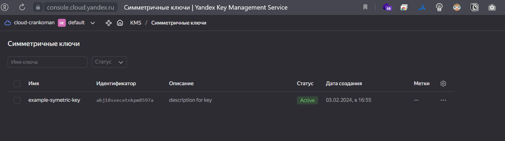
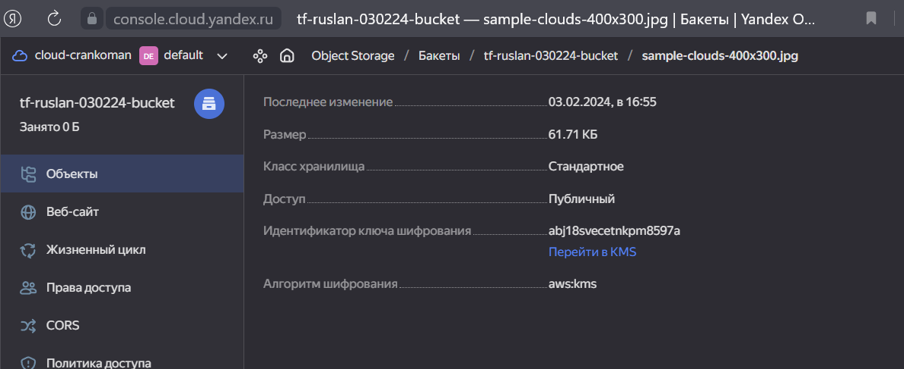

# Домашнее задание к занятию «Безопасность в облачных провайдерах»  

Используя конфигурации, выполненные в рамках предыдущих домашних заданий, нужно добавить возможность шифрования бакета.

---
## Задание 1. Yandex Cloud   

1. С помощью ключа в KMS необходимо зашифровать содержимое бакета:

 - создать ключ в KMS;
 - с помощью ключа зашифровать содержимое бакета, созданного ранее.
2. (Выполняется не в Terraform)* Создать статический сайт в Object Storage c собственным публичным адресом и сделать доступным по HTTPS:

 - создать сертификат;
 - создать статическую страницу в Object Storage и применить сертификат HTTPS;
 - в качестве результата предоставить скриншот на страницу с сертификатом в заголовке (замочек).

<-- Ответ

Прописываем манифесты в той же папке и запускаем 

`terraform apply --auto-approve`
<details>                         
    <summary>подробнее</summary>

```shell
devops@4SER-1670916090:~/netology/devops/kuber/15.3$ terraform apply --auto-approve
yandex_iam_service_account.sa: Refreshing state... [id=aje1kmjll2g7bmrk327b]
yandex_iam_service_account.sa1: Refreshing state... [id=ajes3jjuifdcn1ivb7k6]
yandex_vpc_network.devops_net: Refreshing state... [id=enpvpgdev7u091iekjq1]
yandex_vpc_route_table.nat-route-table: Refreshing state... [id=enpd5rrt4bk9c2m9uhtv]
yandex_vpc_subnet.public-subnet: Refreshing state... [id=e9b7oh0pnh4pksi1ijol]
yandex_iam_service_account_static_access_key.sa-static-key: Refreshing state... [id=aje4jbha2nmmcs8d278o]
yandex_vpc_subnet.private-subnet: Refreshing state... [id=e9b2g2i13fhvqb0cqesm]

Note: Objects have changed outside of Terraform

Terraform detected the following changes made outside of Terraform since the last "terraform apply" which may have affected this plan:

  # yandex_iam_service_account.sa has been deleted
  - resource "yandex_iam_service_account" "sa" {
      - id         = "aje1kmjll2g7bmrk327b" -> null
        name       = "tf-test-sa"
        # (2 unchanged attributes hidden)
    }

  # yandex_iam_service_account_static_access_key.sa-static-key has been deleted
  - resource "yandex_iam_service_account_static_access_key" "sa-static-key" {
      - access_key         = "YCAJEHsJqvnrRGYzR5buz3ZrP" -> null
        id                 = "aje4jbha2nmmcs8d278o"
      - secret_key         = (sensitive value) -> null
        # (3 unchanged attributes hidden)
    }

  # yandex_vpc_network.devops_net has been deleted
  - resource "yandex_vpc_network" "devops_net" {
      - id                        = "enpvpgdev7u091iekjq1" -> null
        name                      = "devops_net"
        # (5 unchanged attributes hidden)
    }

  # yandex_vpc_route_table.nat-route-table has been deleted
  - resource "yandex_vpc_route_table" "nat-route-table" {
      - id         = "enpd5rrt4bk9c2m9uhtv" -> null
        # (4 unchanged attributes hidden)

        # (1 unchanged block hidden)
    }

  # yandex_vpc_subnet.private-subnet has been deleted
  - resource "yandex_vpc_subnet" "private-subnet" {
      - id             = "e9b2g2i13fhvqb0cqesm" -> null
        name           = "private"
        # (8 unchanged attributes hidden)
    }

  # yandex_vpc_subnet.public-subnet has been deleted
  - resource "yandex_vpc_subnet" "public-subnet" {
      - id             = "e9b7oh0pnh4pksi1ijol" -> null
        name           = "public"
        # (7 unchanged attributes hidden)
    }


Unless you have made equivalent changes to your configuration, or ignored the relevant attributes using ignore_changes, the following
plan may include actions to undo or respond to these changes.

────────────────────────────────────────────────────────────────────────────────────────────────────────────────────────────────────────

Terraform used the selected providers to generate the following execution plan. Resource actions are indicated with the following
symbols:
  + create

Terraform will perform the following actions:

  # yandex_compute_instance.nat-instance will be created
  + resource "yandex_compute_instance" "nat-instance" {
      + created_at                = (known after apply)
      + folder_id                 = (known after apply)
      + fqdn                      = (known after apply)
      + gpu_cluster_id            = (known after apply)
      + hostname                  = (known after apply)
      + id                        = (known after apply)
      + maintenance_grace_period  = (known after apply)
      + maintenance_policy        = (known after apply)
      + metadata                  = {
          + "ssh-keys" = <<-EOT
                ubuntu:ssh-rsa AAAAB3NzaC1yc2EAAAADAQABAAABgQCwcK6AMVsw1RoPhjWyhAjSF2DMPWG/O8aFcAVWVBkEsY+pKrpegYgeU8c203BdBmOwPZJrhIQ3eTzguD68q2CHUk7kg4xk6pFGhrWbLTinX3LYY9gbL9v4wcPqJIb5hlGMNzDb9FhqzUVYsc5hMoxu7LBqDXFL95L7t0mmWcTiFjtacz4rbEY3OqsdYTcTkV4DemgKnQxweqg7wz7RVozXB4fM835CRnrmCrA2MSOVEh8gmRjRI0luHAANJM1J/wJYOiVvFL8RTpgKQAiifdztdAX+Ho0z5Ckd/hqljjosFxs2lbPQJOeoxrpNOUQJyXl8OmiRi9n9Wu5WFSACYMzp+1zSKdo51TWwR52eVwhB0JUQ/asX9FdtGSDExBgJfjGTMIjSecCIbp+xDVBv4lSPTeqhtZ8a7gEf5P/+ndbeMox3HZeVa8KjSBKvNDIB5p4NKU+gZUBm5VDsgRAqmShNq22mYxcv9pC9kLmxOCZ1iK4xCS1db5vmLVJMIfiX3F0= devops@4SER-1670916090.4server.su
            EOT
        }
      + name                      = "nat-vm"
      + network_acceleration_type = "standard"
      + platform_id               = "standard-v1"
      + service_account_id        = (known after apply)
      + status                    = (known after apply)
      + zone                      = "ru-central1-a"

      + boot_disk {
          + auto_delete = true
          + device_name = (known after apply)
          + disk_id     = (known after apply)
          + mode        = (known after apply)

          + initialize_params {
              + block_size  = (known after apply)
              + description = (known after apply)
              + image_id    = "fd80mrhj8fl2oe87o4e1"
              + name        = (known after apply)
              + size        = (known after apply)
              + snapshot_id = (known after apply)
              + type        = "network-hdd"
            }
        }

      + network_interface {
          + index              = (known after apply)
          + ip_address         = "192.168.10.254"
          + ipv4               = true
          + ipv6               = (known after apply)
          + ipv6_address       = (known after apply)
          + mac_address        = (known after apply)
          + nat                = true
          + nat_ip_address     = (known after apply)
          + nat_ip_version     = (known after apply)
          + security_group_ids = (known after apply)
          + subnet_id          = (known after apply)
        }

      + resources {
          + core_fraction = 20
          + cores         = 2
          + memory        = 2
        }
    }

  # yandex_compute_instance.private-instance will be created
  + resource "yandex_compute_instance" "private-instance" {
      + created_at                = (known after apply)
      + folder_id                 = (known after apply)
      + fqdn                      = (known after apply)
      + gpu_cluster_id            = (known after apply)
      + hostname                  = (known after apply)
      + id                        = (known after apply)
      + maintenance_grace_period  = (known after apply)
      + maintenance_policy        = (known after apply)
      + metadata                  = {
          + "ssh-keys" = <<-EOT
                ubuntu:ssh-rsa AAAAB3NzaC1yc2EAAAADAQABAAABgQCwcK6AMVsw1RoPhjWyhAjSF2DMPWG/O8aFcAVWVBkEsY+pKrpegYgeU8c203BdBmOwPZJrhIQ3eTzguD68q2CHUk7kg4xk6pFGhrWbLTinX3LYY9gbL9v4wcPqJIb5hlGMNzDb9FhqzUVYsc5hMoxu7LBqDXFL95L7t0mmWcTiFjtacz4rbEY3OqsdYTcTkV4DemgKnQxweqg7wz7RVozXB4fM835CRnrmCrA2MSOVEh8gmRjRI0luHAANJM1J/wJYOiVvFL8RTpgKQAiifdztdAX+Ho0z5Ckd/hqljjosFxs2lbPQJOeoxrpNOUQJyXl8OmiRi9n9Wu5WFSACYMzp+1zSKdo51TWwR52eVwhB0JUQ/asX9FdtGSDExBgJfjGTMIjSecCIbp+xDVBv4lSPTeqhtZ8a7gEf5P/+ndbeMox3HZeVa8KjSBKvNDIB5p4NKU+gZUBm5VDsgRAqmShNq22mYxcv9pC9kLmxOCZ1iK4xCS1db5vmLVJMIfiX3F0= devops@4SER-1670916090.4server.su
            EOT
        }
      + name                      = "private-vm-name"
      + network_acceleration_type = "standard"
      + platform_id               = "standard-v1"
      + service_account_id        = (known after apply)
      + status                    = (known after apply)
      + zone                      = "ru-central1-a"

      + boot_disk {
          + auto_delete = true
          + device_name = (known after apply)
          + disk_id     = (known after apply)
          + mode        = (known after apply)

          + initialize_params {
              + block_size  = (known after apply)
              + description = (known after apply)
              + image_id    = "fd8ba0ukgkn46r0qr1gi"
              + name        = (known after apply)
              + size        = (known after apply)
              + snapshot_id = (known after apply)
              + type        = "network-hdd"
            }
        }

      + network_interface {
          + index              = (known after apply)
          + ip_address         = (known after apply)
          + ipv4               = true
          + ipv6               = (known after apply)
          + ipv6_address       = (known after apply)
          + mac_address        = (known after apply)
          + nat                = false
          + nat_ip_address     = (known after apply)
          + nat_ip_version     = (known after apply)
          + security_group_ids = (known after apply)
          + subnet_id          = (known after apply)
        }

      + resources {
          + core_fraction = 20
          + cores         = 2
          + memory        = 2
        }
    }

  # yandex_compute_instance.public-instance will be created
  + resource "yandex_compute_instance" "public-instance" {
      + created_at                = (known after apply)
      + folder_id                 = (known after apply)
      + fqdn                      = (known after apply)
      + gpu_cluster_id            = (known after apply)
      + hostname                  = (known after apply)
      + id                        = (known after apply)
      + maintenance_grace_period  = (known after apply)
      + maintenance_policy        = (known after apply)
      + metadata                  = {
          + "ssh-keys" = <<-EOT
                ubuntu:ssh-rsa AAAAB3NzaC1yc2EAAAADAQABAAABgQCwcK6AMVsw1RoPhjWyhAjSF2DMPWG/O8aFcAVWVBkEsY+pKrpegYgeU8c203BdBmOwPZJrhIQ3eTzguD68q2CHUk7kg4xk6pFGhrWbLTinX3LYY9gbL9v4wcPqJIb5hlGMNzDb9FhqzUVYsc5hMoxu7LBqDXFL95L7t0mmWcTiFjtacz4rbEY3OqsdYTcTkV4DemgKnQxweqg7wz7RVozXB4fM835CRnrmCrA2MSOVEh8gmRjRI0luHAANJM1J/wJYOiVvFL8RTpgKQAiifdztdAX+Ho0z5Ckd/hqljjosFxs2lbPQJOeoxrpNOUQJyXl8OmiRi9n9Wu5WFSACYMzp+1zSKdo51TWwR52eVwhB0JUQ/asX9FdtGSDExBgJfjGTMIjSecCIbp+xDVBv4lSPTeqhtZ8a7gEf5P/+ndbeMox3HZeVa8KjSBKvNDIB5p4NKU+gZUBm5VDsgRAqmShNq22mYxcv9pC9kLmxOCZ1iK4xCS1db5vmLVJMIfiX3F0= devops@4SER-1670916090.4server.su
            EOT
        }
      + name                      = "public-vm-name"
      + network_acceleration_type = "standard"
      + platform_id               = "standard-v1"
      + service_account_id        = (known after apply)
      + status                    = (known after apply)
      + zone                      = "ru-central1-a"

      + boot_disk {
          + auto_delete = true
          + device_name = (known after apply)
          + disk_id     = (known after apply)
          + mode        = (known after apply)

          + initialize_params {
              + block_size  = (known after apply)
              + description = (known after apply)
              + image_id    = "fd8ba0ukgkn46r0qr1gi"
              + name        = (known after apply)
              + size        = (known after apply)
              + snapshot_id = (known after apply)
              + type        = "network-hdd"
            }
        }

      + network_interface {
          + index              = (known after apply)
          + ip_address         = (known after apply)
          + ipv4               = true
          + ipv6               = (known after apply)
          + ipv6_address       = (known after apply)
          + mac_address        = (known after apply)
          + nat                = true
          + nat_ip_address     = (known after apply)
          + nat_ip_version     = (known after apply)
          + security_group_ids = (known after apply)
          + subnet_id          = (known after apply)
        }

      + resources {
          + core_fraction = 20
          + cores         = 2
          + memory        = 2
        }
    }

  # yandex_iam_service_account.sa will be created
  + resource "yandex_iam_service_account" "sa" {
      + created_at = (known after apply)
      + folder_id  = "b1g5vv7mvebufecjtbri"
      + id         = (known after apply)
      + name       = "tf-test-sa"
    }

  # yandex_iam_service_account_static_access_key.sa-static-key will be created
  + resource "yandex_iam_service_account_static_access_key" "sa-static-key" {
      + access_key           = (known after apply)
      + created_at           = (known after apply)
      + description          = "static access key for object storage"
      + encrypted_secret_key = (known after apply)
      + id                   = (known after apply)
      + key_fingerprint      = (known after apply)
      + secret_key           = (sensitive value)
      + service_account_id   = (known after apply)
    }

  # yandex_kms_symmetric_key.key-a will be created
  + resource "yandex_kms_symmetric_key" "key-a" {
      + created_at          = (known after apply)
      + default_algorithm   = "AES_128"
      + deletion_protection = false
      + description         = "description for key"
      + folder_id           = (known after apply)
      + id                  = (known after apply)
      + name                = "example-symetric-key"
      + rotated_at          = (known after apply)
      + rotation_period     = "8760h"
      + status              = (known after apply)
    }

  # yandex_resourcemanager_folder_iam_member.kms will be created
  + resource "yandex_resourcemanager_folder_iam_member" "kms" {
      + folder_id = "b1g5vv7mvebufecjtbri"
      + id        = (known after apply)
      + member    = (known after apply)
      + role      = "kms.keys.encrypterDecrypter"
    }

  # yandex_resourcemanager_folder_iam_member.sa-editor will be created
  + resource "yandex_resourcemanager_folder_iam_member" "sa-editor" {
      + folder_id = "b1g5vv7mvebufecjtbri"
      + id        = (known after apply)
      + member    = (known after apply)
      + role      = "storage.editor"
    }

  # yandex_storage_bucket.test-bucket will be created
  + resource "yandex_storage_bucket" "test-bucket" {
      + access_key            = (known after apply)
      + acl                   = "public-read"
      + bucket                = "tf-ruslan-030224-bucket"
      + bucket_domain_name    = (known after apply)
      + default_storage_class = (known after apply)
      + folder_id             = (known after apply)
      + force_destroy         = false
      + id                    = (known after apply)
      + secret_key            = (sensitive value)
      + website_domain        = (known after apply)
      + website_endpoint      = (known after apply)

      + server_side_encryption_configuration {
          + rule {
              + apply_server_side_encryption_by_default {
                  + kms_master_key_id = (known after apply)
                  + sse_algorithm     = "aws:kms"
                }
            }
        }
    }

  # yandex_storage_object.image-upload will be created
  + resource "yandex_storage_object" "image-upload" {
      + access_key                    = (known after apply)
      + acl                           = "public-read"
      + bucket                        = "tf-ruslan-030224-bucket"
      + content_type                  = (known after apply)
      + id                            = (known after apply)
      + key                           = "sample-clouds-400x300.jpg"
      + object_lock_legal_hold_status = "OFF"
      + secret_key                    = (sensitive value)
      + source                        = "./sample-clouds-400x300.jpg"
    }

  # yandex_vpc_network.devops_net will be created
  + resource "yandex_vpc_network" "devops_net" {
      + created_at                = (known after apply)
      + default_security_group_id = (known after apply)
      + folder_id                 = (known after apply)
      + id                        = (known after apply)
      + labels                    = (known after apply)
      + name                      = "devops_net"
      + subnet_ids                = (known after apply)
    }

  # yandex_vpc_route_table.nat-route-table will be created
  + resource "yandex_vpc_route_table" "nat-route-table" {
      + created_at = (known after apply)
      + folder_id  = (known after apply)
      + id         = (known after apply)
      + labels     = (known after apply)
      + network_id = (known after apply)

      + static_route {
          + destination_prefix = "0.0.0.0/0"
          + next_hop_address   = "192.168.10.254"
        }
    }

  # yandex_vpc_subnet.private-subnet will be created
  + resource "yandex_vpc_subnet" "private-subnet" {
      + created_at     = (known after apply)
      + folder_id      = (known after apply)
      + id             = (known after apply)
      + labels         = (known after apply)
      + name           = "private"
      + network_id     = (known after apply)
      + route_table_id = (known after apply)
      + v4_cidr_blocks = [
          + "192.168.20.0/24",
        ]
      + v6_cidr_blocks = (known after apply)
      + zone           = "ru-central1-a"
    }

  # yandex_vpc_subnet.public-subnet will be created
  + resource "yandex_vpc_subnet" "public-subnet" {
      + created_at     = (known after apply)
      + folder_id      = (known after apply)
      + id             = (known after apply)
      + labels         = (known after apply)
      + name           = "public"
      + network_id     = (known after apply)
      + v4_cidr_blocks = [
          + "192.168.10.0/24",
        ]
      + v6_cidr_blocks = (known after apply)
      + zone           = "ru-central1-a"
    }

Plan: 14 to add, 0 to change, 0 to destroy.

Changes to Outputs:
  + nat-instance_ip        = "192.168.10.254"
  + nat-instance_nat_ip    = (known after apply)
  + picture_url            = (known after apply)
  + private-instance_ip    = (known after apply)
  + public-instance_ip     = (known after apply)
  + public-instance_nat_ip = (known after apply)
yandex_vpc_network.devops_net: Creating...
yandex_iam_service_account.sa: Creating...
yandex_kms_symmetric_key.key-a: Creating...
yandex_kms_symmetric_key.key-a: Creation complete after 1s [id=abj18svecetnkpm8597a]
yandex_vpc_network.devops_net: Creation complete after 2s [id=enp33cjf5hs635u108u8]
yandex_vpc_subnet.public-subnet: Creating...
yandex_vpc_route_table.nat-route-table: Creating...
yandex_iam_service_account.sa: Creation complete after 3s [id=ajeqge13thj67krnra76]
yandex_iam_service_account_static_access_key.sa-static-key: Creating...
yandex_resourcemanager_folder_iam_member.sa-editor: Creating...
yandex_resourcemanager_folder_iam_member.kms: Creating...
yandex_vpc_route_table.nat-route-table: Creation complete after 1s [id=enph0iea67ie6i1ljk7m]
yandex_vpc_subnet.private-subnet: Creating...
yandex_vpc_subnet.private-subnet: Creation complete after 0s [id=e9b2eposp3hvnvtokg5l]
yandex_compute_instance.private-instance: Creating...
yandex_iam_service_account_static_access_key.sa-static-key: Creation complete after 1s [id=ajetrga54809ktdg9ehj]
yandex_storage_bucket.test-bucket: Creating...
yandex_vpc_subnet.public-subnet: Creation complete after 2s [id=e9b8mbecr9kl6n281juu]
yandex_compute_instance.nat-instance: Creating...
yandex_compute_instance.public-instance: Creating...
yandex_resourcemanager_folder_iam_member.kms: Creation complete after 2s [id=b1g5vv7mvebufecjtbri/kms.keys.encrypterDecrypter/serviceAccount:ajeqge13thj67krnra76]
yandex_resourcemanager_folder_iam_member.sa-editor: Creation complete after 5s [id=b1g5vv7mvebufecjtbri/storage.editor/serviceAccount:ajeqge13thj67krnra76]
yandex_storage_bucket.test-bucket: Creation complete after 6s [id=tf-ruslan-030224-bucket]
yandex_storage_object.image-upload: Creating...
yandex_storage_object.image-upload: Creation complete after 1s [id=sample-clouds-400x300.jpg]
yandex_compute_instance.private-instance: Still creating... [10s elapsed]
yandex_compute_instance.nat-instance: Still creating... [10s elapsed]
yandex_compute_instance.public-instance: Still creating... [10s elapsed]
yandex_compute_instance.private-instance: Still creating... [20s elapsed]
yandex_compute_instance.nat-instance: Still creating... [20s elapsed]
yandex_compute_instance.public-instance: Still creating... [20s elapsed]
yandex_compute_instance.private-instance: Still creating... [30s elapsed]
yandex_compute_instance.public-instance: Still creating... [30s elapsed]
yandex_compute_instance.nat-instance: Still creating... [30s elapsed]
yandex_compute_instance.public-instance: Creation complete after 35s [id=fhma9ps15ksfn9ei4lgn]
yandex_compute_instance.private-instance: Creation complete after 36s [id=fhm3ifa123hm5ah5m9lt]
yandex_compute_instance.nat-instance: Still creating... [40s elapsed]
yandex_compute_instance.nat-instance: Still creating... [50s elapsed]
yandex_compute_instance.nat-instance: Creation complete after 58s [id=fhmdhi3ebpev0c7b7rnf]

Apply complete! Resources: 14 added, 0 changed, 0 destroyed.

Outputs:

nat-instance_ip = "192.168.10.254"
nat-instance_nat_ip = "62.84.114.31"
picture_url = "https://tf-ruslan-030224-bucket.storage.yandexcloud.net"
private-instance_ip = "192.168.20.4"
public-instance_ip = "192.168.10.10"
public-instance_nat_ip = "178.154.204.20"
```
</details>

Проверяем 





------


Полезные документы:

- [Настройка HTTPS статичного сайта](https://cloud.yandex.ru/docs/storage/operations/hosting/certificate).
- [Object Storage bucket](https://registry.terraform.io/providers/yandex-cloud/yandex/latest/docs/resources/storage_bucket).
- [KMS key](https://registry.terraform.io/providers/yandex-cloud/yandex/latest/docs/resources/kms_symmetric_key).

--- 
## Задание 2*. AWS (задание со звёздочкой)

Это необязательное задание. Его выполнение не влияет на получение зачёта по домашней работе.

**Что нужно сделать**

1. С помощью роли IAM записать файлы ЕС2 в S3-бакет:
 - создать роль в IAM для возможности записи в S3 бакет;
 - применить роль к ЕС2-инстансу;
 - с помощью bootstrap-скрипта записать в бакет файл веб-страницы.
2. Организация шифрования содержимого S3-бакета:

 - используя конфигурации, выполненные в домашнем задании из предыдущего занятия, добавить к созданному ранее бакету S3 возможность шифрования Server-Side, используя общий ключ;
 - включить шифрование SSE-S3 бакету S3 для шифрования всех вновь добавляемых объектов в этот бакет.

3. *Создание сертификата SSL и применение его к ALB:

 - создать сертификат с подтверждением по email;
 - сделать запись в Route53 на собственный поддомен, указав адрес LB;
 - применить к HTTPS-запросам на LB созданный ранее сертификат.

Resource Terraform:

- [IAM Role](https://registry.terraform.io/providers/hashicorp/aws/latest/docs/resources/iam_role).
- [AWS KMS](https://registry.terraform.io/providers/hashicorp/aws/latest/docs/resources/kms_key).
- [S3 encrypt with KMS key](https://registry.terraform.io/providers/hashicorp/aws/latest/docs/resources/s3_bucket_object#encrypting-with-kms-key).

Пример bootstrap-скрипта:

```
#!/bin/bash
yum install httpd -y
service httpd start
chkconfig httpd on
cd /var/www/html
echo "<html><h1>My cool web-server</h1></html>" > index.html
aws s3 mb s3://mysuperbacketname2021
aws s3 cp index.html s3://mysuperbacketname2021
```

### Правила приёма работы

Домашняя работа оформляется в своём Git репозитории в файле README.md. Выполненное домашнее задание пришлите ссылкой на .md-файл в вашем репозитории.
Файл README.md должен содержать скриншоты вывода необходимых команд, а также скриншоты результатов.
Репозиторий должен содержать тексты манифестов или ссылки на них в файле README.md.