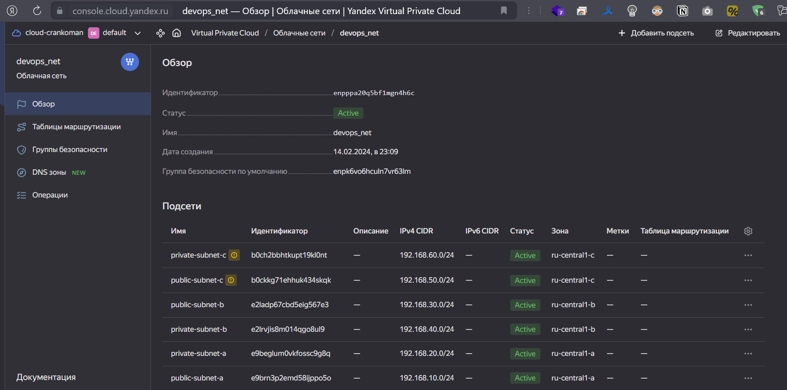
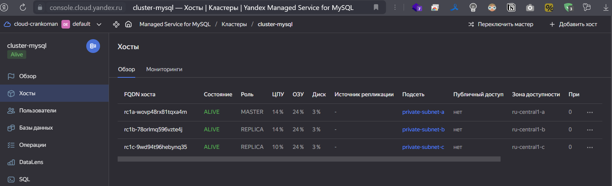
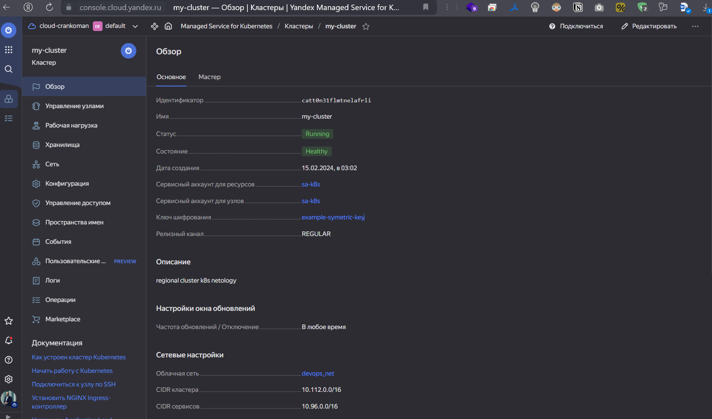
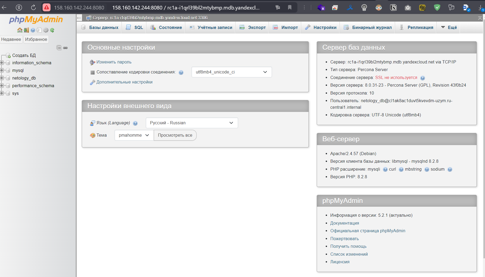

# Домашнее задание к занятию «Кластеры. Ресурсы под управлением облачных провайдеров»

### Цели задания 

1. Организация кластера Kubernetes и кластера баз данных MySQL в отказоустойчивой архитектуре.
2. Размещение в private подсетях кластера БД, а в public — кластера Kubernetes.

---
## Задание 1. Yandex Cloud

1. Настроить с помощью Terraform кластер баз данных MySQL.

 - Используя настройки VPC из предыдущих домашних заданий, добавить дополнительно подсеть private в разных зонах, чтобы обеспечить отказоустойчивость. 
 - Разместить ноды кластера MySQL в разных подсетях.
 - Необходимо предусмотреть репликацию с произвольным временем технического обслуживания.
 - Использовать окружение Prestable, платформу Intel Broadwell с производительностью 50% CPU и размером диска 20 Гб.
 - Задать время начала резервного копирования — 23:59.
 - Включить защиту кластера от непреднамеренного удаления.
 - Создать БД с именем `netology_db`, логином и паролем.

<-- Ответ

Прописываем манифесты (db.tf и network.tf) в той же папке и запускаем 

`terraform apply --auto-approve`
<details>                         
    <summary>подробнее</summary>

```shell
devops@4SER-1670916090:~/netology/devops/kuber/15.4$ terraform apply --auto-approve

Terraform used the selected providers to generate the following execution plan. Resource actions are indicated with the following symbols:
  + create

Terraform will perform the following actions:

  # yandex_mdb_mysql_cluster.cluster-mysql will be created
  + resource "yandex_mdb_mysql_cluster" "cluster-mysql" {
      + allow_regeneration_host   = false
      + backup_retain_period_days = (known after apply)
      + created_at                = (known after apply)
      + deletion_protection       = true
      + environment               = "PRESTABLE"
      + folder_id                 = (known after apply)
      + health                    = (known after apply)
      + host_group_ids            = (known after apply)
      + id                        = (known after apply)
      + mysql_config              = {
          + "default_authentication_plugin" = "MYSQL_NATIVE_PASSWORD"
          + "innodb_print_all_deadlocks"    = "true"
          + "max_connections"               = "100"
          + "sql_mode"                      = "ONLY_FULL_GROUP_BY,STRICT_TRANS_TABLES,NO_ZERO_IN_DATE,NO_ZERO_DATE,ERROR_FOR_DIVISION_BY_ZERO,NO_ENGINE_SUBSTITUTION"
        }
      + name                      = "cluster-mysql"
      + network_id                = (known after apply)
      + status                    = (known after apply)
      + version                   = "8.0"

      + backup_window_start {
          + hours   = 23
          + minutes = 59
        }

      + host {
          + assign_public_ip   = false
          + fqdn               = (known after apply)
          + replication_source = (known after apply)
          + subnet_id          = (known after apply)
          + zone               = "ru-central1-a"
        }
      + host {
          + assign_public_ip   = false
          + fqdn               = (known after apply)
          + replication_source = (known after apply)
          + subnet_id          = (known after apply)
          + zone               = "ru-central1-b"
        }
      + host {
          + assign_public_ip   = false
          + fqdn               = (known after apply)
          + replication_source = (known after apply)
          + subnet_id          = (known after apply)
          + zone               = "ru-central1-c"
        }

      + maintenance_window {
          + type = "ANYTIME"
        }

      + resources {
          + disk_size          = 20
          + disk_type_id       = "network-ssd"
          + resource_preset_id = "b1.medium"
        }
    }

  # yandex_mdb_mysql_database.mysql_database will be created
  + resource "yandex_mdb_mysql_database" "mysql_database" {
      + cluster_id = (known after apply)
      + id         = (known after apply)
      + name       = "netology_db"
    }

  # yandex_mdb_mysql_user.netology_db will be created
  + resource "yandex_mdb_mysql_user" "netology_db" {
      + authentication_plugin = "MYSQL_NATIVE_PASSWORD"
      + cluster_id            = (known after apply)
      + global_permissions    = [
          + "PROCESS",
        ]
      + id                    = (known after apply)
      + name                  = "netology_db"
      + password              = (sensitive value)

      + connection_limits {
          + max_connections_per_hour = 30
          + max_questions_per_hour   = 10
          + max_updates_per_hour     = 20
          + max_user_connections     = 40
        }

      + permission {
          + database_name = "netology_db"
          + roles         = [
              + "ALL",
            ]
        }
    }

  # yandex_vpc_network.devops_net will be created
  + resource "yandex_vpc_network" "devops_net" {
      + created_at                = (known after apply)
      + default_security_group_id = (known after apply)
      + folder_id                 = (known after apply)
      + id                        = (known after apply)
      + labels                    = (known after apply)
      + name                      = "devops_net"
      + subnet_ids                = (known after apply)
    }

  # yandex_vpc_subnet.private-subnet-a will be created
  + resource "yandex_vpc_subnet" "private-subnet-a" {
      + created_at     = (known after apply)
      + folder_id      = (known after apply)
      + id             = (known after apply)
      + labels         = (known after apply)
      + name           = "private-subnet-a"
      + network_id     = (known after apply)
      + v4_cidr_blocks = [
          + "192.168.20.0/24",
        ]
      + v6_cidr_blocks = (known after apply)
      + zone           = "ru-central1-a"
    }

  # yandex_vpc_subnet.private-subnet-b will be created
  + resource "yandex_vpc_subnet" "private-subnet-b" {
      + created_at     = (known after apply)
      + folder_id      = (known after apply)
      + id             = (known after apply)
      + labels         = (known after apply)
      + name           = "private-subnet-b"
      + network_id     = (known after apply)
      + v4_cidr_blocks = [
          + "192.168.40.0/24",
        ]
      + v6_cidr_blocks = (known after apply)
      + zone           = "ru-central1-b"
    }

  # yandex_vpc_subnet.private-subnet-c will be created
  + resource "yandex_vpc_subnet" "private-subnet-c" {
      + created_at     = (known after apply)
      + folder_id      = (known after apply)
      + id             = (known after apply)
      + labels         = (known after apply)
      + name           = "private-subnet-c"
      + network_id     = (known after apply)
      + v4_cidr_blocks = [
          + "192.168.60.0/24",
        ]
      + v6_cidr_blocks = (known after apply)
      + zone           = "ru-central1-c"
    }

  # yandex_vpc_subnet.public-subnet-a will be created
  + resource "yandex_vpc_subnet" "public-subnet-a" {
      + created_at     = (known after apply)
      + folder_id      = (known after apply)
      + id             = (known after apply)
      + labels         = (known after apply)
      + name           = "public-subnet-a"
      + network_id     = (known after apply)
      + v4_cidr_blocks = [
          + "192.168.10.0/24",
        ]
      + v6_cidr_blocks = (known after apply)
      + zone           = "ru-central1-a"
    }

  # yandex_vpc_subnet.public-subnet-b will be created
  + resource "yandex_vpc_subnet" "public-subnet-b" {
      + created_at     = (known after apply)
      + folder_id      = (known after apply)
      + id             = (known after apply)
      + labels         = (known after apply)
      + name           = "public-subnet-b"
      + network_id     = (known after apply)
      + v4_cidr_blocks = [
          + "192.168.30.0/24",
        ]
      + v6_cidr_blocks = (known after apply)
      + zone           = "ru-central1-b"
    }

  # yandex_vpc_subnet.public-subnet-c will be created
  + resource "yandex_vpc_subnet" "public-subnet-c" {
      + created_at     = (known after apply)
      + folder_id      = (known after apply)
      + id             = (known after apply)
      + labels         = (known after apply)
      + name           = "public-subnet-c"
      + network_id     = (known after apply)
      + v4_cidr_blocks = [
          + "192.168.50.0/24",
        ]
      + v6_cidr_blocks = (known after apply)
      + zone           = "ru-central1-c"
    }

Plan: 10 to add, 0 to change, 0 to destroy.

Changes to Outputs:
  + mysql = (known after apply)
yandex_vpc_network.devops_net: Creating...
yandex_vpc_network.devops_net: Creation complete after 3s [id=enpppa20q5bf1mgn4h6c]
yandex_vpc_subnet.private-subnet-a: Creating...
yandex_vpc_subnet.private-subnet-b: Creating...
yandex_vpc_subnet.public-subnet-b: Creating...
yandex_vpc_subnet.public-subnet-a: Creating...
yandex_vpc_subnet.private-subnet-c: Creating...
yandex_vpc_subnet.public-subnet-c: Creating...
yandex_vpc_subnet.private-subnet-c: Creation complete after 0s [id=b0ch2bbhtkupt19kl0nt]
yandex_vpc_subnet.public-subnet-a: Creation complete after 0s [id=e9brn3p2emd58ijppo5o]
yandex_vpc_subnet.public-subnet-b: Creation complete after 1s [id=e2ladp67cbd5eig567e3]
yandex_vpc_subnet.public-subnet-c: Creation complete after 1s [id=b0ckkg71ehhuk434skqk]
yandex_vpc_subnet.private-subnet-b: Creation complete after 2s [id=e2lrvjis8m014qgo8ul9]
yandex_vpc_subnet.private-subnet-a: Creation complete after 3s [id=e9beglum0vkfossc9g8q]
yandex_mdb_mysql_cluster.cluster-mysql: Creating...
yandex_mdb_mysql_cluster.cluster-mysql: Still creating... [10s elapsed]
yandex_mdb_mysql_cluster.cluster-mysql: Still creating... [20s elapsed]
yandex_mdb_mysql_cluster.cluster-mysql: Still creating... [30s elapsed]
yandex_mdb_mysql_cluster.cluster-mysql: Still creating... [40s elapsed]
yandex_mdb_mysql_cluster.cluster-mysql: Still creating... [50s elapsed]
yandex_mdb_mysql_cluster.cluster-mysql: Still creating... [1m0s elapsed]
yandex_mdb_mysql_cluster.cluster-mysql: Still creating... [1m10s elapsed]
yandex_mdb_mysql_cluster.cluster-mysql: Still creating... [1m20s elapsed]
yandex_mdb_mysql_cluster.cluster-mysql: Still creating... [1m30s elapsed]
yandex_mdb_mysql_cluster.cluster-mysql: Still creating... [1m40s elapsed]
yandex_mdb_mysql_cluster.cluster-mysql: Still creating... [1m50s elapsed]
yandex_mdb_mysql_cluster.cluster-mysql: Still creating... [2m0s elapsed]
yandex_mdb_mysql_cluster.cluster-mysql: Still creating... [2m10s elapsed]
yandex_mdb_mysql_cluster.cluster-mysql: Still creating... [2m20s elapsed]
yandex_mdb_mysql_cluster.cluster-mysql: Still creating... [2m30s elapsed]
yandex_mdb_mysql_cluster.cluster-mysql: Still creating... [2m40s elapsed]
yandex_mdb_mysql_cluster.cluster-mysql: Still creating... [2m50s elapsed]
yandex_mdb_mysql_cluster.cluster-mysql: Still creating... [3m0s elapsed]
yandex_mdb_mysql_cluster.cluster-mysql: Still creating... [3m10s elapsed]
yandex_mdb_mysql_cluster.cluster-mysql: Still creating... [3m20s elapsed]
yandex_mdb_mysql_cluster.cluster-mysql: Still creating... [3m30s elapsed]
yandex_mdb_mysql_cluster.cluster-mysql: Still creating... [3m40s elapsed]
yandex_mdb_mysql_cluster.cluster-mysql: Still creating... [3m50s elapsed]
yandex_mdb_mysql_cluster.cluster-mysql: Still creating... [4m0s elapsed]
yandex_mdb_mysql_cluster.cluster-mysql: Still creating... [4m10s elapsed]
yandex_mdb_mysql_cluster.cluster-mysql: Still creating... [4m20s elapsed]
yandex_mdb_mysql_cluster.cluster-mysql: Still creating... [4m30s elapsed]
yandex_mdb_mysql_cluster.cluster-mysql: Still creating... [4m40s elapsed]
yandex_mdb_mysql_cluster.cluster-mysql: Still creating... [4m50s elapsed]
yandex_mdb_mysql_cluster.cluster-mysql: Still creating... [5m0s elapsed]
yandex_mdb_mysql_cluster.cluster-mysql: Still creating... [5m10s elapsed]
yandex_mdb_mysql_cluster.cluster-mysql: Still creating... [5m20s elapsed]
yandex_mdb_mysql_cluster.cluster-mysql: Still creating... [5m30s elapsed]
yandex_mdb_mysql_cluster.cluster-mysql: Still creating... [5m40s elapsed]
yandex_mdb_mysql_cluster.cluster-mysql: Still creating... [5m50s elapsed]
yandex_mdb_mysql_cluster.cluster-mysql: Still creating... [6m0s elapsed]
yandex_mdb_mysql_cluster.cluster-mysql: Still creating... [6m10s elapsed]
yandex_mdb_mysql_cluster.cluster-mysql: Still creating... [6m20s elapsed]
yandex_mdb_mysql_cluster.cluster-mysql: Still creating... [6m30s elapsed]
yandex_mdb_mysql_cluster.cluster-mysql: Still creating... [6m40s elapsed]
yandex_mdb_mysql_cluster.cluster-mysql: Still creating... [6m50s elapsed]
yandex_mdb_mysql_cluster.cluster-mysql: Still creating... [7m0s elapsed]
yandex_mdb_mysql_cluster.cluster-mysql: Still creating... [7m10s elapsed]
yandex_mdb_mysql_cluster.cluster-mysql: Still creating... [7m20s elapsed]
yandex_mdb_mysql_cluster.cluster-mysql: Still creating... [7m30s elapsed]
yandex_mdb_mysql_cluster.cluster-mysql: Still creating... [7m40s elapsed]
yandex_mdb_mysql_cluster.cluster-mysql: Still creating... [7m50s elapsed]
yandex_mdb_mysql_cluster.cluster-mysql: Still creating... [8m0s elapsed]
yandex_mdb_mysql_cluster.cluster-mysql: Still creating... [8m10s elapsed]
yandex_mdb_mysql_cluster.cluster-mysql: Still creating... [8m20s elapsed]
yandex_mdb_mysql_cluster.cluster-mysql: Still creating... [8m30s elapsed]
yandex_mdb_mysql_cluster.cluster-mysql: Still creating... [8m40s elapsed]
yandex_mdb_mysql_cluster.cluster-mysql: Still creating... [8m50s elapsed]
yandex_mdb_mysql_cluster.cluster-mysql: Creation complete after 8m59s [id=c9q9dn5e57g6cpomqur8]
yandex_mdb_mysql_database.mysql_database: Creating...
yandex_mdb_mysql_database.mysql_database: Still creating... [10s elapsed]
yandex_mdb_mysql_database.mysql_database: Still creating... [20s elapsed]
yandex_mdb_mysql_database.mysql_database: Creation complete after 21s [id=c9q9dn5e57g6cpomqur8:netology_db]
yandex_mdb_mysql_user.netology_db: Creating...
yandex_mdb_mysql_user.netology_db: Still creating... [10s elapsed]
yandex_mdb_mysql_user.netology_db: Still creating... [20s elapsed]
yandex_mdb_mysql_user.netology_db: Creation complete after 23s [id=c9q9dn5e57g6cpomqur8:netology_db]

Apply complete! Resources: 10 added, 0 changed, 0 destroyed.

Outputs:

mysql = "rc1a-wovp48rx81tqxa4m.mdb.yandexcloud.net"

```

</details>

Проверяем:





------

1. Настроить с помощью Terraform кластер Kubernetes.

 - Используя настройки VPC из предыдущих домашних заданий, добавить дополнительно две подсети public в разных зонах, чтобы обеспечить отказоустойчивость.
 - Создать отдельный сервис-аккаунт с необходимыми правами. 
 - Создать региональный мастер Kubernetes с размещением нод в трёх разных подсетях.
 - Добавить возможность шифрования ключом из KMS, созданным в предыдущем домашнем задании.
 - Создать группу узлов, состояющую из трёх машин с автомасштабированием до шести.
 - Подключиться к кластеру с помощью `kubectl`.
 - *Запустить микросервис phpmyadmin и подключиться к ранее созданной БД.
 - *Создать сервис-типы Load Balancer и подключиться к phpmyadmin. Предоставить скриншот с публичным адресом и подключением к БД.

<-- Ответ

Прописываем манифесты (k8s.tf и kms.tf) в той же папке и запускаем 

`terraform apply --auto-approve`
<details>                         
    <summary>подробнее</summary>

```shell
terraform apply --auto-approve

Terraform used the selected providers to generate the following execution plan. Resource actions are indicated with the following symbols:
  + create

Terraform will perform the following actions:

  # yandex_iam_service_account.sa-k8s will be created
  + resource "yandex_iam_service_account" "sa-k8s" {
      + created_at  = (known after apply)
      + description = "Service account for Kubernetes cluster"
      + folder_id   = (known after apply)
      + id          = (known after apply)
      + name        = "sa-k8s"
    }

  # yandex_kms_symmetric_key.key-a will be created
  + resource "yandex_kms_symmetric_key" "key-a" {
      + created_at          = (known after apply)
      + default_algorithm   = "AES_128"
      + deletion_protection = false
      + description         = "description for key"
      + folder_id           = (known after apply)
      + id                  = (known after apply)
      + name                = "example-symetric-key"
      + rotated_at          = (known after apply)
      + rotation_period     = "8760h"
      + status              = (known after apply)
    }

  # yandex_kubernetes_cluster.my-cluster will be created
  + resource "yandex_kubernetes_cluster" "my-cluster" {
      + cluster_ipv4_range       = (known after apply)
      + cluster_ipv6_range       = (known after apply)
      + created_at               = (known after apply)
      + description              = "regional cluster k8s netology"
      + folder_id                = (known after apply)
      + health                   = (known after apply)
      + id                       = (known after apply)
      + labels                   = (known after apply)
      + log_group_id             = (known after apply)
      + name                     = "my-cluster"
      + network_id               = (known after apply)
      + node_ipv4_cidr_mask_size = 24
      + node_service_account_id  = (known after apply)
      + release_channel          = (known after apply)
      + service_account_id       = (known after apply)
      + service_ipv4_range       = (known after apply)
      + service_ipv6_range       = (known after apply)
      + status                   = (known after apply)

      + kms_provider {
          + key_id = (known after apply)
        }

      + master {
          + cluster_ca_certificate = (known after apply)
          + etcd_cluster_size      = (known after apply)
          + external_v4_address    = (known after apply)
          + external_v4_endpoint   = (known after apply)
          + external_v6_endpoint   = (known after apply)
          + internal_v4_address    = (known after apply)
          + internal_v4_endpoint   = (known after apply)
          + public_ip              = true
          + version                = "1.28"
          + version_info           = (known after apply)

          + regional {
              + region = "ru-central1"

              + location {
                  + subnet_id = (known after apply)
                  + zone      = "ru-central1-a"
                }
              + location {
                  + subnet_id = (known after apply)
                  + zone      = "ru-central1-b"
                }
              + location {
                  + subnet_id = (known after apply)
                  + zone      = "ru-central1-c"
                }
            }
        }
    }

  # yandex_kubernetes_node_group.my-node-group will be created
  + resource "yandex_kubernetes_node_group" "my-node-group" {
      + cluster_id        = (known after apply)
      + created_at        = (known after apply)
      + description       = "description"
      + id                = (known after apply)
      + instance_group_id = (known after apply)
      + labels            = (known after apply)
      + name              = "my-node-group"
      + status            = (known after apply)
      + version           = "1.28"
      + version_info      = (known after apply)

      + allocation_policy {
          + location {
              + subnet_id = (known after apply)
              + zone      = "ru-central1-a"
            }
        }

      + instance_template {
          + metadata                  = (known after apply)
          + nat                       = (known after apply)
          + network_acceleration_type = (known after apply)
          + platform_id               = "standard-v1"

          + boot_disk {
              + size = 30
              + type = "network-ssd"
            }

          + container_runtime {
              + type = "containerd"
            }

          + network_interface {
              + ipv4       = true
              + ipv6       = (known after apply)
              + nat        = true
              + subnet_ids = (known after apply)
            }

          + resources {
              + core_fraction = 5
              + cores         = 2
              + gpus          = 0
              + memory        = 2
            }

          + scheduling_policy {
              + preemptible = true
            }
        }

      + scale_policy {
          + auto_scale {
              + initial = 3
              + max     = 6
              + min     = 3
            }
        }
    }

  # yandex_mdb_mysql_cluster.cluster-mysql will be created
  + resource "yandex_mdb_mysql_cluster" "cluster-mysql" {
      + allow_regeneration_host   = false
      + backup_retain_period_days = (known after apply)
      + created_at                = (known after apply)
      + deletion_protection       = true
      + environment               = "PRESTABLE"
      + folder_id                 = (known after apply)
      + health                    = (known after apply)
      + host_group_ids            = (known after apply)
      + id                        = (known after apply)
      + mysql_config              = {
          + "default_authentication_plugin" = "MYSQL_NATIVE_PASSWORD"
          + "innodb_print_all_deadlocks"    = "true"
          + "max_connections"               = "100"
          + "sql_mode"                      = "ONLY_FULL_GROUP_BY,STRICT_TRANS_TABLES,NO_ZERO_IN_DATE,NO_ZERO_DATE,ERROR_FOR_DIVISION_BY_ZERO,NO_ENGINE_SUBSTITUTION"
        }
      + name                      = "cluster-mysql"
      + network_id                = (known after apply)
      + status                    = (known after apply)
      + version                   = "8.0"

      + backup_window_start {
          + hours   = 23
          + minutes = 59
        }

      + host {
          + assign_public_ip   = false
          + fqdn               = (known after apply)
          + replication_source = (known after apply)
          + subnet_id          = (known after apply)
          + zone               = "ru-central1-a"
        }
      + host {
          + assign_public_ip   = false
          + fqdn               = (known after apply)
          + replication_source = (known after apply)
          + subnet_id          = (known after apply)
          + zone               = "ru-central1-b"
        }
      + host {
          + assign_public_ip   = false
          + fqdn               = (known after apply)
          + replication_source = (known after apply)
          + subnet_id          = (known after apply)
          + zone               = "ru-central1-c"
        }

      + maintenance_window {
          + type = "ANYTIME"
        }

      + resources {
          + disk_size          = 20
          + disk_type_id       = "network-ssd"
          + resource_preset_id = "b1.medium"
        }
    }

  # yandex_mdb_mysql_database.mysql_database will be created
  + resource "yandex_mdb_mysql_database" "mysql_database" {
      + cluster_id = (known after apply)
      + id         = (known after apply)
      + name       = "netology_db"
    }

  # yandex_mdb_mysql_user.netology_db will be created
  + resource "yandex_mdb_mysql_user" "netology_db" {
      + authentication_plugin = "MYSQL_NATIVE_PASSWORD"
      + cluster_id            = (known after apply)
      + global_permissions    = [
          + "PROCESS",
        ]
      + id                    = (known after apply)
      + name                  = "netology_db"
      + password              = (sensitive value)

      + connection_limits {
          + max_connections_per_hour = 3000
          + max_questions_per_hour   = 1000
          + max_updates_per_hour     = 2000
          + max_user_connections     = 4000
        }

      + permission {
          + database_name = "netology_db"
          + roles         = [
              + "ALL",
            ]
        }
    }

  # yandex_resourcemanager_folder_iam_member.editor will be created
  + resource "yandex_resourcemanager_folder_iam_member" "editor" {
      + folder_id = "b1g5vv7mvebufecjtbri"
      + id        = (known after apply)
      + member    = (known after apply)
      + role      = "editor"
    }

  # yandex_resourcemanager_folder_iam_member.encrypterDecrypter will be created
  + resource "yandex_resourcemanager_folder_iam_member" "encrypterDecrypter" {
      + folder_id = "b1g5vv7mvebufecjtbri"
      + id        = (known after apply)
      + member    = (known after apply)
      + role      = "kms.keys.encrypterDecrypter"
    }

  # yandex_resourcemanager_folder_iam_member.images-puller will be created
  + resource "yandex_resourcemanager_folder_iam_member" "images-puller" {
      + folder_id = "b1g5vv7mvebufecjtbri"
      + id        = (known after apply)
      + member    = (known after apply)
      + role      = "container-registry.images.puller"
    }

  # yandex_resourcemanager_folder_iam_member.k8s-clusters-agent will be created
  + resource "yandex_resourcemanager_folder_iam_member" "k8s-clusters-agent" {
      + folder_id = "b1g5vv7mvebufecjtbri"
      + id        = (known after apply)
      + member    = (known after apply)
      + role      = "k8s.clusters.agent"
    }

  # yandex_resourcemanager_folder_iam_member.vpc-public-admin will be created
  + resource "yandex_resourcemanager_folder_iam_member" "vpc-public-admin" {
      + folder_id = "b1g5vv7mvebufecjtbri"
      + id        = (known after apply)
      + member    = (known after apply)
      + role      = "vpc.publicAdmin"
    }

  # yandex_vpc_network.devops_net will be created
  + resource "yandex_vpc_network" "devops_net" {
      + created_at                = (known after apply)
      + default_security_group_id = (known after apply)
      + folder_id                 = (known after apply)
      + id                        = (known after apply)
      + labels                    = (known after apply)
      + name                      = "devops_net"
      + subnet_ids                = (known after apply)
    }

  # yandex_vpc_subnet.private-subnet-a will be created
  + resource "yandex_vpc_subnet" "private-subnet-a" {
      + created_at     = (known after apply)
      + folder_id      = (known after apply)
      + id             = (known after apply)
      + labels         = (known after apply)
      + name           = "private-subnet-a"
      + network_id     = (known after apply)
      + v4_cidr_blocks = [
          + "192.168.20.0/24",
        ]
      + v6_cidr_blocks = (known after apply)
      + zone           = "ru-central1-a"
    }

  # yandex_vpc_subnet.private-subnet-b will be created
  + resource "yandex_vpc_subnet" "private-subnet-b" {
      + created_at     = (known after apply)
      + folder_id      = (known after apply)
      + id             = (known after apply)
      + labels         = (known after apply)
      + name           = "private-subnet-b"
      + network_id     = (known after apply)
      + v4_cidr_blocks = [
          + "192.168.40.0/24",
        ]
      + v6_cidr_blocks = (known after apply)
      + zone           = "ru-central1-b"
    }

  # yandex_vpc_subnet.private-subnet-c will be created
  + resource "yandex_vpc_subnet" "private-subnet-c" {
      + created_at     = (known after apply)
      + folder_id      = (known after apply)
      + id             = (known after apply)
      + labels         = (known after apply)
      + name           = "private-subnet-c"
      + network_id     = (known after apply)
      + v4_cidr_blocks = [
          + "192.168.60.0/24",
        ]
      + v6_cidr_blocks = (known after apply)
      + zone           = "ru-central1-c"
    }

  # yandex_vpc_subnet.public-subnet-a will be created
  + resource "yandex_vpc_subnet" "public-subnet-a" {
      + created_at     = (known after apply)
      + folder_id      = (known after apply)
      + id             = (known after apply)
      + labels         = (known after apply)
      + name           = "public-subnet-a"
      + network_id     = (known after apply)
      + v4_cidr_blocks = [
          + "192.168.10.0/24",
        ]
      + v6_cidr_blocks = (known after apply)
      + zone           = "ru-central1-a"
    }

  # yandex_vpc_subnet.public-subnet-b will be created
  + resource "yandex_vpc_subnet" "public-subnet-b" {
      + created_at     = (known after apply)
      + folder_id      = (known after apply)
      + id             = (known after apply)
      + labels         = (known after apply)
      + name           = "public-subnet-b"
      + network_id     = (known after apply)
      + v4_cidr_blocks = [
          + "192.168.30.0/24",
        ]
      + v6_cidr_blocks = (known after apply)
      + zone           = "ru-central1-b"
    }

  # yandex_vpc_subnet.public-subnet-c will be created
  + resource "yandex_vpc_subnet" "public-subnet-c" {
      + created_at     = (known after apply)
      + folder_id      = (known after apply)
      + id             = (known after apply)
      + labels         = (known after apply)
      + name           = "public-subnet-c"
      + network_id     = (known after apply)
      + v4_cidr_blocks = [
          + "192.168.50.0/24",
        ]
      + v6_cidr_blocks = (known after apply)
      + zone           = "ru-central1-c"
    }

Plan: 19 to add, 0 to change, 0 to destroy.

Changes to Outputs:
  + k8s_id  = (known after apply)
  + k8s_url = (known after apply)
  + mysql   = (known after apply)
yandex_vpc_network.devops_net: Creating...
yandex_kms_symmetric_key.key-a: Creating...
yandex_iam_service_account.sa-k8s: Creating...
yandex_kms_symmetric_key.key-a: Creation complete after 1s [id=abj38hnce7lveb3spk31]
yandex_vpc_network.devops_net: Creation complete after 3s [id=enp4rd92qub6h0cfmapr]
yandex_vpc_subnet.public-subnet-c: Creating...
yandex_vpc_subnet.private-subnet-a: Creating...
yandex_vpc_subnet.public-subnet-a: Creating...
yandex_vpc_subnet.private-subnet-b: Creating...
yandex_vpc_subnet.public-subnet-b: Creating...
yandex_vpc_subnet.private-subnet-c: Creating...
yandex_iam_service_account.sa-k8s: Creation complete after 3s [id=aje7vlsa69vnbj3m6v6d]
yandex_resourcemanager_folder_iam_member.images-puller: Creating...
yandex_resourcemanager_folder_iam_member.editor: Creating...
yandex_resourcemanager_folder_iam_member.k8s-clusters-agent: Creating...
yandex_resourcemanager_folder_iam_member.encrypterDecrypter: Creating...
yandex_vpc_subnet.public-subnet-c: Creation complete after 1s [id=b0cqajdp8rb822fg4rbl]
yandex_resourcemanager_folder_iam_member.vpc-public-admin: Creating...
yandex_vpc_subnet.private-subnet-a: Creation complete after 1s [id=e9bodmoo8ma9u7cu7m53]
yandex_vpc_subnet.private-subnet-c: Creation complete after 2s [id=b0cj33jeoctf5i5sqvkp]
yandex_vpc_subnet.public-subnet-a: Creation complete after 2s [id=e9bbtccdgjes5u3sedpa]
yandex_resourcemanager_folder_iam_member.images-puller: Creation complete after 3s [id=b1g5vv7mvebufecjtbri/container-registry.images.puller/serviceAccount:aje7vlsa69vnbj3m6v6d]
yandex_vpc_subnet.public-subnet-b: Creation complete after 3s [id=e2l11f1qic82hg5rl72o]
yandex_vpc_subnet.private-subnet-b: Creation complete after 4s [id=e2lvoe368gpqf9vb59p9]
yandex_mdb_mysql_cluster.cluster-mysql: Creating...
yandex_resourcemanager_folder_iam_member.editor: Creation complete after 5s [id=b1g5vv7mvebufecjtbri/editor/serviceAccount:aje7vlsa69vnbj3m6v6d]
yandex_resourcemanager_folder_iam_member.encrypterDecrypter: Creation complete after 8s [id=b1g5vv7mvebufecjtbri/kms.keys.encrypterDecrypter/serviceAccount:aje7vlsa69vnbj3m6v6d]
yandex_resourcemanager_folder_iam_member.k8s-clusters-agent: Still creating... [10s elapsed]
yandex_resourcemanager_folder_iam_member.vpc-public-admin: Still creating... [10s elapsed]
yandex_resourcemanager_folder_iam_member.k8s-clusters-agent: Creation complete after 11s [id=b1g5vv7mvebufecjtbri/k8s.clusters.agent/serviceAccount:aje7vlsa69vnbj3m6v6d]
yandex_resourcemanager_folder_iam_member.vpc-public-admin: Creation complete after 13s [id=b1g5vv7mvebufecjtbri/vpc.publicAdmin/serviceAccount:aje7vlsa69vnbj3m6v6d]
yandex_mdb_mysql_cluster.cluster-mysql: Still creating... [10s elapsed]
yandex_kubernetes_cluster.my-cluster: Creating...
yandex_mdb_mysql_cluster.cluster-mysql: Still creating... [20s elapsed]
yandex_kubernetes_cluster.my-cluster: Still creating... [10s elapsed]
yandex_mdb_mysql_cluster.cluster-mysql: Still creating... [30s elapsed]
yandex_kubernetes_cluster.my-cluster: Still creating... [20s elapsed]
yandex_mdb_mysql_cluster.cluster-mysql: Still creating... [40s elapsed]
yandex_kubernetes_cluster.my-cluster: Still creating... [30s elapsed]
yandex_mdb_mysql_cluster.cluster-mysql: Still creating... [50s elapsed]
yandex_kubernetes_cluster.my-cluster: Still creating... [40s elapsed]
yandex_mdb_mysql_cluster.cluster-mysql: Still creating... [1m0s elapsed]
yandex_kubernetes_cluster.my-cluster: Still creating... [50s elapsed]
yandex_mdb_mysql_cluster.cluster-mysql: Still creating... [1m10s elapsed]
yandex_kubernetes_cluster.my-cluster: Still creating... [1m0s elapsed]
yandex_mdb_mysql_cluster.cluster-mysql: Still creating... [1m20s elapsed]
yandex_kubernetes_cluster.my-cluster: Still creating... [1m10s elapsed]
yandex_mdb_mysql_cluster.cluster-mysql: Still creating... [1m30s elapsed]
yandex_kubernetes_cluster.my-cluster: Still creating... [1m20s elapsed]
yandex_mdb_mysql_cluster.cluster-mysql: Still creating... [1m40s elapsed]
yandex_kubernetes_cluster.my-cluster: Still creating... [1m30s elapsed]
yandex_mdb_mysql_cluster.cluster-mysql: Still creating... [1m50s elapsed]
yandex_kubernetes_cluster.my-cluster: Still creating... [1m40s elapsed]
yandex_mdb_mysql_cluster.cluster-mysql: Still creating... [2m0s elapsed]
yandex_kubernetes_cluster.my-cluster: Still creating... [1m50s elapsed]
yandex_mdb_mysql_cluster.cluster-mysql: Still creating... [2m10s elapsed]
yandex_kubernetes_cluster.my-cluster: Still creating... [2m0s elapsed]
yandex_mdb_mysql_cluster.cluster-mysql: Still creating... [2m20s elapsed]
yandex_kubernetes_cluster.my-cluster: Still creating... [2m10s elapsed]
yandex_mdb_mysql_cluster.cluster-mysql: Still creating... [2m30s elapsed]
yandex_kubernetes_cluster.my-cluster: Still creating... [2m20s elapsed]
yandex_mdb_mysql_cluster.cluster-mysql: Still creating... [2m40s elapsed]
yandex_kubernetes_cluster.my-cluster: Still creating... [2m30s elapsed]
yandex_mdb_mysql_cluster.cluster-mysql: Still creating... [2m50s elapsed]
yandex_kubernetes_cluster.my-cluster: Still creating... [2m40s elapsed]
yandex_mdb_mysql_cluster.cluster-mysql: Still creating... [3m0s elapsed]
yandex_kubernetes_cluster.my-cluster: Still creating... [2m50s elapsed]
yandex_mdb_mysql_cluster.cluster-mysql: Still creating... [3m10s elapsed]
yandex_kubernetes_cluster.my-cluster: Still creating... [3m0s elapsed]
yandex_mdb_mysql_cluster.cluster-mysql: Still creating... [3m20s elapsed]
yandex_kubernetes_cluster.my-cluster: Still creating... [3m10s elapsed]
yandex_mdb_mysql_cluster.cluster-mysql: Still creating... [3m30s elapsed]
yandex_kubernetes_cluster.my-cluster: Still creating... [3m20s elapsed]
yandex_mdb_mysql_cluster.cluster-mysql: Still creating... [3m40s elapsed]
yandex_kubernetes_cluster.my-cluster: Still creating... [3m30s elapsed]
yandex_mdb_mysql_cluster.cluster-mysql: Still creating... [3m50s elapsed]
yandex_kubernetes_cluster.my-cluster: Still creating... [3m40s elapsed]
yandex_mdb_mysql_cluster.cluster-mysql: Still creating... [4m0s elapsed]
yandex_kubernetes_cluster.my-cluster: Still creating... [3m50s elapsed]
yandex_mdb_mysql_cluster.cluster-mysql: Still creating... [4m10s elapsed]
yandex_kubernetes_cluster.my-cluster: Still creating... [4m0s elapsed]
yandex_mdb_mysql_cluster.cluster-mysql: Still creating... [4m20s elapsed]
yandex_kubernetes_cluster.my-cluster: Still creating... [4m10s elapsed]
yandex_mdb_mysql_cluster.cluster-mysql: Still creating... [4m30s elapsed]
yandex_kubernetes_cluster.my-cluster: Still creating... [4m20s elapsed]
yandex_mdb_mysql_cluster.cluster-mysql: Still creating... [4m40s elapsed]
yandex_kubernetes_cluster.my-cluster: Still creating... [4m30s elapsed]
yandex_mdb_mysql_cluster.cluster-mysql: Still creating... [4m50s elapsed]
yandex_kubernetes_cluster.my-cluster: Still creating... [4m40s elapsed]
yandex_mdb_mysql_cluster.cluster-mysql: Still creating... [5m0s elapsed]
yandex_kubernetes_cluster.my-cluster: Still creating... [4m50s elapsed]
yandex_mdb_mysql_cluster.cluster-mysql: Still creating... [5m10s elapsed]
yandex_kubernetes_cluster.my-cluster: Still creating... [5m0s elapsed]
yandex_mdb_mysql_cluster.cluster-mysql: Still creating... [5m20s elapsed]
yandex_kubernetes_cluster.my-cluster: Still creating... [5m10s elapsed]
yandex_mdb_mysql_cluster.cluster-mysql: Still creating... [5m30s elapsed]
yandex_kubernetes_cluster.my-cluster: Still creating... [5m20s elapsed]
yandex_mdb_mysql_cluster.cluster-mysql: Still creating... [5m40s elapsed]
yandex_kubernetes_cluster.my-cluster: Creation complete after 5m30s [id=catt0n31flmtnelafrli]
yandex_kubernetes_node_group.my-node-group: Creating...
yandex_mdb_mysql_cluster.cluster-mysql: Still creating... [5m50s elapsed]
yandex_kubernetes_node_group.my-node-group: Still creating... [10s elapsed]
yandex_mdb_mysql_cluster.cluster-mysql: Still creating... [6m0s elapsed]
yandex_kubernetes_node_group.my-node-group: Still creating... [20s elapsed]
yandex_mdb_mysql_cluster.cluster-mysql: Still creating... [6m10s elapsed]
yandex_kubernetes_node_group.my-node-group: Still creating... [30s elapsed]
yandex_mdb_mysql_cluster.cluster-mysql: Still creating... [6m20s elapsed]
yandex_kubernetes_node_group.my-node-group: Still creating... [40s elapsed]
yandex_mdb_mysql_cluster.cluster-mysql: Still creating... [6m30s elapsed]
yandex_kubernetes_node_group.my-node-group: Still creating... [50s elapsed]
yandex_mdb_mysql_cluster.cluster-mysql: Still creating... [6m40s elapsed]
yandex_kubernetes_node_group.my-node-group: Still creating... [1m0s elapsed]
yandex_mdb_mysql_cluster.cluster-mysql: Still creating... [6m50s elapsed]
yandex_kubernetes_node_group.my-node-group: Still creating... [1m10s elapsed]
yandex_mdb_mysql_cluster.cluster-mysql: Still creating... [7m0s elapsed]
yandex_kubernetes_node_group.my-node-group: Still creating... [1m20s elapsed]
yandex_mdb_mysql_cluster.cluster-mysql: Still creating... [7m10s elapsed]
yandex_kubernetes_node_group.my-node-group: Still creating... [1m30s elapsed]
yandex_mdb_mysql_cluster.cluster-mysql: Still creating... [7m20s elapsed]
yandex_kubernetes_node_group.my-node-group: Still creating... [1m40s elapsed]
yandex_mdb_mysql_cluster.cluster-mysql: Still creating... [7m30s elapsed]
yandex_kubernetes_node_group.my-node-group: Still creating... [1m50s elapsed]
yandex_mdb_mysql_cluster.cluster-mysql: Still creating... [7m40s elapsed]
yandex_kubernetes_node_group.my-node-group: Still creating... [2m0s elapsed]
yandex_mdb_mysql_cluster.cluster-mysql: Still creating... [7m50s elapsed]
yandex_kubernetes_node_group.my-node-group: Still creating... [2m10s elapsed]
yandex_mdb_mysql_cluster.cluster-mysql: Still creating... [8m0s elapsed]
yandex_kubernetes_node_group.my-node-group: Still creating... [2m20s elapsed]
yandex_mdb_mysql_cluster.cluster-mysql: Still creating... [8m10s elapsed]
yandex_kubernetes_node_group.my-node-group: Still creating... [2m30s elapsed]
yandex_mdb_mysql_cluster.cluster-mysql: Still creating... [8m20s elapsed]
yandex_kubernetes_node_group.my-node-group: Still creating... [2m40s elapsed]
yandex_mdb_mysql_cluster.cluster-mysql: Still creating... [8m30s elapsed]
yandex_kubernetes_node_group.my-node-group: Still creating... [2m50s elapsed]
yandex_mdb_mysql_cluster.cluster-mysql: Still creating... [8m40s elapsed]
yandex_kubernetes_node_group.my-node-group: Still creating... [3m0s elapsed]
yandex_kubernetes_node_group.my-node-group: Creation complete after 3m3s [id=catmurigp7s03iqdg40s]
yandex_mdb_mysql_cluster.cluster-mysql: Still creating... [8m50s elapsed]
yandex_mdb_mysql_cluster.cluster-mysql: Still creating... [9m0s elapsed]
yandex_mdb_mysql_cluster.cluster-mysql: Still creating... [9m10s elapsed]
yandex_mdb_mysql_cluster.cluster-mysql: Still creating... [9m20s elapsed]
yandex_mdb_mysql_cluster.cluster-mysql: Still creating... [9m30s elapsed]
yandex_mdb_mysql_cluster.cluster-mysql: Still creating... [9m40s elapsed]
yandex_mdb_mysql_cluster.cluster-mysql: Still creating... [9m50s elapsed]
yandex_mdb_mysql_cluster.cluster-mysql: Still creating... [10m0s elapsed]
yandex_mdb_mysql_cluster.cluster-mysql: Still creating... [10m10s elapsed]
yandex_mdb_mysql_cluster.cluster-mysql: Still creating... [10m20s elapsed]
yandex_mdb_mysql_cluster.cluster-mysql: Still creating... [10m30s elapsed]
yandex_mdb_mysql_cluster.cluster-mysql: Still creating... [10m40s elapsed]
yandex_mdb_mysql_cluster.cluster-mysql: Still creating... [10m50s elapsed]
yandex_mdb_mysql_cluster.cluster-mysql: Still creating... [11m0s elapsed]
yandex_mdb_mysql_cluster.cluster-mysql: Still creating... [11m10s elapsed]
yandex_mdb_mysql_cluster.cluster-mysql: Still creating... [11m20s elapsed]
yandex_mdb_mysql_cluster.cluster-mysql: Still creating... [11m30s elapsed]
yandex_mdb_mysql_cluster.cluster-mysql: Still creating... [11m40s elapsed]
yandex_mdb_mysql_cluster.cluster-mysql: Still creating... [11m50s elapsed]
yandex_mdb_mysql_cluster.cluster-mysql: Still creating... [12m0s elapsed]
yandex_mdb_mysql_cluster.cluster-mysql: Still creating... [12m10s elapsed]
yandex_mdb_mysql_cluster.cluster-mysql: Still creating... [12m20s elapsed]
yandex_mdb_mysql_cluster.cluster-mysql: Still creating... [12m30s elapsed]
yandex_mdb_mysql_cluster.cluster-mysql: Still creating... [12m40s elapsed]
yandex_mdb_mysql_cluster.cluster-mysql: Still creating... [12m50s elapsed]
yandex_mdb_mysql_cluster.cluster-mysql: Still creating... [13m0s elapsed]
yandex_mdb_mysql_cluster.cluster-mysql: Still creating... [13m10s elapsed]
yandex_mdb_mysql_cluster.cluster-mysql: Still creating... [13m20s elapsed]
yandex_mdb_mysql_cluster.cluster-mysql: Still creating... [13m30s elapsed]
yandex_mdb_mysql_cluster.cluster-mysql: Still creating... [13m40s elapsed]
yandex_mdb_mysql_cluster.cluster-mysql: Still creating... [13m50s elapsed]
yandex_mdb_mysql_cluster.cluster-mysql: Still creating... [14m0s elapsed]
yandex_mdb_mysql_cluster.cluster-mysql: Still creating... [14m10s elapsed]
yandex_mdb_mysql_cluster.cluster-mysql: Creation complete after 14m17s [id=c9q5ueku65vntiaere0j]
yandex_mdb_mysql_database.mysql_database: Creating...
yandex_mdb_mysql_database.mysql_database: Still creating... [10s elapsed]
yandex_mdb_mysql_database.mysql_database: Still creating... [20s elapsed]
yandex_mdb_mysql_database.mysql_database: Creation complete after 20s [id=c9q5ueku65vntiaere0j:netology_db]
yandex_mdb_mysql_user.netology_db: Creating...
yandex_mdb_mysql_user.netology_db: Still creating... [10s elapsed]
yandex_mdb_mysql_user.netology_db: Still creating... [20s elapsed]
yandex_mdb_mysql_user.netology_db: Creation complete after 24s [id=c9q5ueku65vntiaere0j:netology_db]

Apply complete! Resources: 19 added, 0 changed, 0 destroyed.

Outputs:

k8s_id = "catt0n31flmtnelafrli"
k8s_url = "https://158.160.145.83"
mysql = "rc1a-i1qrl39bl2mtybmp.mdb.yandexcloud.net"
```

</details>


Подключаемся по kubectl `yc managed-kubernetes cluster get-credentials --id catt0n31flmtnelafrli --external` и выполняем `kubectl apply -f pmyadm.yaml`

<details>                         
    <summary>подробнее</summary>

```shell
kubectl apply -f pmyadm.yaml
deployment.apps/phpmyadmin-deployment created
service/phpmyadmin created

kubectl get all
NAME                                        READY   STATUS    RESTARTS   AGE
pod/phpmyadmin-deployment-bb95f7df7-hlthz   1/1     Running   0          73s

NAME                 TYPE           CLUSTER-IP     EXTERNAL-IP       PORT(S)          AGE
service/kubernetes   ClusterIP      10.96.128.1    <none>            443/TCP          13m
service/phpmyadmin   LoadBalancer   10.96.135.92   158.160.142.244   8080:32279/TCP   72s

NAME                                    READY   UP-TO-DATE   AVAILABLE   AGE
deployment.apps/phpmyadmin-deployment   1/1     1            1           73s

NAME                                              DESIRED   CURRENT   READY   AGE
replicaset.apps/phpmyadmin-deployment-bb95f7df7   1         1         1       73s

```

</details>

Проверяем 




------

Полезные документы:

- [MySQL cluster](https://registry.terraform.io/providers/yandex-cloud/yandex/latest/docs/resources/mdb_mysql_cluster).
- [Создание кластера Kubernetes](https://cloud.yandex.ru/docs/managed-kubernetes/operations/kubernetes-cluster/kubernetes-cluster-create)
- [K8S Cluster](https://registry.terraform.io/providers/yandex-cloud/yandex/latest/docs/resources/kubernetes_cluster).
- [K8S node group](https://registry.terraform.io/providers/yandex-cloud/yandex/latest/docs/resources/kubernetes_node_group).

--- 

## Задание 2*. Вариант с AWS (задание со звёздочкой)

Это необязательное задание. Его выполнение не влияет на получение зачёта по домашней работе.

**Что нужно сделать**

1. Настроить с помощью Terraform кластер EKS в три AZ региона, а также RDS на базе MySQL с поддержкой MultiAZ для репликации и создать два readreplica для работы.
 
 - Создать кластер RDS на базе MySQL.
 - Разместить в Private subnet и обеспечить доступ из public сети c помощью security group.
 - Настроить backup в семь дней и MultiAZ для обеспечения отказоустойчивости.
 - Настроить Read prelica в количестве двух штук на два AZ.

2. Создать кластер EKS на базе EC2.

 - С помощью Terraform установить кластер EKS на трёх EC2-инстансах в VPC в public сети.
 - Обеспечить доступ до БД RDS в private сети.
 - С помощью kubectl установить и запустить контейнер с phpmyadmin (образ взять из docker hub) и проверить подключение к БД RDS.
 - Подключить ELB (на выбор) к приложению, предоставить скрин.

Полезные документы:

- [Модуль EKS](https://learn.hashicorp.com/tutorials/terraform/eks).

### Правила приёма работы

Домашняя работа оформляется в своём Git репозитории в файле README.md. Выполненное домашнее задание пришлите ссылкой на .md-файл в вашем репозитории.
Файл README.md должен содержать скриншоты вывода необходимых команд, а также скриншоты результатов.
Репозиторий должен содержать тексты манифестов или ссылки на них в файле README.md.