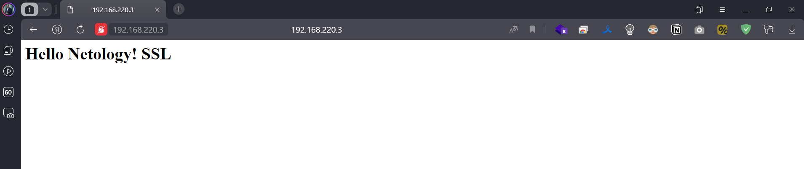

# Домашнее задание к занятию «Конфигурация приложений»

### Цель задания

В тестовой среде Kubernetes необходимо создать конфигурацию и продемонстрировать работу приложения.

------

### Задание 1. Создать Deployment приложения и решить возникшую проблему с помощью ConfigMap. Добавить веб-страницу

1. Создать Deployment приложения, состоящего из контейнеров nginx и multitool.
2. Решить возникшую проблему с помощью ConfigMap.
3. Продемонстрировать, что pod стартовал и оба конейнера работают.
4. Сделать простую веб-страницу и подключить её к Nginx с помощью ConfigMap. Подключить Service и показать вывод curl или в браузере.
5. Предоставить манифесты, а также скриншоты или вывод необходимых команд.

<-- Ответ

1. Создаем deployment_n_m [deployment_n_m.yaml](deployment_n_m.yaml) и развертываем `kubectl apply -f deployment_n_m.yaml`
   Так как multitul пытается стартовать на 80 порту, который занят nginx его надо переопределить

```commandline
kubectl get all
NAME                                 READY   STATUS   RESTARTS      AGE
pod/netology-kube-767bc4c96f-4cm7q   1/2     Error    1 (15s ago)   20s

NAME                 TYPE        CLUSTER-IP     EXTERNAL-IP   PORT(S)   AGE
service/kubernetes   ClusterIP   10.152.183.1   <none>        443/TCP   20d

NAME                            READY   UP-TO-DATE   AVAILABLE   AGE
deployment.apps/netology-kube   0/1     1            0           20s

NAME                                       DESIRED   CURRENT   READY   AGE
replicaset.apps/netology-kube-767bc4c96f   1         1         0       20s

kubectl logs netology-kube-767bc4c96f-4cm7q multitool 
The directory /usr/share/nginx/html is not mounted.
Therefore, over-writing the default index.html file with some useful information:
WBITT Network MultiTool (with NGINX) - netology-kube-767bc4c96f-4cm7q - 10.1.76.118 - HTTP: 80 , HTTPS: 443 . (Formerly praqma/network-multitool)
2024/01/08 13:05:41 [emerg] 1#1: bind() to 0.0.0.0:80 failed (98: Address in use)
nginx: [emerg] bind() to 0.0.0.0:80 failed (98: Address in use)
```

2. Создаем configmap_n_m [configmap_n_m.yaml](configmap_n_m.yaml) и развертываем `kubectl apply -f configmap_n_m.yaml`
   
Добавляем в [deployment_n_m.yaml](deployment_n_m.yaml) директивы и обновляем `kubectl apply -f configmap_n_m.yaml`:

```yaml
        env:
        - name: HTTP_PORT
          valueFrom:
            configMapKeyRef:
              name: nm-configmap
              key: port_multitool
```

3. Проверяем что все запустилось и работает 

```commandline
kubectl get all
NAME                                 READY   STATUS    RESTARTS   AGE
pod/netology-kube-5b4876cc4c-xhbwj   2/2     Running   0          3s

NAME                 TYPE        CLUSTER-IP     EXTERNAL-IP   PORT(S)   AGE
service/kubernetes   ClusterIP   10.152.183.1   <none>        443/TCP   20d

NAME                            READY   UP-TO-DATE   AVAILABLE   AGE
deployment.apps/netology-kube   1/1     1            1           3s

NAME                                       DESIRED   CURRENT   READY   AGE
replicaset.apps/netology-kube-5b4876cc4c   1         1         1       3s

kubectl exec -it deployments/netology-kube -c multitool -- curl localhost
<!DOCTYPE html>
<html>
<head>
<title>Welcome to nginx!</title>
<style>
    body {
        width: 35em;
        margin: 0 auto;
        font-family: Tahoma, Verdana, Arial, sans-serif;
    }
</style>
</head>
<body>
<h1>Welcome to nginx!</h1>
<p>If you see this page, the nginx web server is successfully installed and
working. Further configuration is required.</p>

<p>For online documentation and support please refer to
<a href="http://nginx.org/">nginx.org</a>.<br/>
Commercial support is available at
<a href="http://nginx.com/">nginx.com</a>.</p>

<p><em>Thank you for using nginx.</em></p>
</body>
</html>

kubectl exec -it deployments/netology-kube -c multitool -- curl localhost:8080
WBITT Network MultiTool (with NGINX) - netology-kube-5b4876cc4c-xhbwj - 10.1.76.77 - HTTP: 8080 , HTTPS: 443 . (Formerly praqma/network-multitool)
```

4. Создаем service_n_m [service_n_m.yaml](service_n_m.yaml) и развертываем `kubectl apply -f service_n_m.yaml`

Обновляем [configmap_n_m.yaml](configmap_n_m.yaml) и развертываем `kubectl apply -f configmap_n_m.yaml`
добавляем

```yaml
  index.html: |
    <html><body><h1>Hello Netology!</h1></body></html>
```
Обновляем [deployment_n_m.yaml](deployment_n_m.yaml) и развертываем `kubectl apply -f deployment_n_m.yaml`

```yaml
        volumeMounts:
        - mountPath: /usr/share/nginx/html/index.html
          subPath: index.html
          name: nginx-page
...

      volumes:
      - name: nginx-page
        configMap:
          name: nm-configmap
```

```commandline

kubectl get all
NAME                                 READY   STATUS    RESTARTS   AGE
pod/netology-kube-74bdc4d49d-xszjp   2/2     Running   0          33s

NAME                    TYPE        CLUSTER-IP       EXTERNAL-IP   PORT(S)           AGE
service/kubernetes      ClusterIP   10.152.183.1     <none>        443/TCP           20d
service/netology-kube   ClusterIP   10.152.183.231   <none>        80/TCP,8080/TCP   18m

NAME                            READY   UP-TO-DATE   AVAILABLE   AGE
deployment.apps/netology-kube   1/1     1            1           24m

NAME                                       DESIRED   CURRENT   READY   AGE
replicaset.apps/netology-kube-74bdc4d49d   1         1         1       33s

curl 10.152.183.231
<html><body><h1>Hello Netology!</h1></body></html>
```


------

### Задание 2. Создать приложение с вашей веб-страницей, доступной по HTTPS 

1. Создать Deployment приложения, состоящего из Nginx.
2. Создать собственную веб-страницу и подключить её как ConfigMap к приложению.
3. Выпустить самоподписной сертификат SSL. Создать Secret для использования сертификата.
4. Создать Ingress и необходимый Service, подключить к нему SSL в вид. Продемонстировать доступ к приложению по HTTPS. 
4. Предоставить манифесты, а также скриншоты или вывод необходимых команд.

<-- Ответ

1.  Создаем deployment_n_m [deployment_n.yaml](deployment_n.yaml) и развертываем `kubectl apply -f deployment_n.yaml`
2.  Создаем configmap_n [configmap_n.yaml](configmap_n.yaml) и развертываем `kubectl apply -f configmap_n.yaml`
3.  Создаем сертификат и ключ `openssl req -newkey rsa:2048 -nodes -keyout ca.key -x509 -days 3654 -out ca.crt`

Создаем секрет и сохраняем в файл [secret.yaml](secret.yaml)
`kubectl create secret tls secret-tls --cert=ca.crt --key=ca.key && kubectl get secrets secret-tls -o yaml > secret.yaml` 

1.  Создаем ingress [ingress.yaml](ingress.yaml) и развертываем `kubectl apply -f ingress.yaml`. Создаем service_n [service_n.yaml](service_n.yaml) и развертываем `kubectl apply -f service_n.yaml`
2.  Проверяем:
   
```commandline
kubectl get all
NAME                                   READY   STATUS    RESTARTS   AGE
pod/netology-kube-n-67f59f657d-hmq8x   1/1     Running   0          12m

NAME                      TYPE        CLUSTER-IP      EXTERNAL-IP   PORT(S)   AGE
service/kubernetes        ClusterIP   10.152.183.1    <none>        443/TCP   20d
service/netology-kube-n   ClusterIP   10.152.183.73   <none>        80/TCP    11m

NAME                              READY   UP-TO-DATE   AVAILABLE   AGE
deployment.apps/netology-kube-n   1/1     1            1           12m

NAME                                         DESIRED   CURRENT   READY   AGE
replicaset.apps/netology-kube-n-67f59f657d   1         1         1       12m

kubectl get configmaps 
NAME               DATA   AGE
kube-root-ca.crt   1      20d
n-configmap        1      15m

kubectl get secrets 
NAME         TYPE                DATA   AGE
secret-tls   kubernetes.io/tls   2      19m

kubectl get ingress
NAME          CLASS    HOSTS   ADDRESS     PORTS     AGE
ingress-tls   public   *       127.0.0.1   80, 443   70s
```



------
