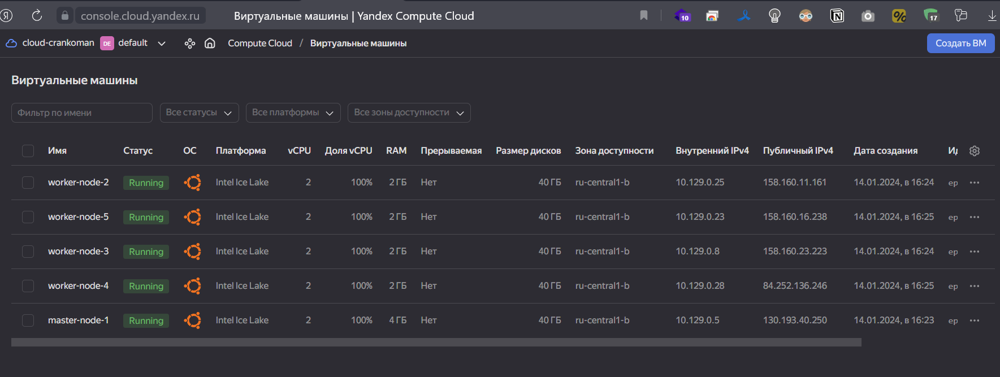

# Домашнее задание к занятию «Установка Kubernetes»

### Цель задания

Установить кластер K8s.

### Чеклист готовности к домашнему заданию

1. Развёрнутые ВМ с ОС Ubuntu 20.04-lts.


### Инструменты и дополнительные материалы, которые пригодятся для выполнения задания

1. [Инструкция по установке kubeadm](https://kubernetes.io/docs/setup/production-environment/tools/kubeadm/create-cluster-kubeadm/).
2. [Документация kubespray](https://kubespray.io/).

-----

### Задание 1. Установить кластер k8s с 1 master node

1. Подготовка работы кластера из 5 нод: 1 мастер и 4 рабочие ноды.
2. В качестве CRI — containerd.
3. Запуск etcd производить на мастере.
4. Способ установки выбрать самостоятельно.


<-- Ответ

1. Создаем в YC 5 ВМ с ресурсами:
- master-node-1 - 2 cpu, 4GB ram, 40GB HDD
- worker-node-2 - 2 cpu, 2GB ram, 40GB HDD
- worker-node-3 - 2 cpu, 2GB ram, 40GB HDD
- worker-node-4 - 2 cpu, 2GB ram, 40GB HDD
- worker-node-5 - 2 cpu, 2GB ram, 40GB HDD



1. Установим необходимые пакеты и включим forwarding

```commandline

sudo apt update && sudo apt install -y apt-transport-https
curl -4 -sL https://dl.k8s.io/apt/doc/apt-key.gpg | sudo apt-key add -
sudo touch /etc/apt/sources.list.d/kubernetes.list
echo "deb http://apt.kubernetes.io/ kubernetes-xenial main" | sudo tee -a /etc/apt/sources.list.d/kubernetes.list
sudo apt update && sudo apt install -y kubelet kubeadm kubectl containerd 

#
modprobe br_netfilter
echo "net.ipv4.ip_forward=1" >> /etc/sysctl.conf
echo "net.bridge.bridge-nf-call-iptables=1" >> /etc/sysctl.conf
echo "net.bridge.bridge-nf-call-arptables=1" >> /etc/sysctl.conf
echo "net.bridge.bridge-nf-call-ip6tables=1" >> /etc/sysctl.conf

```

3. Ставим мастерноду 

```commandline
sudo kubeadm init \
--apiserver-advertise-address=10.129.0.5 \
--pod-network-cidr 10.244.0.0/16 \
--apiserver-cert-extra-sans=130.193.40.250
```
Подключаем воркер ноды 

```commandline
sudo kubeadm join 10.129.0.5:6443 --token 48ln5l.fowgp7zijvlemy9v \
        --discovery-token-ca-cert-hash sha256:efa501f5b95fd05ee6129de62ae794b2129a9f89273062fce4945b2ee56bda76

```

Натсриваем kubectl для подключения 

```commandline
mkdir -p $HOME/.kube
sudo cp -i /etc/kubernetes/admin.conf $HOME/.kube/config
sudo chown $(id -u):$(id -g) $HOME/.kube/config
}
```


Пробуем получить список нод

```commandline
kubectl get nodes
NAME            STATUS     ROLES           AGE     VERSION
master-node-1   NotReady   control-plane   4m56s   v1.28.2
worker-node-2   NotReady   <none>          3m39s   v1.28.2
worker-node-3   NotReady   <none>          3m20s   v1.28.2
worker-node-4   NotReady   <none>          3m8s    v1.28.2
worker-node-5   NotReady   <none>          3m6s    v1.28.2
```

Выясняем причину 

```commandline
kubectl describe nodes master-node-1
...
KubeletNotReady              container runtime network not ready: NetworkReady=false reason:NetworkPluginNotReady message:Network plugin returns error: cni plugin not initialized
...
```

Доустанавливаем flannel

```commandline
kubectl apply -f https://raw.githubusercontent.com/coreos/flannel/master/Documentation/kube-flannel.yml
namespace/kube-flannel created
clusterrole.rbac.authorization.k8s.io/flannel created
clusterrolebinding.rbac.authorization.k8s.io/flannel created
serviceaccount/flannel created
configmap/kube-flannel-cfg created
daemonset.apps/kube-flannel-ds created
```

Ждем и проверяем

```commandline
kubectl get nodes
NAME            STATUS   ROLES           AGE   VERSION
master-node-1   Ready    control-plane   13m   v1.28.2
worker-node-2   Ready    <none>          12m   v1.28.2
worker-node-3   Ready    <none>          11m   v1.28.2
worker-node-4   Ready    <none>          11m   v1.28.2
worker-node-5   Ready    <none>          11m   v1.28.2
```
------

