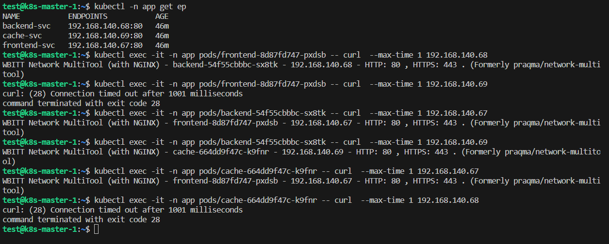

# Домашнее задание к занятию «Как работает сеть в K8s»

### Цель задания

Настроить сетевую политику доступа к подам.

### Чеклист готовности к домашнему заданию

1. Кластер K8s с установленным сетевым плагином Calico.

### Инструменты и дополнительные материалы, которые пригодятся для выполнения задания

1. [Документация Calico](https://www.tigera.io/project-calico/).
2. [Network Policy](https://kubernetes.io/docs/concepts/services-networking/network-policies/).
3. [About Network Policy](https://docs.projectcalico.org/about/about-network-policy).

-----

### Задание 1. Создать сетевую политику или несколько политик для обеспечения доступа

1. Создать deployment'ы приложений frontend, backend и cache и соответсвующие сервисы.
2. В качестве образа использовать network-multitool.
3. Разместить поды в namespace App.
4. Создать политики, чтобы обеспечить доступ frontend -> backend -> cache. Другие виды подключений должны быть запрещены.
5. Продемонстрировать, что трафик разрешён и запрещён.

<-- Ответ

0. Развертываем кластер из 1-й мастерноды и 1-й воркерноды и ставим k8s

```commandline
sudo apt update && sudo apt install -y apt-transport-https
curl -4 -sL https://dl.k8s.io/apt/doc/apt-key.gpg | sudo apt-key add -
sudo touch /etc/apt/sources.list.d/kubernetes.list
echo "deb http://apt.kubernetes.io/ kubernetes-xenial main" | sudo tee -a /etc/apt/sources.list.d/kubernetes.list
sudo apt update && sudo apt install -y kubelet kubeadm kubectl containerd 
sudo apt-mark hold kubelet kubeadm kubectl containerd
#
modprobe overlay
modprobe br_netfilter
cat <<EOF | sudo tee /etc/sysctl.d/kubernetes.conf
net.bridge.bridge-nf-call-ip6tables = 1
net.bridge.bridge-nf-call-iptables = 1
net.ipv4.ip_forward = 1
EOF
sudo sysctl --system
```

Поднимаем мастерноду

```commandline
sudo kubeadm init \
--apiserver-advertise-address=10.129.0.7 \
--pod-network-cidr=192.168.0.0/16 \
--apiserver-cert-extra-sans=158.160.75.182
```

Натсриваем kubectl для подключения 

```commandline
mkdir -p $HOME/.kube
sudo cp -i /etc/kubernetes/admin.conf $HOME/.kube/config
sudo chown $(id -u):$(id -g) $HOME/.kube/config
echo 'source <(kubectl completion bash)' >>~/.bashrc
```

Ставим calico и дожидаемся пока поднимется и проверяем

```commandline
kubectl create -f https://raw.githubusercontent.com/projectcalico/calico/v3.27.0/manifests/tigera-operator.yaml
kubectl create -f https://raw.githubusercontent.com/projectcalico/calico/v3.27.0/manifests/custom-resources.yaml

kubectl get pods -n calico-system
NAME                                       READY   STATUS    RESTARTS   AGE
calico-kube-controllers-58ffd6598b-d94cl   1/1     Running   0          97s
calico-node-5sptx                          1/1     Running   0          97s
calico-typha-5c79b6c769-bnm4m              1/1     Running   0          97s
csi-node-driver-nmppc                      2/2     Running   0          97s

kubectl get nodes 
NAME           STATUS   ROLES           AGE     VERSION
k8s-master-1   Ready    control-plane   3m21s   v1.28.2
```

Подключаем воркерноду и проверяем

```commandline
sudo kubeadm join 10.129.0.7:6443 --token 2wxa15.vw3g5v7ul2znr7as \
        --discovery-token-ca-cert-hash sha256:fee6d19858eda8c755fdd883c63238bac9b2449ebc233422c4c8785846b19071

kubectl get nodes 
NAME           STATUS   ROLES           AGE   VERSION
k8s-master-1   Ready    control-plane   66m   v1.28.2
k8s-node-2     Ready    <none>          61m   v1.28.2

kubectl get pods -n calico-system
NAME                                       READY   STATUS    RESTARTS   AGE
calico-kube-controllers-58ffd6598b-d94cl   1/1     Running   0          64m
calico-node-5sptx                          1/1     Running   0          64m
calico-node-blhb2                          1/1     Running   0          60m
calico-typha-5c79b6c769-bnm4m              1/1     Running   0          64m
csi-node-driver-mg9qf                      2/2     Running   0          60m
csi-node-driver-nmppc                      2/2     Running   0          64m

```

1. Создаем Deployments и Services

`deployments.yaml`
```yaml
apiVersion: apps/v1
kind: Deployment
metadata:
  name: frontend
  labels:
    app: frontend
  namespace: app
spec:
  replicas: 1
  selector:
    matchLabels:
      app: frontend
  template:
    metadata:
      labels:
        app: frontend
    spec:
      containers:
        - name: multitool
          image: wbitt/network-multitool
          env:
            - name: HTTP_PORT
              value: "80"
          resources:
            requests:
              memory: "64Mi"
              cpu: "250m"
            limits:
              memory: "128Mi"
              cpu: "1"
---
apiVersion: apps/v1
kind: Deployment
metadata:
  name: backend
  labels:
    app: backend
  namespace: app
spec:
  replicas: 1
  selector:
    matchLabels:
      app: backend
  template:
    metadata:
      labels:
        app: backend
    spec:
      containers:
        - name: multitool
          image: wbitt/network-multitool
          env:
            - name: HTTP_PORT
              value: "80"
          resources:
            requests:
              memory: "64Mi"
              cpu: "250m"
            limits:
              memory: "128Mi"
              cpu: "1"
---
apiVersion: apps/v1
kind: Deployment
metadata:
  name: cache
  labels:
    app: cache
  namespace: app
spec:
  replicas: 1
  selector:
    matchLabels:
      app: cache
  template:
    metadata:
      labels:
        app: cache
    spec:
      containers:
        - name: multitool
          image: wbitt/network-multitool
          env:
            - name: HTTP_PORT
              value: "80"
          resources:
            requests:
              memory: "64Mi"
              cpu: "250m"
            limits:
              memory: "128Mi"
              cpu: "1"
---
```

`services.yaml`
```yaml
apiVersion: v1
kind: Service
metadata:
  name: frontend-svc
  namespace: app
spec:
  ports:
    - name: http
      port: 80
      protocol: TCP
  selector:
    app: frontend
---
apiVersion: v1
kind: Service
metadata:
  name: backend-svc
  namespace: app
spec:
  ports:
    - name: http
      port: 80
      protocol: TCP
  selector:
    app: backend
---
apiVersion: v1
kind: Service
metadata:
  name: cache-svc
  namespace: app
spec:
  ports:
    - name: http
      port: 80
      protocol: TCP
  selector:
    app: cache
---
```

`networkpolicys.yaml`
```yaml
apiVersion: networking.k8s.io/v1
kind: NetworkPolicy
metadata:
  name: ingress-deny-all
spec:
  podSelector:
    {}
  policyTypes:
    - Ingress
---
apiVersion: networking.k8s.io/v1
kind: NetworkPolicy
metadata:
  name: backend
  namespace: app
spec:
  podSelector:
    matchLabels:
      app: backend
  policyTypes:
    - Ingress
  ingress:
    - from:
      - podSelector:
          matchLabels:
            app: frontend
      ports:
        - protocol: TCP
          port: 80
---
apiVersion: networking.k8s.io/v1
kind: NetworkPolicy
metadata:
  name: cache
  namespace: app
spec:
  podSelector:
    matchLabels:
      app: cache
  policyTypes:
    - Ingress
  ingress:
    - from:
      - podSelector:
          matchLabels:
            app: backend
      ports:
        - protocol: TCP
          port: 80
```

Применяем

```commandline
kubectl create namespace app
namespace/app created

kubectl apply -f deployments.yaml 
deployment.apps/frontend created
deployment.apps/backend created
deployment.apps/cache created

kubectl apply -f services.yaml 
service/frontend-svc created
service/backend-svc created
service/cache-svc created

kubectl apply -f networkpolicys.yaml 
networkpolicy.networking.k8s.io/ingress-deny-all created
networkpolicy.networking.k8s.io/backend created
networkpolicy.networking.k8s.io/cache created
```

Проверяем 
```commandline
kubectl get all -n app 
NAME                           READY   STATUS    RESTARTS   AGE
pod/backend-54f55cbbbc-sx8tk   1/1     Running   0          55m
pod/cache-664dd9f47c-k9fnr     1/1     Running   0          55m
pod/frontend-8d87fd747-pxdsb   1/1     Running   0          55m

NAME                   TYPE        CLUSTER-IP       EXTERNAL-IP   PORT(S)   AGE
service/backend-svc    ClusterIP   10.110.142.243   <none>        80/TCP    50m
service/cache-svc      ClusterIP   10.109.202.102   <none>        80/TCP    50m
service/frontend-svc   ClusterIP   10.96.17.22      <none>        80/TCP    50m

NAME                       READY   UP-TO-DATE   AVAILABLE   AGE
deployment.apps/backend    1/1     1            1           55m
deployment.apps/cache      1/1     1            1           55m
deployment.apps/frontend   1/1     1            1           55m

NAME                                 DESIRED   CURRENT   READY   AGE
replicaset.apps/backend-54f55cbbbc   1         1         1       55m
replicaset.apps/cache-664dd9f47c     1         1         1       55m
replicaset.apps/frontend-8d87fd747   1         1         1       55m

kubectl -n app get ep
NAME           ENDPOINTS           AGE
backend-svc    192.168.140.68:80   39m
cache-svc      192.168.140.69:80   39m
frontend-svc   192.168.140.67:80   39m
```

5. Проверяем правила




-----
