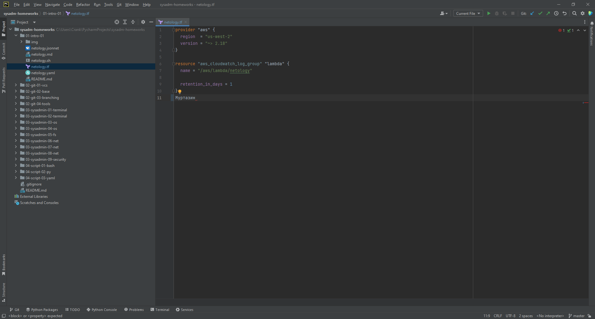
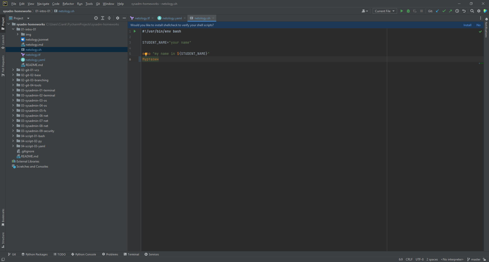
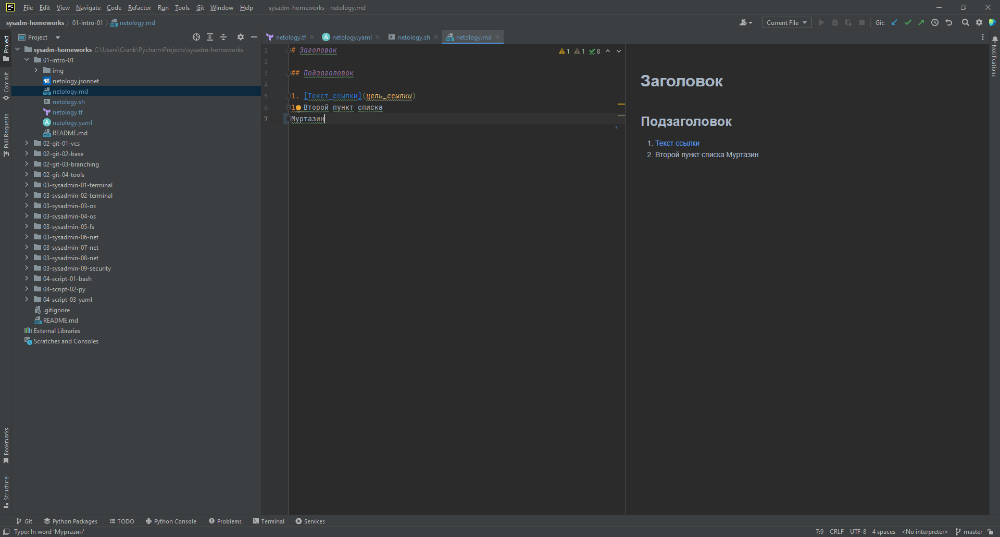
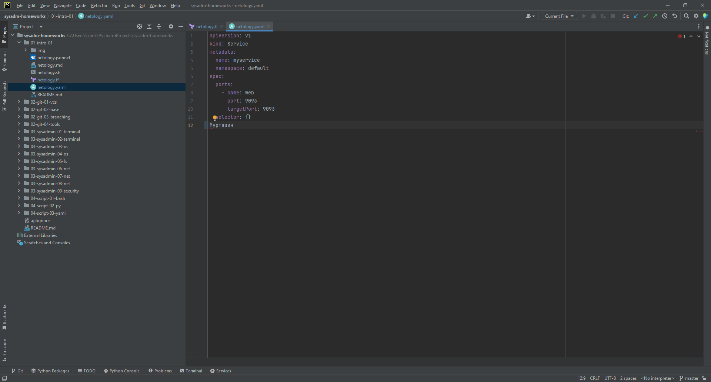
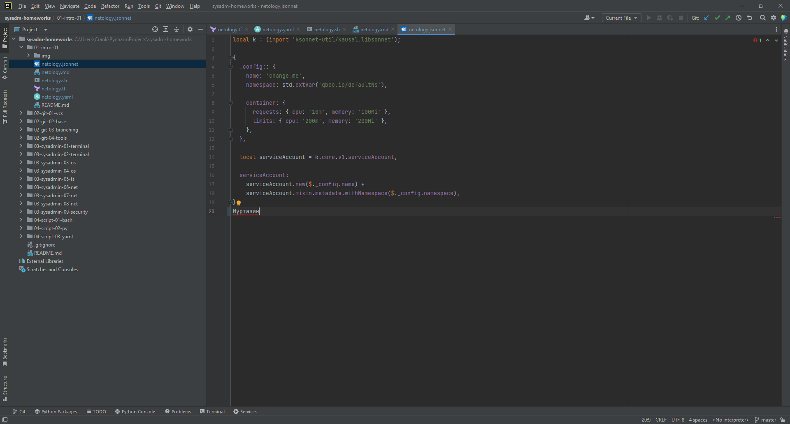

# Домашнее задание к занятию "Введение в DevOps"
## Муртазин Руслан DEVOPS-24

1. Убедится, что работает подсветка синтаксиса, файлы должны выглядеть вот так:
    - Terraform: 
    - Bash:
    - Markdown:
    - Yaml:
    - Jsonnet:
2. Описание жизненного цикла задачи (разработки нового функционала)
### Условия
 - Стартап, который запустил интернет-магазин.
 - От клиентов вам приходят задачи, связанные с разработкой нового функционала.
 - Задач много, и все они требуют выкладки на тестовые среды, одобрения тестировщика, проверки менеджером перед показом клиенту.
 - В случае необходимости, необходим откат изменений.
### Задача
 - Описать решение в соответствии с жизненным циклом разработки программного обеспечения. 
 - Использование какого-либо конкретного метода разработки необязательно. 
 - Для решения главное - прописать по пунктам шаги решения задачи (реализации в конечный результат) с участием менеджера, разработчика (или команды разработчиков), тестировщика (или команды тестировщиков) и себя как DevOps-инженера.

### Решение

1. Жизненый цикл:
   1. Планирование
   2. Разработка (написание кода)
   3. Сборка
   4. Тестирование
   5. Релиз
   6. Развертывание
   7. Эксплуатация
   8. Мониторинг
2. Команда:
   1. Менеджер
   2. Команда разработки
   3. Команда тестирования
   4. DevOps-инженер
3. Шаги:
   1. Планирование. Выполнятся менеджером, который ставит задачу. Разработка и DevOps которые решают как будут реализовывать и оценивают.
   2. Разработка. DevOps совместно с разработкой настригает различные среды(разработка, тестовая, предпродуктивная), репозитории, IDE. Определяют как будет работать CI. Как будет запускаться код (виртализаци, контейнеризация)
   3. Сборка. Настраивается CI. Разработчики совместно с DevOps проверяют что написанный ими код корректно собирается, проверяют логи. Запускаются автоматические тесты качества и безопасности кода и бибилиотек.
   4. Тестирование. Выполнятся сборка на тестовый контур, где тестировщики проводят тестирование, собирают логи при падении. Повторно пересобирается стенд после исправления ошибок.
   5. Сборка релиза. Разработчики с менеджером определяют, какой функционал попадают в релиз. DevOps помогает упаковать котовое решение в контейнеры/дистрибутивы и размещает в необходимых репозиториях для дальнейшего использования.
   6. Развертывание. DevOps развертывает готовый релиз на часть продуктивной среды где вместе с тестировщиками и менеджером проверяют работоспособность. После передают для использования части клиентов.
   7. Эксплантация. DevOps вместе с разработчикам решает задачи по оптимизации, масштабированию при работе на всех клиентов.
   8. Мониторинг. DevOps автоматизирует задачи по мониторингу производительности, появлении ошибок и автоматической реакции на них. Например, автоматическое выделение и освобождения ресурсов при необходимости. Автоматическое заведение ошибок в тикет системе из лолгов.